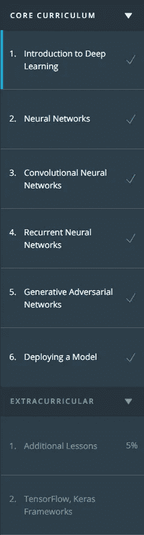
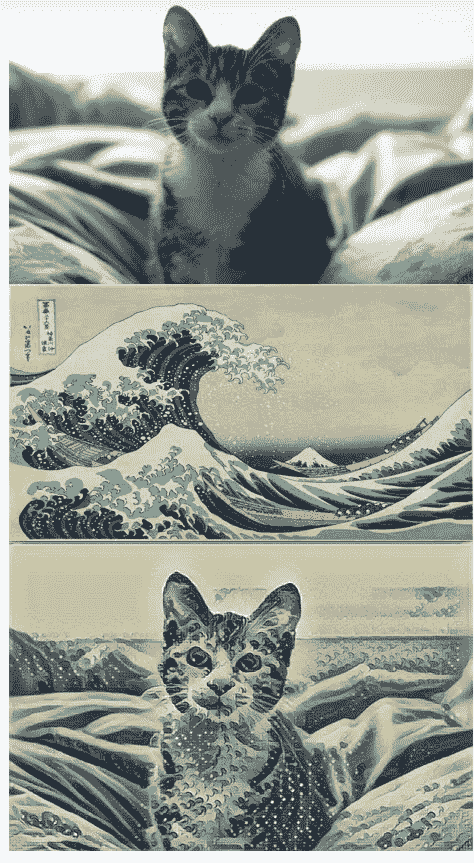
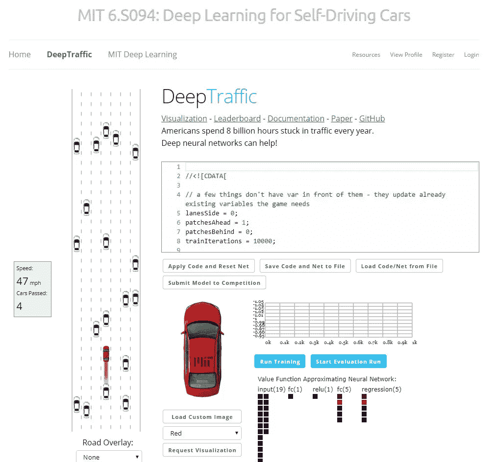

# PyTorch 深度学习纳米学位:简介

> 原文：<https://medium.datadriveninvestor.com/pytorch-deep-learning-nanodegree-introduction-161817c22384?source=collection_archive---------2----------------------->

*简介*

[神经网络](https://medium.com/@artgor/pytorch-deep-learning-nanodegree-neural-nerworks-cf44a852be59)

[卷积神经网络](https://medium.com/@artgor/pytorch-deep-learning-nano-degree-convolutional-neural-networks-b92ee1969bb7)

[递归神经网络](https://medium.com/@artgor/pytorch-deep-learning-nanodegree-recurrent-neural-networks-894fce63469b)

[生成性对抗网络](https://medium.com/@artgor/pytorch-deep-learning-nanodegree-generative-adversarial-networks-bc37e2b50a81)

[部署模型](https://medium.com/@artgor/pytorch-deep-learning-nanodegree-deploying-a-model-b2a7f0ac0685)

[这趟旅程的终点](https://medium.com/@artgor/pytorch-deep-learning-nanodegree-the-end-of-this-journey-5c1d6eeb0026)

去年秋天，乌达城和脸书宣布了 PyTorch 奖学金挑战。来自世界各地的人都可以申请这项奖学金，他们也确实这样做了:有大约 18000 份申请，其中 10000 人能够参加这项挑战。


[https://blog.udacity.com/2018/10/introducing-the-pytorch-scholarship-challenge-from-facebook.html](https://blog.udacity.com/2018/10/introducing-the-pytorch-scholarship-challenge-from-facebook.html)

这个挑战是关于什么的？人们有两个月的时间完成 PyTorch 的免费课程[深度学习简介](https://www.udacity.com/course/deep-learning-pytorch--ud188)，前 300 名将获得免费的[深度学习纳米学位](https://eu.udacity.com/course/deep-learning-nanodegree--nd101)。

这个课程非常基础，所以很多参与者都能完成；但是做这件事并不是入选前 300 名的唯一要求——对社区的贡献也是要衡量的。有很多活动——回答 slack 上的问题、网络研讨会、学习小组和许多其他活动。

最后我上了 top-300，能够通过这个纳米学位！

在这些课程之前，我已经做了几个深度学习项目，但它们是在 TensorFlow 或 Keras 中，我想学习 py torch——所以这个纳米学位是一个研究它的绝佳机会。

我计划在几篇博文中描述我的经历。

我不会张贴完整的代码或深入每一课的细节——这些帖子是针对那些想知道这门课是关于什么的或想学习一些具体东西的人。另一方面，我会发布课程视频的直接链接(Udacity 同意)，并写下我感兴趣的内容。

顺便说一下，所有(或几乎所有)代码都可以在这个 GitHub repo 中找到:[https://github.com/udacity/deep-learning-v2-pytorch](https://github.com/udacity/deep-learning-v2-pytorch)它包括练习和解答。



先说介绍吧！

# 简介概述

第一部分致力于向学生介绍 Udacity，展示深度学习和 Python 的基础知识。

首先，我们被告知 Udacity 的指导方针、支持和社区。

课程结构如下:前馈神经网络、基本情感分析和 pytorchCNNRNN；GAN 和在亚马逊的 Sagemaker 上部署深度学习模型。

在课程进行期间，我们应该实施五个项目:

1.  *预测自行车共享数据*
2.  *犬种分类器*
3.  *生成电视脚本*
4.  *生成人脸*
5.  *部署情感分析模型*

另一个有趣的地方是，我们可以使用职业服务，并在 CV、LinkedIn 个人资料和 Github 存储库中接收反馈。

有三个关于使用 Anaconda、Jupyter 笔记本和 Numpy 的简短课程，但我将跳过它们，因为我希望读者已经知道这些主题。相反，我将专注于我们可以看到深度学习的一些酷应用演示的课程！

## 风格转移



风格转换允许您将一幅图像的风格转换到另一幅图像上。它经常用在照片造型的应用程序中！

在 CNN 部分会有一节课专门讲风格转换，但是我们现在可以玩风格转换。

我们用这个回购:[https://github.com/lengstrom/fast-style-transfer](https://github.com/lengstrom/fast-style-transfer)

以下是我们尝试风格转移的步骤:

1.  安装 Tensorflow、Pillow、SciPy 和 moviepy。可以这样做(安装 Anaconda 之后):

```
conda create -n style-transfer python=3
conda activate style-transfer
conda install tensorflow scipy pillow
pip install moviepy
python -c "import imageio; imageio.plugins.ffmpeg.download()"
```

最后一行可能行不通，只需替换为:

```
*pip install imageio-ffmpeg*
```

2.克隆存储库或下载它

3.从[这里](https://d17h27t6h515a5.cloudfront.net/topher/2017/January/587d1865_rain-princess/rain-princess.ckpt)下载雨公主关卡。把它放在快速传送文件夹里。这是一个经过训练的模型，可以用来立即应用风格转移。

4.将要设计样式的图像复制到快速样式转换文件夹中。

5.此后，您可以使用以下命令运行样式转移:

```
python evaluate.py --checkpoint ./rain-princess.ckpt --in-path <path_to_input_file> --out-path ./output_image.jpg
```

就是这样！:)

## 强化学习



虽然强化学习不属于本课程的内容，但它仍然是一个很酷的应用。

下面是关于 [DeepTraffic](https://selfdrivingcars.mit.edu/deeptraffic/) 的[视频](https://youtu.be/az5ElmV4DhY)。这里的网络试图学习一种驾驶策略，使得汽车使用[强化学习](https://en.wikipedia.org/wiki/Reinforcement_learning)尽可能快地移动。当汽车选择快速移动的动作时，网络会得到奖励。正是这种反馈让网络找到最佳速度的行动策略。

## 强化学习的 FlappyBird

您可以选择自己训练代理，但是现在让我们从作者给出的预训练网络开始。

我们用[这个库](https://github.com/yenchenlin/DeepLearningFlappyBird)的作者是林彦琛。

本课的说明:

1.  如果您还没有安装 miniconda 或 anaconda，请安装它们。
2.  为 flappybird 创建一个环境

*   Mac/Linux: `conda create --name=flappybird python=2.7`
*   视窗:`conda create --name=flappybird python=3.5`

3.进入你的康达环境:`conda activate flappybird`

4.`conda install opencv`

5.`pip install pygame`

6.`pip install tensorflow==0.12`

7.`git clone [https://github.com/yenchenlin/DeepLearningFlappyBird.git](https://github.com/yenchenlin/DeepLearningFlappyBird.git)`

8.`cd DeepLearningFlappyBird`

9.`python deep_q_network.py`

如果这些步骤做得正确，您将看到代理正在玩游戏！您可以在资源库中查看更多说明和信息。

一些关于深度学习的书籍:

*   [探索深度学习](https://www.manning.com/books/grokking-deep-learning)作者安德鲁·特拉斯克。这为深度学习提供了一个非常温和的介绍，并且涵盖了直觉而不是理论。
*   [神经网络和深度学习](http://neuralnetworksanddeeplearning.com/)作者迈克尔·尼尔森。这本书比搜索深度学习更严格，包括许多有趣的交互式可视化内容。
*   [深度学习教材](http://www.deeplearningbook.org/)来自伊恩·古德菲勒、约舒阿·本吉奥和亚伦·库维尔。这本在线书籍包含了大量的材料，是推荐的三本书中最严谨的一本。

暂时就这样吧！在下一篇博文中，我将写第二部分——关于基本神经网络。