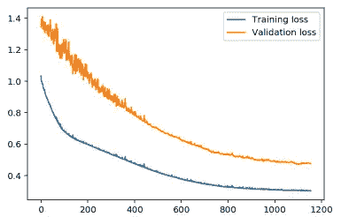
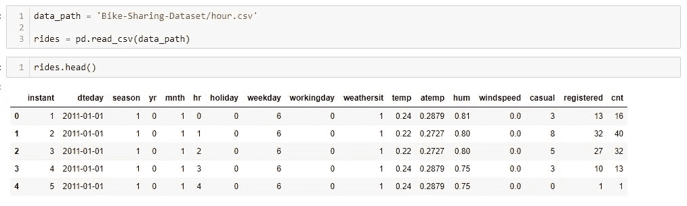
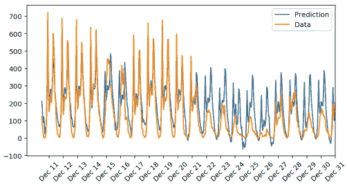
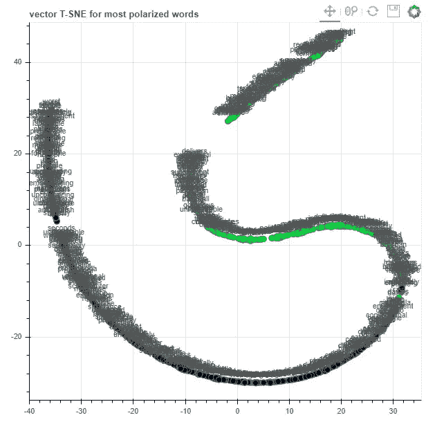
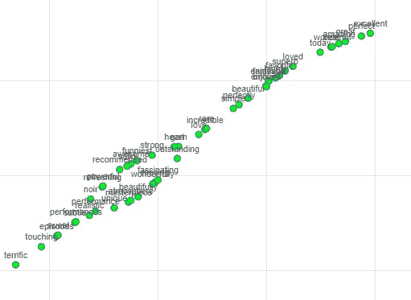
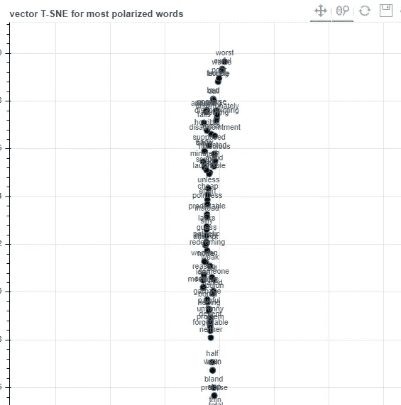

# PyTorch 深度学习纳米学位:神经网络

> 原文：<https://medium.datadriveninvestor.com/pytorch-deep-learning-nanodegree-neural-nerworks-cf44a852be59?source=collection_archive---------3----------------------->

## 纳米级的第二部分:神经网络

[简介](https://medium.com/@artgor/pytorch-deep-learning-nanodegree-introduction-161817c22384)

*神经网络*

[卷积神经网络](https://medium.com/@artgor/pytorch-deep-learning-nano-degree-convolutional-neural-networks-b92ee1969bb7)

[递归神经网络](https://medium.com/@artgor/pytorch-deep-learning-nanodegree-recurrent-neural-networks-894fce63469b)

[生成性对抗网络](https://medium.com/@artgor/pytorch-deep-learning-nanodegree-generative-adversarial-networks-bc37e2b50a81)

[部署模型](https://medium.com/@artgor/pytorch-deep-learning-nanodegree-deploying-a-model-b2a7f0ac0685)

[这趟旅程的终点](https://medium.com/@artgor/pytorch-deep-learning-nanodegree-the-end-of-this-journey-5c1d6eeb0026)

# 一般

在第一课中，我们学习神经网络，实现梯度下降，训练简单的神经网络从头开始编写和 Pytorch。我们也尝到了情感分析的滋味，并完成了本课程的第一个项目。

## 神经网络导论

在这一课中，我们将学习神经网络的基础知识:感知器、误差函数、损失、正向和反向传播。我将跳过这一节。为什么？因为它对任何人都是免费的。Udacity 有一门免费课程:[神经网络入门](https://www.udacity.com/course/deep-learning-pytorch--ud188)。本课程的第二课包含了这个介绍，如果你有兴趣可以浏览一下。

## 实施梯度下降

在本课中，我们将介绍基本梯度下降的实现。

[这里](https://www.youtube.com/watch?v=29PmNG7fuuM)是对什么是梯度下降的基本解释。

这是这节课的视频列表:

[梯度下降:数学](https://www.youtube.com/watch?v=7sxA5Ap8AWM)

这是一个示例代码:

```
*# Defining the sigmoid function for activations*
**def** **sigmoid**(x):
    **return** 1/(1+np.exp(-x))

*# Derivative of the sigmoid function*
**def** **sigmoid_prime**(x):
    **return** sigmoid(x) * (1 - sigmoid(x))

*# Input data*
x = np.array([0.1, 0.3])
*# Target*
y = 0.2
*# Input to output weights*
weights = np.array([-0.8, 0.5])

*# The learning rate, eta in the weight step equation*
learnrate = 0.5

*# the linear combination performed by the node (h in f(h) and f'(h))*
h = x[0]*weights[0] + x[1]*weights[1]
*# or h = np.dot(x, weights)*

*# The neural network output (y-hat)*
nn_output = sigmoid(h)

*# output error (y - y-hat)*
error = y - nn_output

*# output gradient (f'(h))*
output_grad = sigmoid_prime(h)

*# error term (lowercase delta)*
error_term = error * output_grad

*# Gradient descent step* 
del_w = [ learnrate * error_term * x[0],
          learnrate * error_term * x[1]]
*# or del_w = learnrate * error_term * x*
```

[多层感知器](https://www.youtube.com/watch?v=Rs9petvTBLk)

[反向传播](https://www.youtube.com/watch?v=MZL97-2joxQ)

```
import numpy as np
from data_prep import features, targets, features_test, targets_testnp.random.seed(21)def sigmoid(x):
    """
    Calculate sigmoid
    """
    return 1 / (1 + np.exp(-x))# Hyperparameters
n_hidden = 2  # number of hidden units
epochs = 900
learnrate = 0.005n_records, n_features = features.shape
last_loss = None
# Initialize weights
weights_input_hidden = np.random.normal(scale=1 / n_features ** .5,
                                        size=(n_features, n_hidden))
weights_hidden_output = np.random.normal(scale=1 / n_features ** .5,
                                         size=n_hidden)for e in range(epochs):
    del_w_input_hidden = np.zeros(weights_input_hidden.shape)
    del_w_hidden_output = np.zeros(weights_hidden_output.shape)
    for x, y in zip(features.values, targets):
        ## Forward pass ##
        # TODO: Calculate the output
        hidden_input = np.dot(x, weights_input_hidden)
        hidden_output = sigmoid(hidden_input)output = sigmoid(np.dot(hidden_output,
                                weights_hidden_output))## Backward pass ##
        # TODO: Calculate the network's prediction error
        error = y - output# TODO: Calculate error term for the output unit
        output_error_term = error * output * (1 - output)## propagate errors to hidden layer# TODO: Calculate the hidden layer's contribution to the error
        hidden_error = np.dot(output_error_term, weights_hidden_output)# TODO: Calculate the error term for the hidden layer
        hidden_error_term = hidden_error * hidden_output * (1 - hidden_output)# TODO: Update the change in weights
        del_w_hidden_output += output_error_term * hidden_output
        del_w_input_hidden += hidden_error_term * x[:, None]# TODO: Update weights
    weights_input_hidden += learnrate * del_w_input_hidden / n_records
    weights_hidden_output += learnrate * del_w_hidden_output / n_records# Printing out the mean square error on the training set
    if e % (epochs / 10) == 0:
        hidden_output = sigmoid(np.dot(x, weights_input_hidden))
        out = sigmoid(np.dot(hidden_output,
                             weights_hidden_output))
        loss = np.mean((out - targets) ** 2)if last_loss and last_loss < loss:
            print("Train loss: ", loss, "  WARNING - Loss Increasing")
        else:
            print("Train loss: ", loss)
        last_loss = loss# Calculate accuracy on test data
hidden = sigmoid(np.dot(features_test, weights_input_hidden))
out = sigmoid(np.dot(hidden, weights_hidden_output))
predictions = out > 0.5
accuracy = np.mean(predictions == targets_test)
print("Prediction accuracy: {:.3f}".format(accuracy))
```

## 训练神经网络

我也将跳过这一部分，因为上述课程的第 2 课也包含这一部分。

## 项目:预测自行车共享模式

可以在官方回购中看到这个项目的代码:[https://github . com/uda city/deep-learning-v2-py torch/tree/master/project-bike sharing](https://github.com/udacity/deep-learning-v2-pytorch/tree/master/project-bikesharing)



这是本课程的第一个专题。

在这个项目中，我们建立了一个神经网络来预测每天的自行车租赁客流量。我们有各种数据，这些数据将输入到我们的神经网络中:



我们使用一个热编码转换分类变量，归一化目标变量，从而准备好数据。最后 21 天用于验证。

我们在脚本中把神经网络写成一个类。说实话，我花了很长时间才写对，因为我弄乱了尺寸:)

如果一切都做得正确，那么结果将如下所示:



我们可以看到，预测在开始时更好，在结束时更差。当目标值变得更低时，我们的网络似乎无法工作。嗯，这是一个非常基本的神经网络，它只在简单的场景中工作并不奇怪。尽管如此，它仍然有效！这个项目就这样完成了。

## 情感分析

代码在这里:[https://github . com/uda city/deep-learning-v2-py torch/tree/master/情操-分析-网络](https://github.com/udacity/deep-learning-v2-pytorch/tree/master/sentiment-analysis-network)

这是安德鲁·特拉斯克的一课！

这让我非常兴奋，因为我仍然记得他的文章[用 11 行 Python 编写的神经网络](http://iamtrask.github.io/2015/07/12/basic-python-network/)——这是我第一次体验神经网络，我花了几次尝试才理解它。所以我想知道在这一课中我会学到什么酷的东西:)

这里我们建立了一个用于文本分类的神经网络。该课程分为 6 个小项目。来看看是怎么做的吧！

[介绍安德鲁·特拉斯克](https://www.youtube.com/watch?v=ltO71Bm8b3M)

[认识安德鲁](https://www.youtube.com/watch?v=da1I0mea1jQ)

[框定问题](https://www.youtube.com/watch?v=IsTOnkAKaJw)

[迷你项目 1 解决方案](https://www.youtube.com/watch?v=l4r5l0HvHRI)

[将文本转换成数字](https://www.youtube.com/watch?v=7rHBU5cbePE)

[迷你项目 2 解决方案](https://www.youtube.com/watch?v=45ihpPaeO8E)

[构建神经网络](https://www.youtube.com/watch?v=aM2k7RTjjJI)

[迷你项目 3 解决方案](https://www.youtube.com/watch?v=imnxzCev4SI)

[了解神经噪音](https://www.youtube.com/watch?v=ubqhh4Iv7O4)

[了解我们网络中的低效率](https://www.youtube.com/watch?v=4MuS-6ATxCU)

[迷你项目 5 解决方案](https://www.youtube.com/watch?v=Hv86B_jjWTI)

[进一步降噪](https://www.youtube.com/watch?v=Kl3hWxizKVg)

[迷你项目 6 解决方案](https://www.youtube.com/watch?v=ji0famK7gOQ)

[分析:权重是怎么回事？](https://www.youtube.com/watch?v=UHsT35pbpcE)

在这个视频中，你可以看到单词在嵌入空间中的可视化。我有一个不同的情节，让我看看:



图的形状大不相同，但本质上是一样的:



绿色表示“好”字。



而黑色表示“不好的话”。

[结论](https://www.youtube.com/watch?v=nIF0GLOQglQ)

就是这样。希望你和我一样喜欢这一课:)我们从零开始实现了很多东西，相当有用，做了一些好玩的事情。

## 使用 PyTorch 进行深度学习

这一课相当于神经网络导论中的第 4 课。

这是深度学习纳米学位的第一部分。它给了我们神经网络和 PyTorch 的基础知识。事情将在下一部分变得更加有趣——CNN:转移学习、风格转移、自动编码器等等！