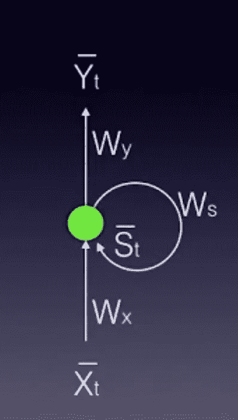
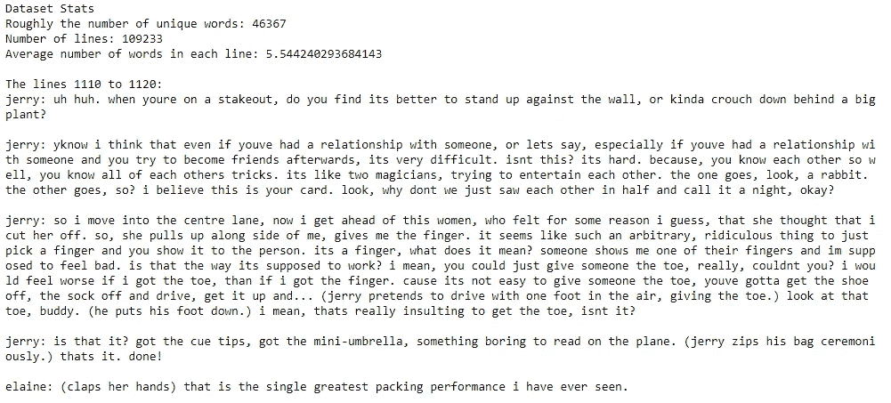
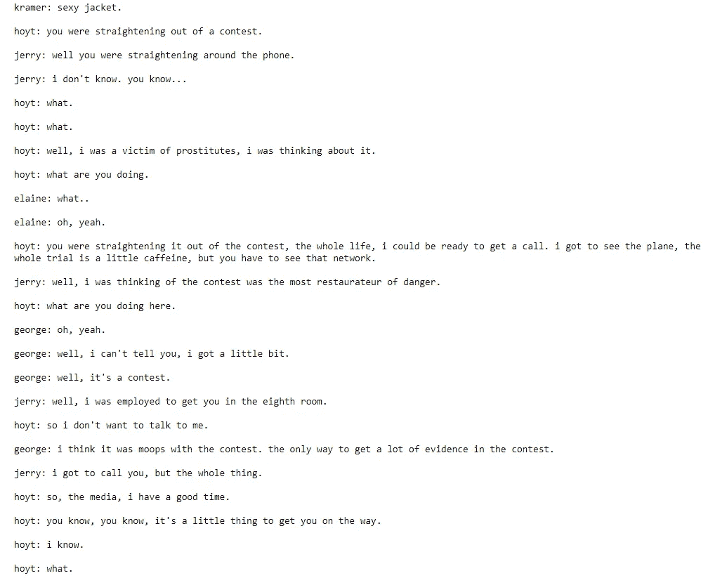

# PyTorch 深度学习纳米学位:递归神经网络

> 原文：<https://medium.datadriveninvestor.com/pytorch-deep-learning-nanodegree-recurrent-neural-networks-894fce63469b?source=collection_archive---------5----------------------->

纳米度的第四部分:CNN

[简介](https://medium.com/@artgor/pytorch-deep-learning-nanodegree-introduction-161817c22384?source=post_page---------------------------)

[神经网络](https://medium.com/@artgor/pytorch-deep-learning-nanodegree-neural-nerworks-cf44a852be59?source=post_page---------------------------)

[卷积神经网络](https://medium.com/datadriveninvestor/pytorch-deep-learning-nano-degree-convolutional-neural-networks-b92ee1969bb7)

*递归神经网络*

[生成性对抗网络](https://medium.com/@artgor/pytorch-deep-learning-nanodegree-generative-adversarial-networks-bc37e2b50a81)

[部署模型](https://medium.com/@artgor/pytorch-deep-learning-nanodegree-deploying-a-model-b2a7f0ac0685)

[这趟旅程的终点](https://medium.com/@artgor/pytorch-deep-learning-nanodegree-the-end-of-this-journey-5c1d6eeb0026)

# 一般

在这一课中，我们学习递归神经网络，尝试 word2vec，写注意和做许多其他事情。此外，我们将致力于第三个项目——生成电视脚本。

## 递归神经网络

在这节课中，我们将学习 RNN 的基础知识——递归神经网络。这种类型的神经网络有许多应用，其中之一是生成序列。它可以是文本序列或时间序列。这个小[程序](https://magenta.tensorflow.org/assets/sketch_rnn_demo/index.html)根据你的图纸画草图！

[RNN 简介](https://www.youtube.com/watch?v=AIQEqg6F38A)

[RNN 历史](https://www.youtube.com/watch?v=HbxAnYUfRnc)

[RNN 申请](https://www.youtube.com/watch?v=6JbTNARuKII)

[前馈神经网络-提醒](https://www.youtube.com/watch?v=_vrp2lZjXf0)

[第二部分提醒](https://www.youtube.com/watch?v=FfPjaGcZODc)

[RNN(甲部)](https://www.youtube.com/watch?v=ofbnDxGSUcg)

作为记忆输入的基本三层反馈神经网络称为 Elman 网络，如下图所示:


[RNN(b 部分)](https://www.youtube.com/watch?v=wsif3p5t7CI)



RNN folded model


RNN unfolded model

[RNN 展开模型](https://www.youtube.com/watch?v=xLIA_PTWXog)

[RNN——例子](https://www.youtube.com/watch?v=MDLk3fhpTx0)

[穿越时间的反向传播(第一部分)](https://www.youtube.com/watch?v=eE2L3-2wKac)

[时间反向传播(b 部分)](https://www.youtube.com/watch?v=bUU9BEQw0IA)

[时间反向传播(c 部分)](https://www.youtube.com/watch?v=uBy_eIJDD1M)

[RNN 总结](https://www.youtube.com/watch?v=nXP0oGGRrO8)

[RNN 到 LSTM](https://www.youtube.com/watch?v=MsqybcWmzGY)

## 长短期记忆网络(LSTM)

[RNN vs LSTM](https://www.youtube.com/watch?v=70MgF-IwAr8)

[LSTM 基础知识](https://www.youtube.com/watch?v=gjb68a4XsqE)

[LSTM 的建筑](https://www.youtube.com/watch?v=ycwthhdx8ws)

[学门](https://www.youtube.com/watch?v=aVHVI7ovbHY)

[遗忘之门](https://www.youtube.com/watch?v=iWxpfxLUPSU)

[记门](https://www.youtube.com/watch?v=0qlm86HaXuU)

[使用闸门](https://www.youtube.com/watch?v=5Ifolm1jTdY)

[把所有的放在一起](https://www.youtube.com/watch?v=IF8FlKW-Zo0)

[其他架构](https://www.youtube.com/watch?v=MsxFDuYlTuQ)

## RNN 和 LSTM 的实施

在这一课中，我们学习如何实现 RNN。我将跳过这一节。为什么？因为它对任何人都是免费的。Udacity 有一门免费课程:[神经网络入门](https://www.udacity.com/course/deep-learning-pytorch--ud188?source=post_page---------------------------)。本课程第 7 课包含了这一课，有兴趣的可以过一遍。

## 超参数

这是一个相当有趣的部分。这里我们看到了几个超参数的重要性以及如何为它们选择好的值。

[简介](https://www.youtube.com/watch?v=erwnzFD7AeE)

[学习率](https://www.youtube.com/watch?v=HLMjeDez7ps)

[小批量](https://www.youtube.com/watch?v=GrrO1NFxaW8)

[训练迭代次数/历元数](https://www.youtube.com/watch?v=TTdHpSb4DV8)

[隐藏单元/层数](https://www.youtube.com/watch?v=IkGAIQH5wH8)

[RNN 超参数](https://www.youtube.com/watch?v=yQvnv7l_aUo)

如果您想了解关于超参数的更多信息，以下是关于该主题的一些很好的资源:

*   [深度架构基于梯度训练的实用建议](https://arxiv.org/abs/1206.5533)yo shua beng io 著
*   [深度学习书籍—第 11.4 章:选择超参数](http://www.deeplearningbook.org/contents/guidelines.html)作者:伊恩·古德菲勒、约舒阿·本吉奥、亚伦·库维尔
*   [神经网络与深度学习一书——第三章:如何选择神经网络的超参数？迈克尔·尼尔森](http://neuralnetworksanddeeplearning.com/chap3.html#how_to_choose_a_neural_network's_hyper-parameters)
*   [Yann le Cun 的高效反向投影(pdf)](http://yann.lecun.com/exdb/publis/pdf/lecun-98b.pdf)

更专业的来源:

*   [如何生成好的文字嵌入？](https://arxiv.org/abs/1507.05523)梁思伟赖、、、徐、
*   由 Dmytro Mishkin、Nikolay Sergievskiy、Jiri Matas 对 CNN 在 ImageNet 上的进展进行系统评估
*   李菲菲贾斯廷·约翰逊 Andrej Karpathy 著[可视化和理解循环网络](https://arxiv.org/abs/1506.02078)

## 嵌入& Word2Vec

这是重要的一课。尽管目前像 BERTs 这样的大型网络越来越常用，但“普通的”rnn 仍然是有效的，因此值得学习如何使用它们。嵌入在他们的训练中起着关键的作用。

带练习和解答的笔记本在这里有:[https://github . com/uda city/deep-learning-v2-py torch/tree/master/word 2 vec-embedding](https://github.com/udacity/deep-learning-v2-pytorch/tree/master/word2vec-embeddings)

[单词嵌入](https://www.youtube.com/watch?v=ZsLhh1mly9k)

[嵌入权重矩阵/查找表](https://www.youtube.com/watch?v=KVCcG5v8fi0)

[数据&子采样](https://www.youtube.com/watch?v=7SJXv2BQzZA)

[子采样解决方案](https://www.youtube.com/watch?v=YXruURuFD7g)

[上下文单词目标](https://www.youtube.com/watch?v=DJN9MzD7ctY)

[配料数据，解决方案](https://www.youtube.com/watch?v=nu2rjLzt1HI)

[Word2Vec 型号](https://www.youtube.com/watch?v=7BEYWhym8lI)

[模型&验证](https://www.youtube.com/watch?v=GKDCq8J76tM)

[阴性采样](https://www.youtube.com/watch?v=gnCwdegYNsQ)

[SkipGramNeg，模型定义](https://www.youtube.com/watch?v=e7ZrzpyXNDs)

[完成模型&定制损耗](https://www.youtube.com/watch?v=7SqNN_eUAdc)

## 情绪预测 RNN

在本课中，我们将构建一个递归神经网络，它可以准确预测电影评论的情绪。我将跳过这一节。为什么？因为它对任何人都是免费的。Udacity 有一门免费课程:[神经网络介绍](https://www.udacity.com/course/deep-learning-pytorch--ud188?source=post_page---------------------------)。本课程第八课包含了这一课，有兴趣可以过一遍。

## 项目:生成电视脚本

这是本课程的第三个专题。在这个项目中，我们将尝试编写一个 RNN，它将生成电视脚本。这个项目的代码模板可以在这里找到:[https://github . com/uda city/deep-learning-v2-py torch/tree/master/project-TV-script-generation](https://github.com/udacity/deep-learning-v2-pytorch/tree/master/project-tv-script-generation)

**使用的数据**

我们将使用第九季电视剧《宋飞正传》的剧本。让我们来看看:



首先，如果我们想要使用单词嵌入，我们需要为所有单词创建唯一的 id:

```
def create_lookup_tables(text):
    """
    Create lookup tables for vocabulary
    :param text: The text of tv scripts split into words
    :return: A tuple of dicts (vocab_to_int, int_to_vocab)
    """
    counts = Counter(text)
    vocab = [i[0] for i in sorted(counts.items(), key=lambda x: x[1], reverse=True)]

    vocab_to_int = {word: i for i, word in enumerate(vocab)}
    int_to_vocab = {v:k for k, v in vocab_to_int.items()}
    return (vocab_to_int, int_to_vocab)
```

然后我们编写一个函数，将标点符号转换成记号:

```
def token_lookup():
    """
    Generate a dict to turn punctuation into a token.
    :return: Tokenized dictionary where the key is the punctuation and the value is the token
    """
    # TODO: Implement Function
    return {'.':  '||period||',
        ',':  '||comma||',
        '"':  '||quotation_mark||',
        ';':  '||semicolon||',
        '!':  '||exclamation_mark||',
        '?':  '||period||',
        '(':  '||left_parenthesis||',
        ')':  '||right_parenthesis||',
        '-': '||double_hyphen||',
        '\n': '||newline||'}
```

之后，我们编写一个定制的数据加载器，它将生成批量数据:

```
def batch_data(words, sequence_length, batch_size):
    """
    Batch the neural network data using DataLoader
    :param words: The word ids of the TV scripts
    :param sequence_length: The sequence length of each batch
    :param batch_size: The size of each batch; the number of sequences in a batch
    :return: DataLoader with batched data
    """
    # TODO: Implement function
    n_batches = len(words) // batch_size
    # full batches
    words = words[:n_batches * batch_size]

    features = []
    targets = []for idx in range(0, len(words) - sequence_length):
        features.append(words[idx: idx + sequence_length])
        targets.append(words[idx + sequence_length])   

    features = np.asarray(features)
    targets = np.asarray(targets)

    data = TensorDataset(torch.from_numpy(features), torch.from_numpy(targets))
    data_loader = torch.utils.data.DataLoader(data, shuffle=False, batch_size = batch_size)

    # return a dataloader
    return data_loader
```

最后我们建造了一个简单的 LSTM:

```
class RNN(nn.Module):

    def __init__(self, vocab_size, output_size, embedding_dim, hidden_dim, n_layers, dropout=0.5):
        """
        Initialize the PyTorch RNN Module
        :param vocab_size: The number of input dimensions of the neural network (the size of the vocabulary)
        :param output_size: The number of output dimensions of the neural network
        :param embedding_dim: The size of embeddings, should you choose to use them        
        :param hidden_dim: The size of the hidden layer outputs
        :param dropout: dropout to add in between LSTM/GRU layers
        """
        super(RNN, self).__init__()
        # TODO: Implement function

        # set class variables

        # define model layers
        self.vocab_size = vocab_size
        self.output_size = output_size
        self.embedding_dim = embedding_dim
        self.hidden_dim = hidden_dim
        self.n_layers = n_layers

        self.embedding = nn.Embedding(self.vocab_size, self.embedding_dim)
        self.lstm = nn.LSTM(self.embedding_dim, self.hidden_dim, self.n_layers, dropout=dropout, batch_first=True)
        self.linear = nn.Linear(self.hidden_dim, self.output_size)

    def forward(self, nn_input, hidden):
        """
        Forward propagation of the neural network
        :param nn_input: The input to the neural network
        :param hidden: The hidden state        
        :return: Two Tensors, the output of the neural network and the latest hidden state
        """
        bs = nn_input.size(0)
        embedding = self.embedding(nn_input.long())

        lstm, h = self.lstm(embedding, hidden)
        lstm = lstm.contiguous().view(-1, self.hidden_dim)

        output = self.linear(lstm)
        output = output.view(bs, -1, self.output_size)[:, -1]return output, h

    def init_hidden(self, batch_size):
        '''
        Initialize the hidden state of an LSTM/GRU
        :param batch_size: The batch_size of the hidden state
        :return: hidden state of dims (n_layers, batch_size, hidden_dim)
        '''
        weight = next(self.parameters()).data

        if (train_on_gpu):
            hidden = (weight.new(self.n_layers, batch_size, self.hidden_dim).zero_().cuda(),
                  weight.new(self.n_layers, batch_size, self.hidden_dim).zero_().cuda())
        else:
            hidden = (weight.new(self.n_layers, batch_size, self.hidden_dim).zero_(),
                      weight.new(self.n_layers, batch_size, self.hidden_dim).zero_())

        return hidden
```

这是我的模型生成的脚本示例:



## 注意力

下面是有练习和解答的笔记本:[https://github . com/uda city/deep-learning-v2-py torch/tree/master/attention](https://github.com/udacity/deep-learning-v2-pytorch/tree/master/attention)

[介绍注意事项](https://www.youtube.com/watch?v=NCn97L5WbCY)

[顺序对顺序型号](https://www.youtube.com/watch?v=tDJBDwriJYQ)

[第二部分](https://www.youtube.com/watch?v=dkHdEAJnV_w)

编码器和解码器不必是 RNNs 他们也可以是 CNN！

在计算机视觉中，我们可以使用这种编码器-解码器模型来为输入图像生成文字或字幕，甚至从一系列输入文字中生成图像。我们将关注第一种情况:为图像生成标题，在下一课中，您将了解更多关于标题生成的内容。现在，我们知道可以将一幅图像输入到 CNN(编码器)中，并使用 LSTM(解码器)为该图像生成描述性的标题。

[序列到序列摘要](https://www.youtube.com/watch?v=MRPHIPR0pGE)

[编码—注意概述](https://www.youtube.com/watch?v=IctAnMaVUKc)

[解码—注意概述](https://www.youtube.com/watch?v=DJxiPd585GY)

[注意编码器](https://www.youtube.com/watch?v=sphe9LDT4rA)

[注意力解码器](https://www.youtube.com/watch?v=5mMz6nN9_Ss)

[Bahdanau 和 Luong 注意了](https://www.youtube.com/watch?v=2eqIUDjefNg)

[倍增的注意力](https://www.youtube.com/watch?v=1-OwCgrx1eQ)

[添加剂注意事项](https://www.youtube.com/watch?v=93VfVWZ-IvY)

[计算机视觉应用](https://www.youtube.com/watch?v=bhWwc4BYTYc)

[其他注意方法](https://www.youtube.com/watch?v=VmsR9FVpQiM)

[变压器和自我关注](https://www.youtube.com/watch?v=F-XN72bQiMQ)

这是深度学习纳米学位的第三部分。我们学习了如何写 RNN，并使用它们完成各种任务。下一部分将是关于生成性对抗网络！