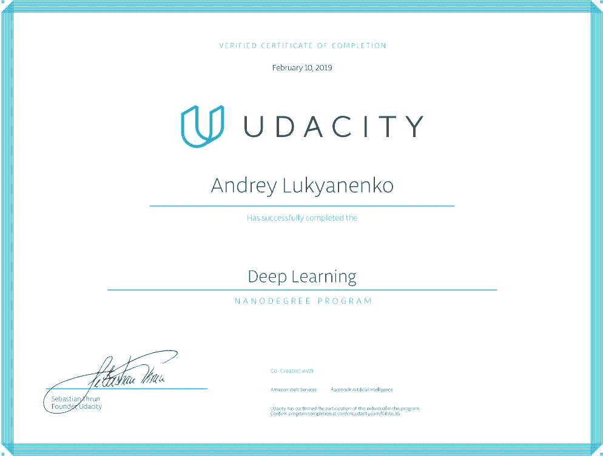

# PyTorch 深度学习纳米学位:这一旅程的终点

> 原文：<https://medium.datadriveninvestor.com/pytorch-deep-learning-nanodegree-the-end-of-this-journey-5c1d6eeb0026?source=collection_archive---------8----------------------->

新的旅程开始了…

[简介](https://medium.com/@artgor/pytorch-deep-learning-nanodegree-introduction-161817c22384?source=post_page---------------------------)

[神经网络](https://medium.com/@artgor/pytorch-deep-learning-nanodegree-neural-nerworks-cf44a852be59?source=post_page---------------------------)

[卷积神经网络](https://medium.com/datadriveninvestor/pytorch-deep-learning-nano-degree-convolutional-neural-networks-b92ee1969bb7)

[递归神经网络](https://medium.com/@artgor/pytorch-deep-learning-nanodegree-recurrent-neural-networks-894fce63469b)

[生成性对抗网络](https://medium.com/@artgor/pytorch-deep-learning-nanodegree-generative-adversarial-networks-bc37e2b50a81)

*这趟旅程的终点*

## 自我反省

正如我在本系列的第一篇文章中所写的，由于成功完成 PyTorch 奖学金挑战，我得以学习 DL Nanodegree。我已经完成了几门 DL 课程，所以我可以将它们与这个纳米学位进行比较。如果我们谈论理论，那么我知道课程中的大部分内容，不包括 GANs 和模型部署。尽管如此，我还是学到了一些新东西，得到了很多实践。这帮助我提高了 PyTorch 技能并结识了新朋友。另一方面，这完全归功于免费奖学金。知道了这门课的内容，我不确定我会自己支付纳米学位的费用——这个价格太高了。也许如果我能说服我的公司支付这门课程的费用，那就没问题了，但是这对于自学来说太多了，因为周围有很多其他很棒的课程。

## 奖励部分:职业帮助

Nanodegree 最酷的事情之一是进入职业门户。我们可以阅读很多信息，尽管我认为这些文章中的大部分都可以免费获取。更重要的是:我们对简历、github 和 linkedin 有 1 次免费评论。
每个案例都有一系列短片，展示主要观点，然后我们可以提交材料。这三件事都有我们应该完成的部分。反馈显示了这些部分及其实现情况的评论。我不确定我能否分享这一部分的所有信息，因为从技术上讲，这不是纳米学位的一部分，而是独立的，但我会提供一些我觉得有趣的提示。

**Github 评论**

对我来说最简短也最有争议的是 Github review。我们可以提交一个存储库，但我们会得到回购和配置文件的反馈。“良好回购的要求”之一是至少每两周提交一次。不确定这是否真的有必要。另外，为作品集写一个自述文件——不确定这是否相关
添加简历是个好主意，我应该自己写。总的来说，用联系信息和合适的头像图片来展示个人资料是值得的。
在提交中写好消息……当然，这很重要，但是你知道这是怎么回事；)

**领英**

视频的主要意思是:你需要写一份好的总结来推销自己，你需要努力拓展人脉，寻找机会。
据说，至少要加入 3 个与求职相关的小组才能看到更多的机会，与相关人员联系，还要关注至少 12 个行业领袖、公司以及与他们的求职相关的话题。不同意这个
据说还不如用要点来描述所有的工作和项目那种简单的文字。是的，我认为这是对的。关于工作的信息应该包括完成的项目和取得的成功的具体信息。

**简历**

它应该看起来很专业:一种风格，如果你有不到 10 年的工作经验，一页，PDF 格式，内容的良好顺序:标题，经验和教育，项目和技能。

应该包含相关的技能，所以不要添加你很久以前学过的不再使用的技能。

项目和经历描述应该包含关于工作细节和成就的简明信息。

这是一次奇妙的旅程，它的发生要感谢很多人。我想感谢优达城和脸书给我机会研究纳米学位。我想感谢我们的社区经理和所有其他来自 Udacity 的人，他们在这个旅程中指导了我们。我想对参与这些活动的人们表示感谢。我想对我在纳米学位工作中遇到的所有人说声谢谢。

“时间之轮没有起点也没有终点。但这是一个开始”