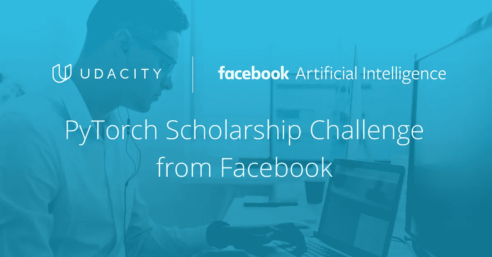
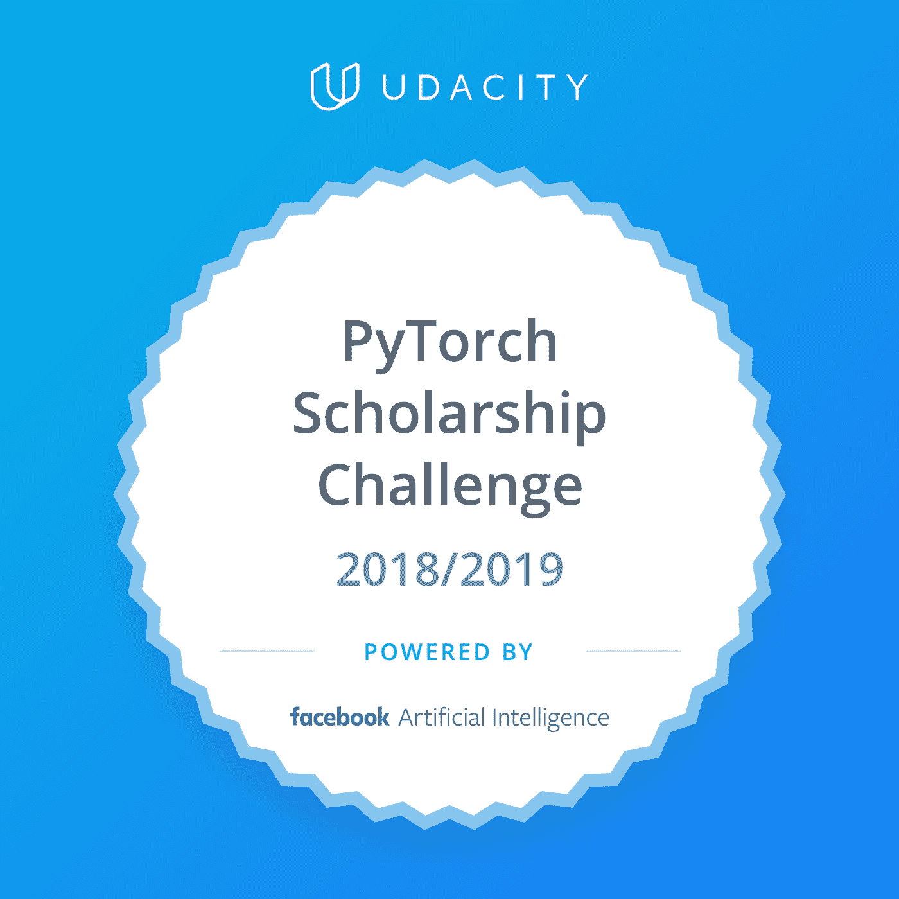
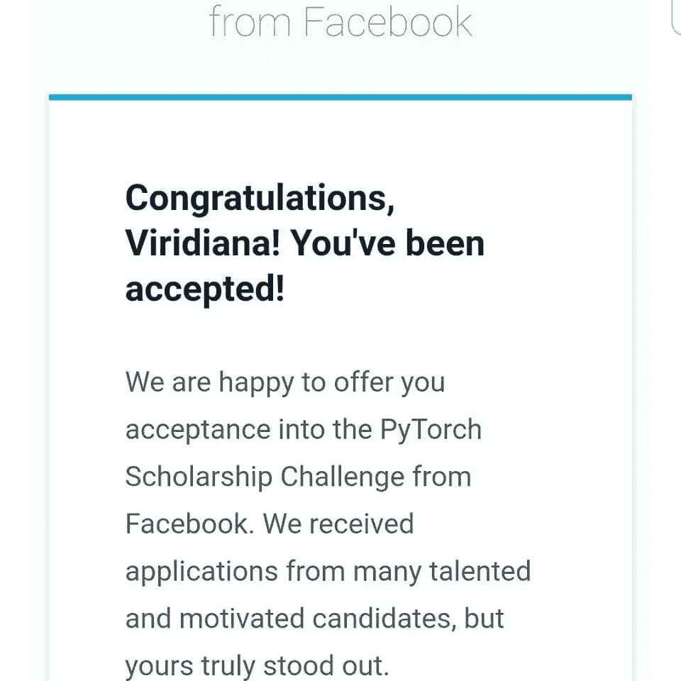

# 来自脸书的 PyTorch 奖学金挑战:我加入！

> 原文：<https://medium.datadriveninvestor.com/pytorch-scholarship-challenge-from-facebook-im-in-c9491e850b6b?source=collection_archive---------7----------------------->

去年 10 月 3 日，我收到了一封来自 Udacity 的电子邮件，邀请我申请*“来自脸书的 PyTorch 奖学金挑战”*。我不知道 Pytorch 和这个奖学金是关于什么的，但当我读到项目描述时，我真的很兴奋！

# **这个节目是关于深度学习的！**

如今，深度学习正在推动人工智能的进步，这些进步正在改变我们的世界。在这个项目中，您将有机会构建并应用自己的深度神经网络来应对图像分类和生成、时间序列预测和模型部署等挑战。

学生将用 2 个月的时间用 PyTorch 构建强大的深度学习模型。来自初始挑战课程的顶尖学生将被选中参加深度学习纳米学位计划。

令我惊讶的是，昨天，我收到了一封电子邮件，通知我被接受参加这次挑战！

我很高兴，因为在过去的两个月里，我一直在学习机器学习、人工智能，并尝试使用 Python 库，与对相同热情感兴趣的人联系真的很棒。我很感激有这个机会。

# **这个节目是关于什么的，为什么我这么兴奋？**

这个计划将涵盖卷积和递归神经网络，生成对抗网络，部署，等等。您将使用 PyTorch，并访问 GPU 来更快地训练模型。你将从巴斯蒂安·特龙、伊恩·古德菲勒、朱俊彦和安德鲁·柴斯克等权威那里学到东西。

你将掌握深度学习的基础知识，这将为你开创或推进职业生涯做好准备，此外还可以在人工智能领域进一步深造。

# **独特的项目，个性化的反馈**

没有什么比从真实的项目中学习更好的了。你将有机会参与五个特别设计的深度学习项目，并从导师那里获得每个项目的详细反馈。

# **涵盖什么样的项目？**

*   预测自行车共享模式
*   犬种分类器
*   生成电视脚本
*   生成面
*   部署情感分析模型

**项目 1:预测自行车共享模式**

学习神经网络基础知识，用 Python 和 NumPy 构建您的第一个网络。您将定义和训练一个多层神经网络，并使用它来分析真实数据。在这个项目中，您将从头开始构建和训练神经网络，以预测某一天自行车共享用户的数量。

**项目 2:犬种分类器**

在这个项目中，您将定义一个卷积神经网络，当被赋予任务:识别狗的品种时，它的表现优于普通人。给定一张狗的图像，你的算法将产生狗的品种的估计。如果提供了一个人的图像，该代码还将*产生一个最相似的狗品种的估计。在探索最先进的 CNN 分类模型的同时，你将对你的应用程序的用户体验做出重要的设计决策。

**项目 3:生成电视脚本**

在这个项目中，你将使用 PyTorch 建立自己的循环网络和长短期记忆网络。您将执行情感分析并生成新文本，并使用递归网络生成类似于电视脚本训练集的新文本。

**项目 4:生成人脸**

与该模型的发明者 Ian Goodfellow 一起学习理解生成性对抗网络。然后，应用您在这个项目中学到的知识，实现一个深度卷积 GAN。这个 DCGAN 由一对多层神经网络组成，它们相互竞争，直到其中一个学会生成逼真的人脸图像。

**项目 5:部署情感分析模型**

在这个项目中，您将在 AWS 上使用 Amazon SageMaker 训练和部署您自己的 PyTorch 情绪分析模型。这个模型将被训练来对电影评论(正面或负面评论)进行情感分析。您将构建模型，部署它，并创建一个从网站访问该模型的网关

# 我已经准备好开始这次冒险了！还有谁得到了这个机会？我们连线吧！

# 相关帖子:

 [## 你需要明白一件事

### 让我解释一下…

medium.com](https://medium.com/datadriveninvestor/uncertainty-now-you-can-handle-it-2e80cefe7e18)