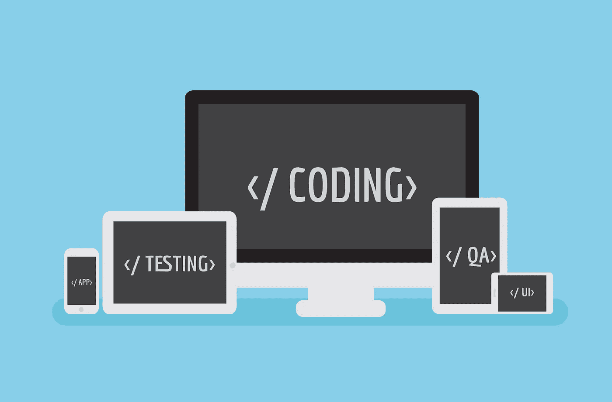

# 软件测试中的质量保证流程

> 原文：<https://medium.datadriveninvestor.com/qa-process-flow-in-software-testing-7e31a3000273?source=collection_archive---------28----------------------->

作为一名质量保证专家并不容易。在发布之前，软件必须经历许多 QA 过程和阶段。此外，让我们记住 QA 测试人员的工作不会在产品发布后结束。即使在发布之后，代码中仍然会发现错误、故障和缺陷，他们必须测试修复和更新，以确保一切正常工作。下面是 QA 测试过程的一些步骤。

# 软件测试中的质量保证过程

以下是典型的 QA 工作流程，以确保一切顺利进行:

1.  **需求—** 在开始 QA 流程之前，确保您有明确的需求。所有的想法都需要以每个人都能理解的格式清晰地写下来。如果您是需求收集过程的参与者，请认为自己是幸运的，因为您可以见证一个项目是如何从零开始创建的。
2.  **测试策略—** 这里的目标是找到更好地测试软件的方法，但是，更重要的是，它应该让你的股东和投资者对你即将发布的产品充满信心。创建一个质量测试策略是至关重要的，因为一旦实施，就很难改变。因此，一定要再次检查需求文档，挑出目标软件环境中最重要的方面。“环境”可以定义为某个操作系统或移动设备。这一阶段的目标是收集应用程序正常运行所需的所有必要设备、平台和软件，以确保能够形成适当的测试策略。
3.  **测试计划—** 现在是时候实施您想出的策略了。请记住，被测试软件的成功将取决于测试进行得有多好，所以一定不要遗漏任何细节。为了确保软件可以在所有平台上测试，创建一个所有环境的矩阵。如果你有你的软件将要使用的所有可能的平台变体，那么你的设置已经准备好了。
4.  **测试—** 现在，当应用程序构建完成后，您就可以开始寻找 bug 了。这是一个非常困难的过程，容易出错，因此，试着用一个全新的视角来看待你正在测试的软件，而不是浏览所有的测试用例。稍后，您将浏览测试用例。跟随软件的导航路径，尽可能熟悉软件。现在是时候检查一些测试用例，并将您的发现与测试用例中提到的那些匹配起来。一定要记下每一个偏差，即使看起来不重要。
5.  **预发布—** 为了确保最高的产品质量，请严格测试软件的以下参数:

*   可量测性
*   表演
*   功能
*   平台兼容性

预测一个应用程序的成功是很困难的，因为成功将依赖于许多测试迭代，但是要确保所有的特性都经过测试。在发布前制作一个所有测试结果的图表，这将让你了解产品在发布前有多稳定。在大多数情况下，QA 流程和程序发生在时间紧张的时候，通常没有太多的时间从最终用户的角度向其他团队成员提供反馈，但这种反馈是极其重要的。

6.**发布—**QA 团队负责发布，它需要一个非常有组织的工作流程。因此，不要在发布当天就开始起草发布文档，总是要提前计划所有的发布活动。这个发布文档应该包括你对软件的所有期望，应该包括所有的需求及其版本。如果存在未解决的缺陷，将它们包含在文档中，不要试图找出受影响最大的区域。

由于每个产品都是独一无二的，都有自己的一套特性，其他质量保证策略将包括一些额外的步骤，以确保所有的特性都经过测试。

# 软件测试员的工作

QA 测试人员的工作充满了挑战，但是如果你喜欢做一些起初看起来混乱的事情，并且将所有事情组织成质量保证步骤，那会很有趣。如果你是面向过程的，那么这份工作可能非常适合你，因为提供[定制软件开发帮助](https://skywell.software/)意味着将大型项目分成几个阶段，每个阶段都有自己独特的目标。

由于每个软件测试人员都肩负着软件质量的重任，您必须确保所有的过程都符合最佳实践过程。当所有的测试结束后，这将会带来巨大的回报。请记住，手动测试是非常耗时的，并且总是会包含一些人为错误。如果您公司的预算允许，一些测试将被自动化，以提供更具预测性的结果，节省时间并在相当长的时间内运行测试用例。话虽如此，QA 测试是一个令人兴奋且不断发展的领域，考虑到当今软件发布的速度，QA 测试人员在未来将会有更高的需求。

*最初发布于*[*sky well . software*](https://skywell.software/blog/qa-process-flow-in-software-testing/)*。*