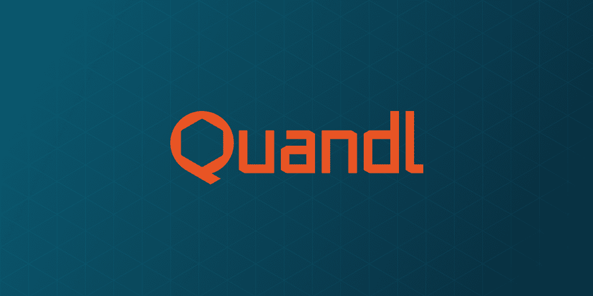

# Quandl 和另类数据革命

> 原文：<https://medium.datadriveninvestor.com/quandl-and-the-alternative-data-revolution-c4d2bf31d648?source=collection_archive---------0----------------------->

Alpha 作为衡量基金界积极管理技能的指标，衡量基金经理战胜市场的能力。除了技能之外，它在很大程度上还与经理使用的信息来源有关，如市场新闻、股票观点、市场预测、投资策略、收益报告、成绩单和档案。

但由于大数据的爆炸，一个全新的可能性世界正在为阿尔法一代打开。

根据摩根大通 2017 年 5 月的综合论文“大数据和人工智能战略——机器学习和替代数据投资方法”，仅在此前两年，全球就有约 90%的数据被创建。这是一个惊人的数据！

似乎事情只会越来越热。事实上，该报告还预测，数字世界中积累的数据总量将在未来几年内爆炸式增长，从 2015 年末的 4.4 吉字节(或万亿吉字节)增长到 2020 年的约 44 吉字节。

有了这些令人难以置信的数字，可以说我们正在经历一场数据革命。这场革命的核心是*替代数据集*的可用性。

替代数据集中的“替代”可以有效地指任何被认为是非市场数据的东西。无论是跟踪石油运输的卫星信息、农产品的天气数据，还是反映公司服务表现的客户反馈，替代数据都在关键程度上帮助其用户获得“信息优势”，最终使他们在创造 alpha 方面处于优势。

*但是人们从哪里获得这样的数据呢？*

这就是像 [Quandl](https://www.quandl.com/) 这样的公司的用武之地。Quandl 成立于 2012 年，现在是替代数据的领先提供商，除了传统的金融和经济数据外，它还向全球超过 250，000 名用户提供替代数据。这些用户目前每天总共下载多达 1000 万个 Quandl 数据集。

# “替代数据是未开发的 Alpha”

通常，Quandl 要么通过与特定的“领域专家”合作，要么通过自己的研究成果来获得这样的数据集。然后，它评估每个数据集的“预测能力、可靠性和合规性”，只有最好的数据集才会被添加到平台中。最后，这些被选中的数据集被准备出售给客户。

如今，Quandl 可以自豪地说，在这些客户中，全球 10 大量化基金中有 7 家，15 大投行中有 14 家，这些客户可以在各种交易策略中利用替代数据，如统计套利和全球宏观交易。

Quandl 采购行动的一个例子可以在[最近与领先的汽车保险提供商](https://www.bloomberg.com/press-releases/2018-03-27/quandl-launches-exclusive-tesla-demographics-dataset)建立的合作伙伴关系中找到，这使该公司能够编制数据集，使投资者能够实时跟踪特斯拉每周的销售情况，以及特斯拉买家的人口统计数据。根据 Quandl 首席执行官 Tammer Kamel 的说法，“投资者吵着要知道特斯拉是否会达到他们的生产目标…我们与汽车保险提供商的独家合作关系为这个问题提供了答案。我们希望我们的客户第一个知道特斯拉是否正在实现其目标。”

今年 4 月，Quandl 与众多机构合作，推出了自己的企业航空情报(CAI)平台，为投资者提供企业飞机航班信息。这些数据涵盖了全球数万架私人飞机，进而使客户能够根据旅行目的地，判断企业可能开展的商业活动，如并购、企业投资、合作和扩张。

事实证明，这些数据对投资者至关重要，他们现在能够获得投资优势。例如，能源公司阿帕奇公司(Apache Corp .)去年启动的一个钻探项目失败的迹象，通过 Quandl 设法获得并出售给投资者的无线电信号数据得到了证实。正如[在《金融邮报》上解释的](http://business.financialpost.com/technology/its-beautiful-this-toronto-startup-is-investors-secret-weapon-to-beating-the-market)，“购买了 Quandl 数据的投资者能够比其他人提前 10 天发现这一点，这让他们能够在众人之前卖出或做空股票。从 4 月 12 日到 4 月 24 日，阿帕奇的股价表现比标准普尔大宗商品生产商石油天然气勘探生产指数差 4.3%。

正如[和 Quandl 自己](https://www.quandl.com/alternative-data)所承认的，“这十年投资者最大的机会来自数字经济产生的数据中隐藏的信号。替代数据是当今世界上最深层、最少被利用的阿尔法来源。”卡梅尔先生称这些数据为“原始的阿尔法来源，知道一些市场不知道的事情。这太棒了……如果你能带着真正的信息优势找到他们，让他们知道市场上同行不知道的可交易的东西，那就非常有价值。”

# 有用的用户工具

Quandl 最吸引人的特性之一是丰富的工具，可供用户进行详细的数据分析，并且与主要的编程语言兼容:

1.  金融数据——Quandl 还提供传统的市场数据集，其中许多是免费的，而其他的则需要订阅。这些数据包括股票价格历史、商品数据、区域市场数据和更多的数据。
2.  Excel 加载项-这个免费的加载项允许您将 Quandl 数据集直接拖入 Excel 电子表格。该公司的 [YouTube 频道](https://www.youtube.com/channel/UCf9vL-a2e0OOuS0FVOCpqyQ)提供了有用的视频指南，更详细地介绍了这项功能是如何工作的。
3.  Python——你可以使用 Quandl 的 [Python API](https://www.quandl.com/tools/python) 获取数据。你必须注册才能获得 API 密匙，这样你就可以访问所有免费的数据集。
4.  R—[Quandl R 包](https://www.quandl.com/tools/r)可以免费使用，并允许从数百个出版商那里直接访问 R 中的所有免费数据集。同样，需要注册才能获得 API 密钥。

Quandl 不是唯一一家提供替代数据的公司。相反，一大批公司现在已经进入这个不断扩大的市场，如 [RS Metrics](https://rsmetrics.com/) ，而[一个繁荣的社区](https://alternativedata.org/)也已经出现，由致力于支持替代数据可用性的机构投资者和数据提供商组成。该社区目前正在运营的替代数据提供商的庞大数据库凸显了这一领域的扩张速度。

当然，不能保证替代数据对用户总是有用的。然而，捕捉曾经隐藏在众目睽睽之下的数据，意味着基金经理现在有机会为阿尔法一代开发全新类型的投入。这将强烈暗示一个新的时代即将来临。

*原载于 2018 年 7 月 30 日*[*www.datadriveninvestor.com*](http://www.datadriveninvestor.com/2018/07/30/quandl-and-the-alternative-data-revolution/)*。*