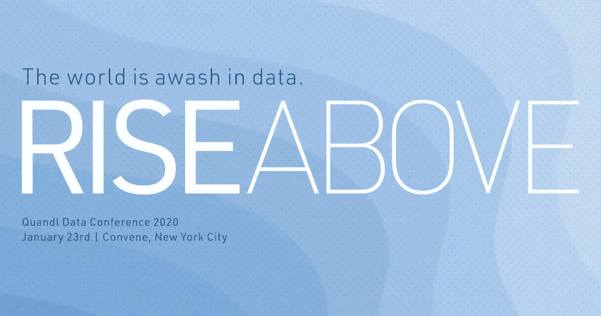
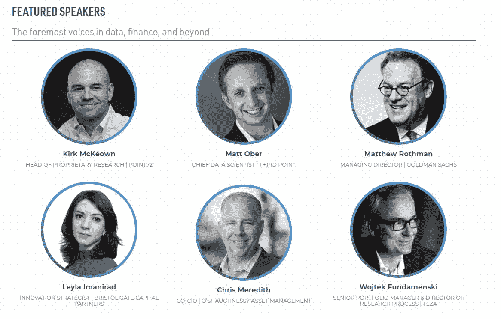

# Quandl 数据大会 2020 演讲嘉宾名单公布

> 原文：<https://medium.datadriveninvestor.com/quandl-data-conference-2020-speaker-list-announced-1f6e72c4cfb3?source=collection_archive---------8----------------------->

领先的替代数据提供商纳斯达克的 Quandl 于 2020 年 1 月 23 日(星期四)在纽约市第 46 届会议上宣布了第四届 Quandl 年度数据大会(QDC 2020)。

特色演讲者包括

*   Point72 的专有研究主管柯克·麦克欧文(Kirk McKeown)；
*   马修·罗斯曼，高盛董事总经理；
*   O'Shaughnessy 资产管理公司首席投资官克里斯·梅雷迪思(Chris Meredith)；
*   以及 Showtime 的《亿万》执行制片人、《十三罗汉》的联合编剧布赖恩·科佩尔曼的主题演讲

点击 [**这里**](http://bit.ly/34s6Gfz) 了解更多关于 QDC2020 的信息。

经过七个小时的编程和三个小时的网络交流，为期一天的活动将见证 alt data 和数据科学先驱们汇聚到当今行业面临的关键痛点:如何在现有的大量数据中识别产生利润的信息。

QDC 2020 的会议将探索:

*   当前用于加速和扩展数据评估的工具、技术和流程
*   更好地利用非市场数据的新一波投资策略
*   数据驱动的投资和推动资本市场的更广泛趋势之间的关系

> *“这十年投资者最大的机会是找到隐藏在数字经济产生的海量数据中的信号”*
> 
> “四年前，我们发起了 Quandl 数据会议，旨在向行业宣传替代数据的可行性，该会议已成为该领域最重要的活动。今年，我们很高兴围绕每个人心中的关键挑战再次召开会议:如何管理几乎无法下咽的数据盛宴。”
> 
> Quandl 的首席执行官 Tammer Kamel

其他演讲者和完整议程将在会议召开前几周公布。

报名详情和早鸟票定价(截止 2019 年 11 月 27 日)可在[此处](http://bit.ly/34s6Gfz)找到。

**关于 Quandl:**

纳斯达克的 Quandl 是金融专业人士替代数据的最大提供商和先驱。该公司寻找、评估和生产未发现的数据资产，将其转化为量化的、可操作的情报，供特定机构客户使用。Quandl 的客户群包括世界顶级的对冲基金、资产管理公司和投资银行，为全球超过 400，000 名分析师提供金融、经济和替代数据。Quandl 于 2012 年由 Tammer Kamel 和 Abraham Thomas 创立，部分原因是他们对有限的数据和原始的交付系统感到失望。Quandl 于 2018 年成为纳斯达克的一部分。在 www.quandl.com 了解更多信息，访问我们的 Quandl 博客，在 Twitter @quandl 上关注我们。

**关于纳斯达克:**

纳斯达克(Nasdaq: NDAQ)是一家服务于资本市场和其他行业的全球性科技公司。我们提供多样化的数据、分析、软件和服务，使客户能够满怀信心地优化和执行他们的业务愿景。要了解更多关于公司、技术解决方案和职业机会的信息，请访问我们的 LinkedIn(领英)、Twitter(T2)【纳斯达克】或 www.nasdaq.com。

*原载于 2019 年 11 月 20 日*[*https://www.businesswire.com*](https://www.businesswire.com/news/home/20191120005181/en/Quandl-Data-Conference-2020-Speaker-List-Announced)*。*