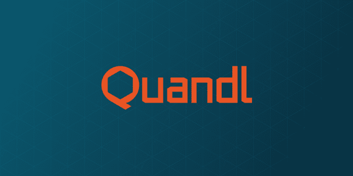

# [QUANDL 网络研讨会]

> 原文：<https://medium.datadriveninvestor.com/quandl-webinar-250c83610fea?source=collection_archive---------16----------------------->

# 外汇交易数据:卖方应用|数据驱动的投资者

对机构投资者和个人投资者而言，外汇市场是最具挑战性但回报丰厚的市场机会之一。

随着算法和应用的进步，给投资者带来最佳竞争优势的是当今高度复杂的货币市场的质量、粒度和及时性。

[***参加我们***](https://www.datadriveninvestor.com/webinar/quandl/) *在* ***Quandl 的网上外汇交易数据研讨会:卖方应用***

Quandl 首席数据官兼联合创始人 Abraham Thomas 将与 CLS 合作，让我们深入了解 CLS 数据如何提供外汇市场中大多数其他应用程序和数据源所不具备的洞察力。

*   如何近乎实时地衡量当前的流动性；
*   了解你相对于竞争对手的市场份额；
*   知道谁在交易什么；银行、基金、企业和非银行金融机构。

我在外汇市场工作了很长一段时间，我相信从其深度和智能的角度来看，访问上述数据将极大地提高您的战略发展能力和绩效。这将有利于对在这些市场制定策略感兴趣的基金经理、定量分析师和数据科学家。

CLS 外汇交易量数据的一些背景也可在[这里](https://www.quandl.com/databases/CLSRV/documentation)获得。

*原载于 2019 年 9 月 30 日*[*https://www.datadriveninvestor.com*](https://www.datadriveninvestor.com/2019/09/30/quandl-webinar/)*。*