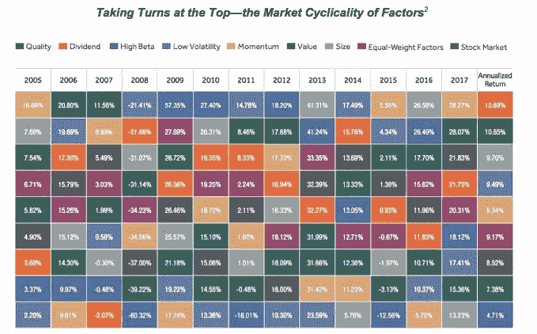
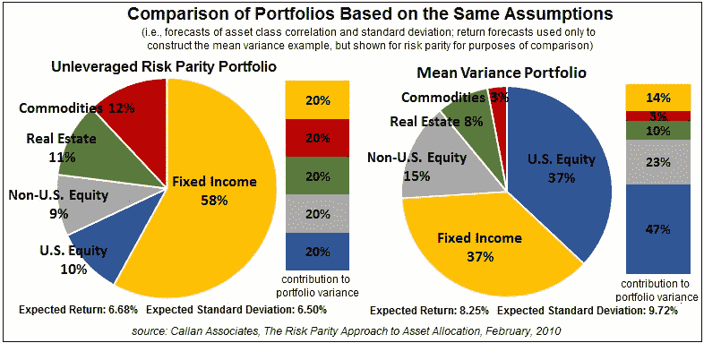
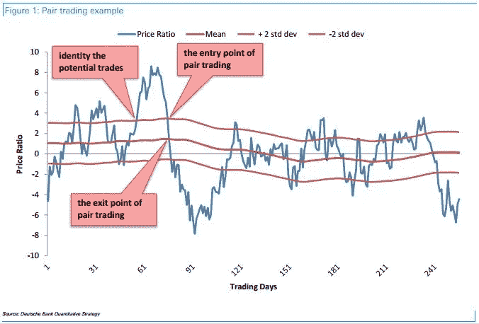
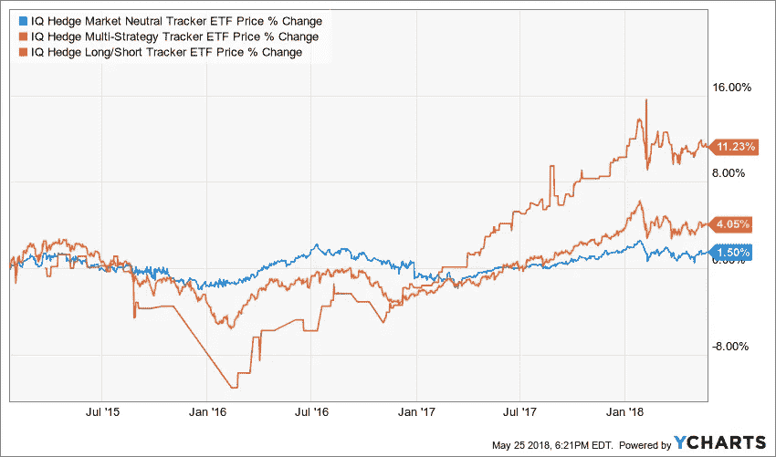
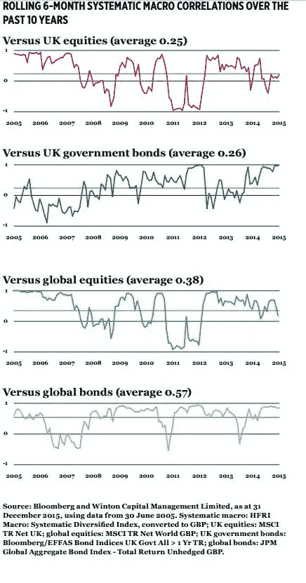
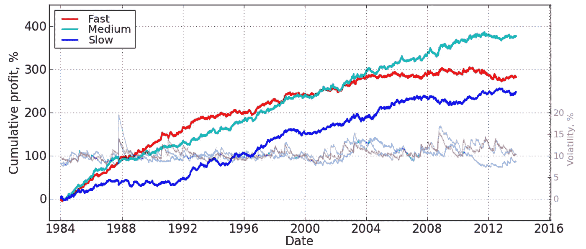

# 量化投资策略——概述

> 原文：<https://medium.datadriveninvestor.com/quantamental-investment-strategies-an-overview-ab3055c62fb1?source=collection_archive---------2----------------------->

*量化策略将统计思维与大数据相结合，以“*思考快与慢”*，增强产生 alpha 的能力。*

投资是关于阿尔法的大小和方向，以及其一致性。Alpha 获取市场因素敞口和/或风险因素敏感度预先确定的投资组合或策略的超额回报。Alpha 建立在学术工作的基础上，最初从相对简单的角度分析了世界，即[线性回归](http://mathworld.wolfram.com/LinearRegression.html)和[均值方差优化](http://chrome-extension://oemmndcbldboiebfnladdacbdfmadadm/http://www.columbia.edu/~mh2078/FoundationsFE/MeanVariance-CAPM.pdf)的联合解释力。随着时间的推移，这种方法扩展到了多因素模型、被动投资和智能测试，当然，还有一些很酷的量化策略。

各种策略使用来自各种来源的信息——基本面数据、价格和其他数据以及替代数据——来“违反”有效市场假说的规则。这些“违规”通常只是几分之一秒的微小优势，可以被识别和持续使用。

 [## 描述性统计与推断性统计。有什么区别？-数据驱动型投资者

### 想象一下。你拥有一家餐馆，想知道人们对你的生意有什么看法。所以，你给一个…

www.datadriveninvestor.com](https://www.datadriveninvestor.com/2019/02/28/descriptive-vs-inferential-statistics-whats-the-difference/) 

# 投资策略概述

概述侧重于以下战略，按字母顺序排列:

1.  事件驱动套利
2.  要素投资
3.  风险平价
4.  统计套利
5.  系统宏观
6.  系统趋势跟踪(“动量”)

字母顺序有一个优点——不是从最流行的到最不流行的，也不是从最复杂的到最不复杂的——允许进行更直观的探索。它还揭示了量化策略关注两个核心概念:套利和系统结构化统计分析。

## 1.事件驱动套利

该策略侧重于利用盈利公告、分析师(盈利或价格预期)修正、合并传闻、股票回购、破产和其他基于公开可用信息、非公开重大信息(又称[内幕交易)](https://www.investor.gov/additional-resources/general-resources/glossary/insider-trading)或其组合[马赛克理论](https://corporatefinanceinstitute.com/resources/knowledge/finance/mosaic-theory/)的未来可能发生的公司事件之前或之后的潜在错误定价。该战略需要高质量的信息和分析，以了解可能发生的事件并量化其影响。

Image source © [www.softquant.com](http://www.softquant.com)

从散户投资者的角度来看，这只不过是在预期收益增加的情况下，在收益公布前买入。从专业(对冲基金)投资者的角度来看，它是正确预测收益修正的可能影响，通常使用包括替代数据在内的其他信息。

持有期通常很短，包括积累期和退出期。头寸可以是空头(预期负收益惊喜)或多头(预期目标公司将被以显著溢价收购)。

## 2.要素投资

该策略侧重于利用资产特征的潜在变化，如价格波动、盈利能力、资产规模、市场资本化或对某些特定指数的敏感性。通常这些方法也被称为*智能测试*。

Image source © [https://www.iris.xyz/learn/building-smarter-portfolios/the-key-to-smarter-investing-smart-beta-etfs](https://www.iris.xyz/learn/building-smarter-portfolios/the-key-to-smarter-investing-smart-beta-etfs)

股票和其他资产具有不同的特征，这些特征是使用统计方法捕捉的，其中统计关系的方向、大小和强度随着时间而变化。这些不同的变化提供了获取差价或套利的机会。一些股票的定价可能高于其历史价格(或价格预期)，各种统计方法可以量化相对于其他股票、市场指数和其他因素的错误定价的幅度，包括错误定价的轨迹和时间变化。这种方法也得到了均值回归的支持，即价格偏离倾向于回归到它们的长期历史均值。

因为这些错误定价可能会持续很长时间，持有期可能会很长。

## 3.风险平价

该策略侧重于利用各种金融资产对风险因素的不同敏感性。在这里，投资者根据对风险、风险因素及其变化的不同敏感度，将他们的投资组合划分为不同的资产类别。

Image source © [https://seekingalpha.com/article/3497276-risk-parity-funds-mad-bad-dangerous-know](https://seekingalpha.com/article/3497276-risk-parity-funds-mad-bad-dangerous-know)

这是一种多元化战略，其中资产配置由各种风险、波动性和敏感性因素决定。通常，调整是基于波动性度量的变化，其中波动性和投资组合分配之间的关系是反向确定的。回报往往通过杠杆作用得到提高，这是另一个风险。

这种风险驱动的策略通常旨在实现更平稳的发展，分散投资有助于基金度过艰难的市场时期。在某种程度上，风险平价与投资因素结合得很好。

## **4。统计套利**

该策略侧重于利用各种证券价格之间的短期或长期关系，在这种情况下，暂时的错误定价会推动决策。

与要素投资相似，统计套利也包含了[均值回归](https://en.wikipedia.org/wiki/Mean_reversion_(finance))——价格偏离倾向于回归到它们的长期历史均值。

*   *配对交易*是一个众所周知的版本:当两种证券之间的相关性发生变化时，即一只股票上涨而另一只股票下跌，该策略将做空表现优异的资产，做多表现不佳的资产，预计相关性会逆转，两者之间的“价差”会随着时间的推移而收敛。配对交易还可以扩展到资产组合，其中相关性保持不变，并使用各种统计方法对组合及其组成资产的相关性进行建模。

Image source © [https://www.benzinga.com/analyst-ratings/analyst-color/15/09/5835988/10-annual-alpha-why-pair-trades-make-sense-when-the-mark](https://www.benzinga.com/analyst-ratings/analyst-color/15/09/5835988/10-annual-alpha-why-pair-trades-make-sense-when-the-mark)

*   这些*市场中性*策略受益于该方法的自我融资性质(空头头寸的现金收益为多头头寸提供资金)和β不敏感性(β对在某种程度上与减少的剩余风险相关)。

Image credit © [https://seekingalpha.com/article/4177420-forget-type-diversification](https://seekingalpha.com/article/4177420-forget-type-diversification)

## 5.系统宏观

该战略侧重于根据通货膨胀、失业和经济增长潜力等经济指标，利用各种资产类别、资产类型(固定收益、股票、大宗商品和外汇)、货币和国家之间的定价差异。这种策略试图捕捉通常控制经济周期演变的规则的差异，以及它们对资产类别变动的影响程度。

[货币套利](https://www.fxstreet.com/macroeconomics/events/brexit)(例如欧元和美元之间)或在英国退出欧盟戏剧期间英镑和欧元/美元之间的各种押注是正在探索的系统性宏观机会的例子。但是，除了汇率差异，宏观经济政策对这些市场的不同影响可以通过利用各种股票和债券指数之间的差异来可靠地捕捉。

Image credit © [https://news.efinancialcareers.com/fi-en/241445/working-for-winton-capital](https://news.efinancialcareers.com/fi-en/241445/working-for-winton-capital)

在系统宏观层面，持有期可能会很长，部分原因是经济趋势和实践的长期发展。在这里列出的策略中，这可能是需要最长持有期的策略。

## 6.系统趋势跟踪(“动量”)

该策略侧重于利用各种资产类别中的动量:动量只是单边的和普遍的价格方向。在价格趋势确定后，投资者在衍生产品中建立空头或多头头寸。一些趋势识别使用技术交易的工具，如交叉移动平均线，或各种以美元、时间和成交量为中心的指标。

动力驱动策略可能是上述策略中最简单、最容易实现的，但它们是有代价的。因为趋势逆转——通常比模型预测的要快——它们通常风险最大，持续盈利能力也较差。

Image credit © [https://www.winton.com/research/historical-performance-of-trend-following](https://www.winton.com/research/historical-performance-of-trend-following)

所有这些定量策略都需要访问高质量的结构化或结构化数据和强大的计算能力。该工作流程与数据收集、清理、结构化(标记、映射)和部署的标准和顺序方法没有显著差异；领域定义(筛选流动性和可交易性、规模和需求)；横截面阿尔法发现和聚合(统计分析和投资组合选择)；和交易。