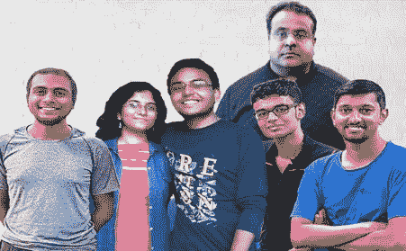
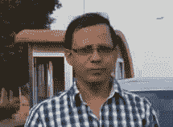

# quantica Computacao-印度首家量子创业公司

> 原文：<https://medium.datadriveninvestor.com/quantica-computacao-first-indian-quantum-startup-d1b50fd3deaa?source=collection_archive---------5----------------------->

Quantica Computacao

**愿景:**

量子力学是 20 世纪初出现的一门科学。通过马克斯·普朗克、爱因斯坦、莱纳斯·泡利、德布罗意等人的巨大工作，量子力学科学繁荣起来，并被证明是宇宙的基本内部工作。随着我们的前进，宇宙中所有可能存在的事物都是基于量子力学的基本原理。随着技术的发展，人类掌握了操纵基本粒子的能力，并使从医学到计算机的一切工作。

在 80 年代初，著名物理学家冯·纽曼和其他巨人如理查德·费曼、大卫·多伊奇一起构思了利用量子力学原理的计算设备的概念。最初的概念被称为量子元胞自动机，它是量子计算的抽象模型。科学家们基于这一概念进行研究，并朝着量子计算的方向前进。在过去的几年里，科技行业都在谈论量子计算，即计算能力的指数级增长。像谷歌、IBM、微软这样的公司和像 Righetti 这样的初创公司，尤其是来自硅谷的公司，正在引领所需硬件和软件技术的前沿发展。

印度开始意识到对量子计算的需求。在全国许多著名机构中，研究正在取得巨大进展。然而，市场和实际研究之间缺乏联系。为了解决这个问题，我们 Quantica Computacao(印度第一家此类创业公司)希望通过创建云开发环境来推动量子计算的发展，以便该国的每个人都可以参与到下一次技术革命中来。

量子计算有许多直接的应用，将影响数百万人的生活。主要应用于密码学和数据安全。量子计算机的巨大速度将有助于在几个小时内破解当前的加密技术，如 RSA，为了应对这一威胁，我们需要开发量子证明加密技术。现代世界产生的数据是巨大的，所以经典计算机在搜索这个巨大的数据库时速度有限。超高速量子计算机可以解决这个问题。下一个潜在的应用是发现新型药物，药物在人体内的作用只能用量子力学来解释。量子力学这种复杂数学的模拟，只有量子计算才能实现。量子计算在供应链管理、媒体广告调度、自然语言处理、机器学习和人工智能方面还有许多其他用途。这些只是一些可识别的应用，谁知道会发生什么，量子计算技术会如何改变世界。我们的主要目标是开发软件技术，以利用未来的量子计算机技术。我们开发了必要的软件工具，在将来建立真正实用的量子计算机时可以使用。该软件将帮助该国的银行和金融机构开发量子密码术，以促进数据安全和加密，为投资银行和股票交易所开发量子机器学习工具，为制药公司开发新的有效药物开发量子模拟算法。运筹学应用的算法，如供应链分配和规划的优化、广告时间安排和收入优化、预测等。一旦硬件技术到位，应用范围将是无限的。我们准备在它就位后立即使用它。

Quantica computacao 已经开始了一项开源计划 python 中的[蒙特卡罗 Quant](https://github.com/bhagvank/Montecarlo_Quant) 。这个项目与金融行业的蒙特卡罗模拟有关，使用量子计算机进行交易和财富管理策略。Monte Carlo Quant 是由 Quantica 的研究人员发起的一个开源项目，旨在为一个平台奠定基础，该平台培育旨在加快计算金融模拟速度的量子计算包的开发。蒙特卡洛开源的[松弛通道](https://goo.gl/iM29fH)和蒙特卡洛开源的[电报组](https://t.me/joinchat/KisuQBYtJbinYm5tBytOTw)是为开发者互动和讨论项目而创建的

作为直接的努力，我们已经创建了可执行量子算法的 alpha 版本，像 Shor 的算法，这在密码学中非常有用，Grover 的量子搜索算法和许多其他量子计算算法。作为第一步，我们目前正在开发一个单量子位量子模拟器，并将于今年 12 月完成；我们正试图创建一个多量子位量子计算模拟器(量子虚拟机——QVM)，以便许多开发人员和潜在的早期感兴趣的客户可以检查和创建自己的算法。到 2019 年底，我们计划建造、测试和部署一个 16 量子位 v1.0 版)供公众使用。与此同时，我们正计划为潜在客户创造更先进的算法和金融产品。

下一步将是为潜在客户创建和测试合适的算法。最初，重点将放在金融机构上。金融机构将是这项技术的直接受益者。密码算法和有效的量子随机数发生器将被测试，并为实际应用提供量子证明。与国内外潜在的硬件制造商合作，为上述金融机构开发合适的量子加密硬件。随着这一主要目标的实现，一群才华横溢的 R&D 团队将致力于开发制药行业的关键应用。这个 R&D 团队将专门与 R&D 的制药合作者合作，开发技术来模拟药物作用，药物输送和副作用的特定方面。

Team

该公司由印度理工学院的校友之一巴格万·科姆马迪先生与阿内什·K·张诗钟先生、阿比吉特·阿南达克里什南先生、阿南亚·谢蒂女士、里什·拉吉先生和兰吉特·纳加尔卡尔先生在钦奈的马德拉斯学院孵化。Aneesh 和 Abhijith 在应用力学系攻读博士学位，Ananya 和 Rishi Raj 在物理系攻读理学学士学位，Ranjeet 是 IIT 马德拉斯大学化学工程专业的大四学生。我们自豪地在印度量子计算先驱顾问委员会的领导下工作，他们是印度阿拉哈巴德哈里什钱德拉研究所的阿伦·库马尔·帕蒂教授和印度 IIT 海得拉巴的宾童龙·拉奥教授，他们是印度量子计算的先驱。

Arun Kumar

我们是印度马德拉斯理工学院创业小组发起的“大挑战:从愿景到创业”倡议的一部分。

我们还将推出两本书，以确保寻求知识的人能够获得知识。一本名为《学习 Q#编程——Q #基础》的书，作者是安尼施、巴格万和宾童龙·拉奥。

M V Panduranaga Rao

这本书是关于微软 quantum 正在开发的 Q#语言，它是一种基于 F#的 quantum 语言，目前仍处于开发阶段。但是这种语言有很大的灵活性。另一本书的标题是“用 Python 实践量子计算”，作者是 Arun Kumar Pati 和 Abhijith Anandakrishnan。它探索了量子硬件和模拟器上的量子编程世界