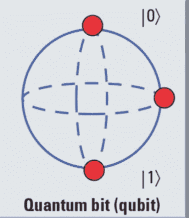
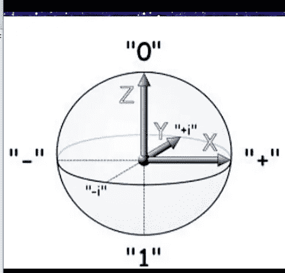
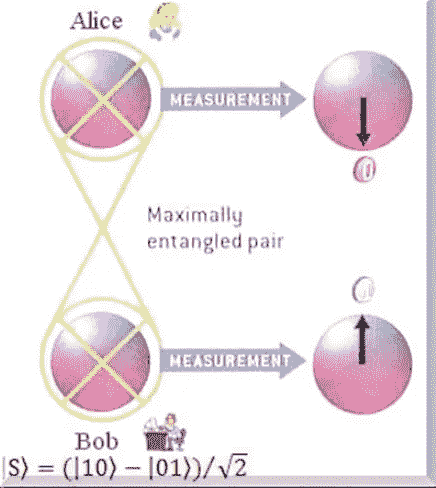
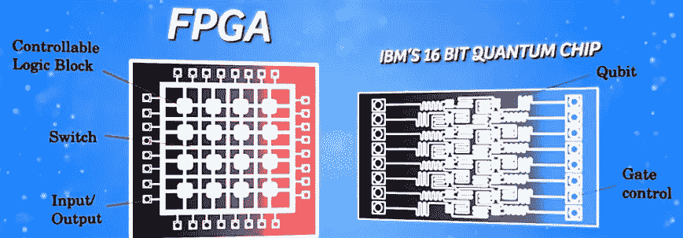
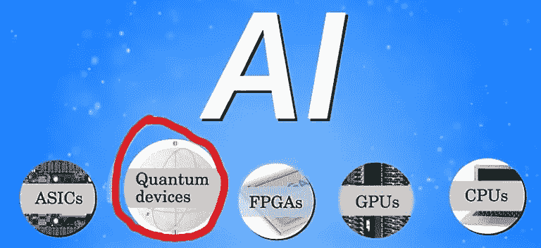
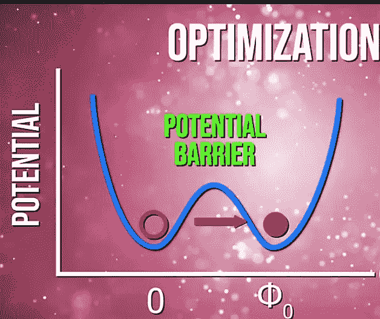
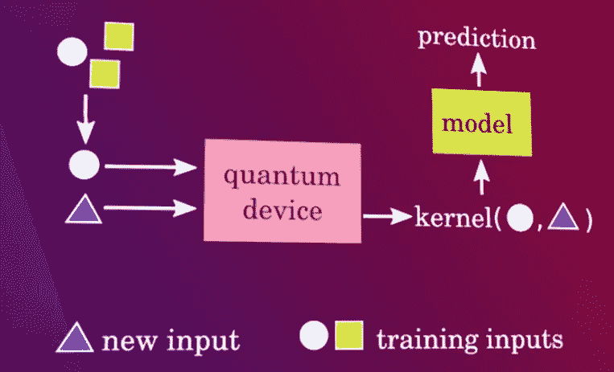

# 量子人工智能

> 原文：<https://medium.datadriveninvestor.com/quantum-artificial-intelligence-595da38c2306?source=collection_archive---------3----------------------->

我们使用的经典计算机使用经典位进行运算，这些位以 0 或 1 的二进制数据表示。但是如果我们可以同时用 1 和 0 来表示比特呢？

嗯，量子力学告诉我们，这种**叠加**在亚原子层面是可能的。量子计算机(或原型)的基本单位是一个量子位(quantum-bit)。这一点可以通过下面的图片看得更清楚。

这些量子位可以同时占据两个状态，即可以表示为一个光子或一个电子。

然后使用许多量子位，我们可以实现**量子纠缠**，我们可以让这些量子位以所有新的有趣方式相互作用。

quantum entanglement

像 IBM、微软、谷歌等大型科技巨头正致力于快速开发全新的高效算法。但是，让我们具体谈谈它在机器学习中的应用。

像 A6 和 FPGA 这样的设备是使用量子位进行计算的小型量子电路。正如我们所知，实现深度学习需要计算能力(就像我们需要**GPU**甚至 **TPUs** 来训练我们的模型)，将量子架构添加到专门的人工智能硬件来训练我们的模型将是非常富有成效的，可以减少时间，并产生全新一代的机器学习。

接下来，有趣的是，量子力学关注最优化，就像我们执行梯度下降一样。科学家感兴趣的是从高维空间(状态)中找到量子位的最低可能状态。**D-Wave**([https://www.dwavesys.com/quantum-computing](https://www.dwavesys.com/quantum-computing))做了一个量子计算机(量子退火)，它的第一个任务就是像 SGD(随机梯度下降)一样优化。

最近，一个混合量子类的变分电路执行运算产生一个**成本函数** &经典计算机对其执行优化。

接下来，我们在深度学习中使用的矩阵运算可以被视为量子力学中的量子编码。量子门执行乘法运算。我们可以把量子门想象成一个巨大神经网络的线性层。

还有一个想法是抽样。我们可以将量子计算机视为采样器，在这里我们可以使用样本来训练机器学习模型(**玻尔兹曼机器-** [**单击**](https://towardsdatascience.com/deep-learning-meets-physics-restricted-boltzmann-machines-part-i-6df5c4918c15) )。

另一个想法是内核评估。量子器件可用于估计核，包括通过计算 2 个高维量子态的内积而难以经典计算的核。这可以输入到 SVM(支持向量机)中，用于我们的 ml 内容。

因此，量子计算机将，

:- *帮助加速 Ai 算法*

*:-设计一种全新的人工智能算法*

*:-同样，机器学习可以帮助设计新的量子算法，而无需科学家绞尽脑汁去寻找。*

有用的链接:

 [## krishnakumarsekar/awesome-量子机器学习

### 在这里你可以得到所有的量子机器学习基础知识，算法，学习材料，项目和描述…

github.com](https://github.com/krishnakumarsekar/awesome-quantum-machine-learning)  [## 量子计算和机器学习如何协同工作

### 到目前为止，我们都(至少稍微)熟悉机器学习和人工智能的概念——但究竟什么是…

hackernoon.com](https://hackernoon.com/how-quantum-computing-machine-learning-work-together-bc61d0f1b3a)