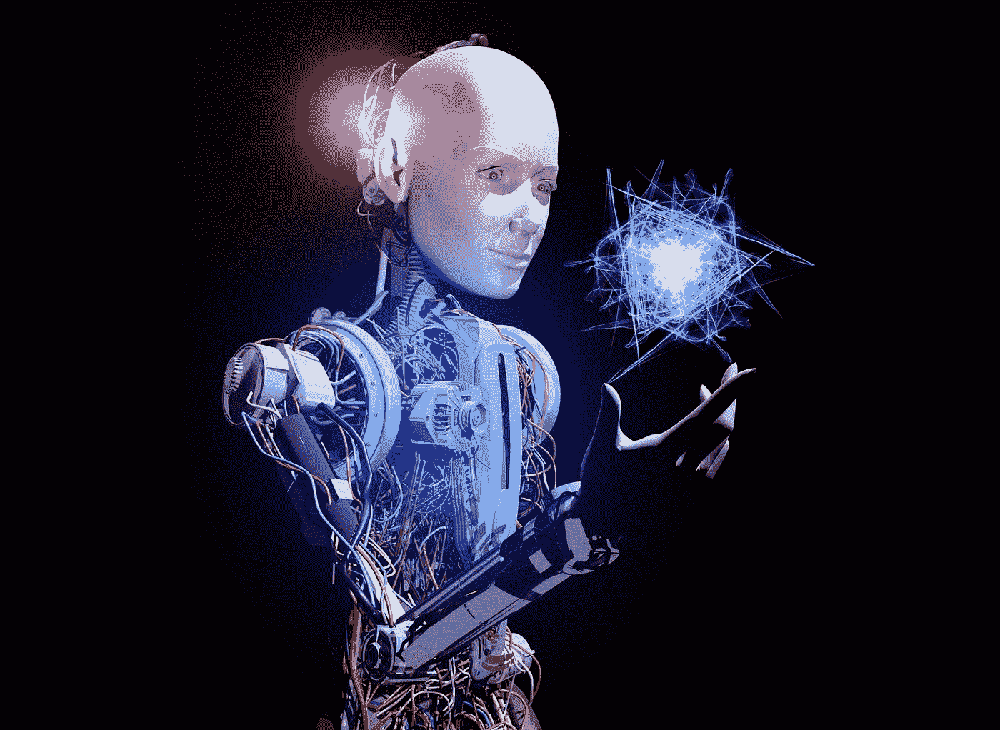
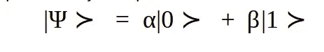
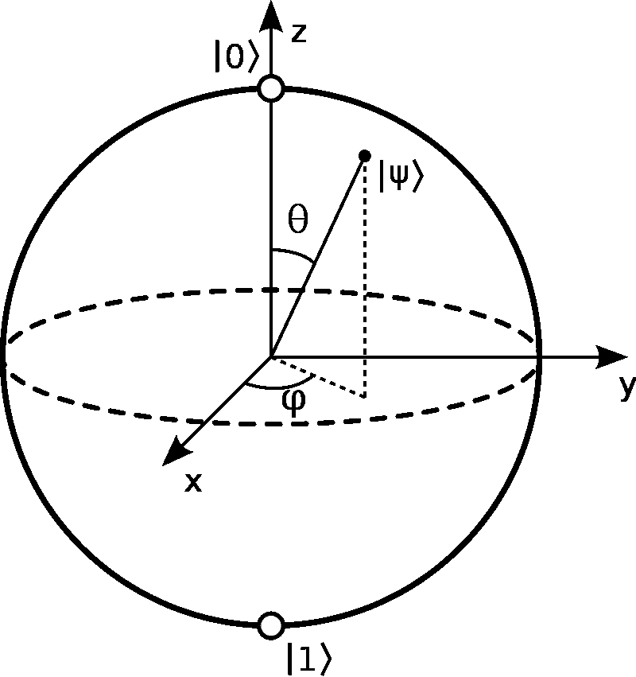
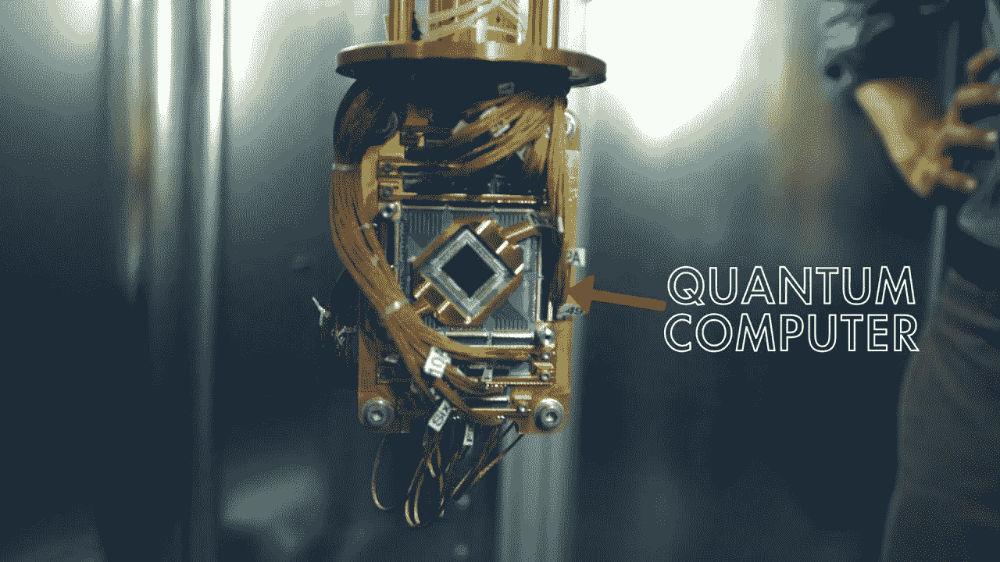

# 量子人工智能

> 原文：<https://medium.datadriveninvestor.com/quantum-artificial-intelligence-cc63d5e92075?source=collection_archive---------9----------------------->

[量子计算](http://bit.ly/GANCourses)是量子信息科学的一个子领域，其重点是从[量子理论](http://bit.ly/GANCourses)[【1】](https://www.physicsoftheuniverse.com/topics_quantum.html)的学习中发展计算机技术，试图利用纠缠[【2】](https://en.wikipedia.org/wiki/Quantum_entanglement#targetText=Quantum%20entanglement%20is%20a%20physical,separated%20by%20a%20large%20distance.)【超位置】[【3】](https://en.wikipedia.org/wiki/Quantum_superposition#targetText=Concept,specified%20by%20a%20complex%20number.)等量子现象来增强量子计算机的计算能力。就计算能力而言，量子计算能够产生巨大的结果，复杂运算性能的纯粹时差令人困惑。相对于传统计算技术，导致性能如此巨大变化的主要原因是两者之间的基本构造块差异。传统计算机的基础是只能接受二进制值的位[【4】](https://whatis.techtarget.com/definition/bit-binary-digit#targetText=A%20bit%20(short%20for%20binary,bit%20multiples%20called%20bytes.)，即它们可以是 1，也可以是 0。显而易见，这种严格性只允许在给定时间内有两个离散值，因此任何复杂的高阶表示都必须由这些基本块的组合来形成，这最终将变得非常麻烦。

[http://bit.ly/GANCourses](http://bit.ly/GANCourses)
Quantum AI [[11]](https://towardsdatascience.com/quantum-computing-and-ai-tie-the-knot-d4440267451b)

## **没有比特只有量子比特**

[量子比特](http://bit.ly/GANCourses)是[量子计算](http://bit.ly/GANCourses)的基本块，取代了传统类型计算[【5】](https://en.wikipedia.org/wiki/Qubit#targetText=Bit%20versus%20qubit&targetText=A%20binary%20digit%20can%20represent,the%20basic%20unit%20of%20information.&targetText=However%2C%20whereas%20the%20state%20of,a%20coherent%20superposition%20of%20both.)中的比特。与传统比特相比，量子比特的主要优势是它们能够接受 0 和 1 之间的任何量子状态，然而，在观察下，所有这些中间状态几乎总是在测量之前根据量子状态的概率坍缩到 0 或 1。一个量子位的物理例子可以是一个光子，它可以具有垂直或水平极化，这两者之间的状态仍然是可行的，但在观察水平上，所有的中间状态将崩溃为零或 1。

 [## 2019 年即将改变世界的技术|数据驱动的投资者

### 很难想象一项技术会像去年的区块链一样受到如此多的关注，但是……

www.datadriveninvestor.com](https://www.datadriveninvestor.com/2019/01/17/the-technologies-poised-to-change-the-world-in-2019/) 

[量子位](http://bit.ly/GANCourses)状态可以用一个简单的公式来表示:

其中，α和β是相应状态的相应概率幅度，通常用复数表示，受以下等式约束:

量子比特最流行的表示之一是布洛赫球表示，如下图所示，它对状态的可视化非常有帮助。

Bloch Sphere

**布洛赫球**

布洛赫球[【6】](http://akyrillidis.github.io/notes/quant_post_7)是二能级量子力学系统或一个量子位的纯态的球面表示。重要的组成部分是量子系统的状态，这里表示为-zcap，对应于纯态 1，对应于纯态 0。请记住，球体表面上唯一对应于纯态的点，表面内的任何东西都是代表混合态的点。

## **人工智能中的量子和人工智能中的量子**

令人惊讶的是，[人工智能](http://bit.ly/GANCourses)正被用来增强我们对量子世界的理解，来自量子世界的知识正被用来增强计算机的计算能力，这反过来将被用来制造更好更大的神经网络。其中一个例子就是[谷歌 AI 量子](http://bit.ly/GANCourses)[【7】](https://ai.google/research/teams/applied-science)。该项目与美国国家航空航天局(NASA)合作的主要目标是开发量子处理器，为研究人员和学者提供实时解决问题的能力，以便他们能够解决量子力学在现实世界应用中的实际和理论问题。不仅如此，他们还致力于在近期的量子处理器上为[量子神经网络](http://bit.ly/GANCourses)[【9】](https://en.wikipedia.org/wiki/Quantum_neural_network)创建一个框架。这同样是有利的，因为[量子位](http://bit.ly/GANCourses)集体可以直接根据概率计算结果，而不必在更高的级别显式设计来这样做，这是传统计算机的情况，传统计算机在其核心使用简单的位来完成主要的计算任务。

[http://bit.ly/GANCourses](http://bit.ly/GANCourses)
Google’s Quantum Computer

同样的例子可以是 sigmoid 激活函数的计算过程。当我们完成这项任务时，它是传统系统的核心，实际上被转换成信息位，所有这些信息被单独处理，然后结果被一起输出，用于下一次操作。在量子计算机中，仅仅通过创建一个以特定顺序相互作用的多个量子位的组合，就可以获得类似的结果。这些值将准备好直接用于进一步传播，而不需要任何额外的处理。

## **像处理千字节一样处理兆兆字节**

quantum 框架的另一个显著特点是，它将能够一次访问整个数据库，这样，在现有的最佳传统处理器上需要几天时间的操作可以在几秒钟内完成。这种计算能力将真正改变数据科学的世界，人们认为不切实际的架构实际上可以得到测试，并用于产生传统系统甚至无法想象的见解。

另一个显著的特点是能够远距离传输数据集，甚至没有一秒钟的延迟。这是通过培养[量子纠缠](http://bit.ly/GANCourses)[【10】](https://en.wikipedia.org/wiki/Quantum_entanglement#targetText=Quantum%20entanglement%20is%20a%20physical,separated%20by%20a%20large%20distance.)现象实现的。

所有这些可能性都很有希望，但我们也必须考虑到这样一个事实，即量子计算仍处于萌芽阶段，随着时间的推移，随着我们发现更多关于量子世界工作的信息，它将在其实现中开辟许多可能性。

## **参考文献**

1.  [**https://www.physicsoftheuniverse.com/topics_quantum.html**](https://www.physicsoftheuniverse.com/topics_quantum.html)
2.  [https://en . Wikipedia . org/wiki/Quantum _ entanglement # target text = Quantum % 20 entanglement % 20 is % 20a % 20 physical，separated % 20 by % 20a % 20 large % 20 distance](https://en.wikipedia.org/wiki/Quantum_entanglement#targetText=Quantum%20entanglement%20is%20a%20physical,separated%20by%20a%20large%20distance)**。**
3.  [**https://en . Wikipedia . org/wiki/Quantum _ 迭加原理#targetText=Concept，指定% 20 by % 20a % 20 complex % 20 number**](https://en.wikipedia.org/wiki/Quantum_superposition#targetText=Concept,specified%20by%20a%20complex%20number)**。**
4.  [**https://what is . tech target . com/definition/bit-binary-digit # target text = A % 20 bit % 20**](https://whatis.techtarget.com/definition/bit-binary-digit#targetText=A%20bit%20)**(简称%20for%20binary，bit % 20multiples %称为%20bytes。**
5.  [**https://en . Wikipedia . org/wiki/Qubit # target text = Bit % 20 vs % 20 Qubit&target text = A % 20 binary % 20 digit % 20 can % 20 表示% 20 basic % 20 unit % 20 of % 20 信息。&target text =然而% 2C %而% 20 状态%20of，一个% 20 连贯% 20 叠加%20of%20both**](https://en.wikipedia.org/wiki/Qubit#targetText=Bit%20versus%20qubit&targetText=A%20binary%20digit%20can%20represent,the%20basic%20unit%20of%20information.&targetText=However%2C%20whereas%20the%20state%20of,a%20coherent%20superposition%20of%20both) **。**
6.  [**http://akyrillidis.github.io/notes/quant_post_7**](http://akyrillidis.github.io/notes/quant_post_7)
7.  [**https://ai.google/research/teams/applied-science**](https://ai.google/research/teams/applied-science)
8.  **【https://www.nasa.gov/】T5[T6](https://www.nasa.gov/)**
9.  **[**https://en.wikipedia.org/wiki/Quantum_neural_network**](https://en.wikipedia.org/wiki/Quantum_neural_network)**
10.  **[https://en . Wikipedia . org/wiki/Quantum _ entanglement # target text = Quantum % 20 entanglement % 20 is % 20a % 20 physical，separated % 20 by % 20a % 20 large % 20 distance](https://en.wikipedia.org/wiki/Quantum_entanglement#targetText=Quantum%20entanglement%20is%20a%20physical,separated%20by%20a%20large%20distance)**。****
11.  **[https://towards data science . com/quantum-computing-and-ai-tie-the-knot-d 4440267451 b](https://towardsdatascience.com/quantum-computing-and-ai-tie-the-knot-d4440267451b)**