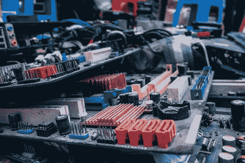
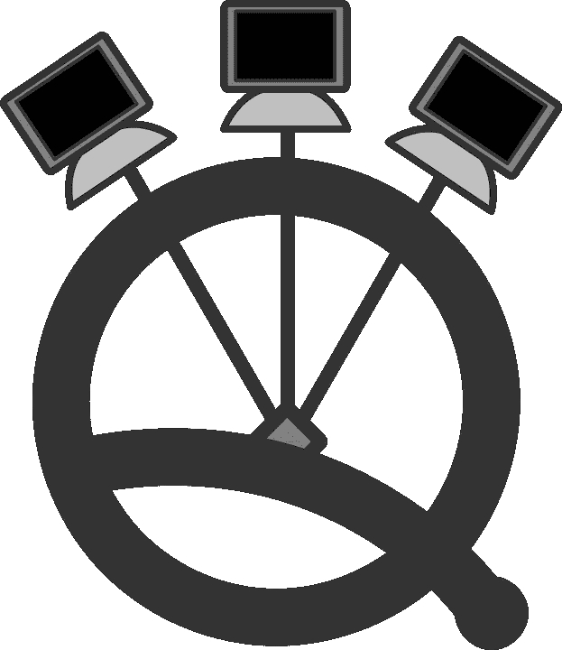
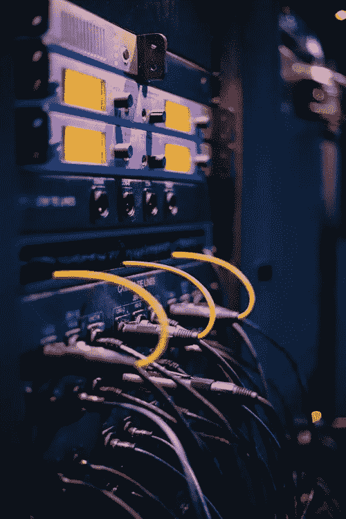

# 量子通信

> 原文：<https://medium.datadriveninvestor.com/quantum-communication-331c1a9c458?source=collection_archive---------6----------------------->

**简介**

爱因斯坦称量子纠缠为幽灵般的超距作用。量子纠缠是量子力学中最奇怪的现象之一。当两个粒子相互作用时，它们会影响彼此的性质。受影响的粒子属性是自旋、极化和动量。一个粒子的变化会同时影响另一个粒子的变化。研究人员已经应用量子纠缠在两个节点之间传输信息。其中一个节点是持有一半纠缠光子的发送者。另一个节点与接收器相关。量子通信是通过操纵光子来实现的。这影响了纠缠光子的瞬间变化。

量子网络的每个节点都有量子处理器。量子网络节点依赖于量子比特。量子位可以以多种状态 0 或 1 存在，也可以是 0 和 1 的叠加。叠加允许一次执行多个计算。量子处理器改变其光子的状态。在转移量子位的同时，纠缠光子在量子网络中的量子处理器中被改变。

这有助于创建一个安全的通信系统。窃听企图或截取信息将解开量子网络中的粒子。因此，它会修改消息。当黑客攻击企图发生时，它是已知的。这一原理正被用于量子密钥分发。解耦与纠缠粒子由于与环境的相互作用而解缠结有关。由于这个原因，长距离通信是困难的。量子中继器用来避免这个问题。量子网络中使用了很多量子中继器。

 [## 准备在 2019 年改变世界的技术-数据驱动的投资者

### 很难想象一项技术会像去年的区块链一样受到如此多的关注，但是……

www.datadriveninvestor.com](https://www.datadriveninvestor.com/2019/01/17/the-technologies-poised-to-change-the-world-in-2019/) 

要克服的问题是创建一个全球性的量子网络。由于长距离是真正的问题，纠缠光子需要通过卫星或光纤传输。超过几百公里，99.99%的交流信息将会消失。对于通信用途，信号将非常弱。

**量子通信**

完全连接的量子网络架构具有单个纠缠光子源，其将量子状态分配给多个用户。量子网络试图最小化所需的资源。量子网络和量子互联网将影响通信世界。量子网络有助于以更高的速度进行通信。这些速度处于更高的数量级。

量子互联网是常规互联网网络的一部分。它可以用于量子计算方案。用户可以通过互联网上的量子云使用量子计算机。许多量子设备将连接到量子网络。任何连接的设备都将能够与量子网络中的其他设备对话。量子互联网可以与今天使用的互联网并行运行。这种网络可以连接量子处理器，其性能优于经典方法。

量子网络发展的第一阶段是确保通信中牢不可破的隐私和安全。下一个阶段是拥有一个成熟的网络。成熟的量子将拥有可以探测引力波的量子传感器。用户可以接收量子生成的代码。他们将无法发送或接收量子态。两个终端用户可以在量子网络上共享一个加密密钥。他们可以接收和测量量子态。他们可以共享一个私钥并验证他们的密码。他们可以获得不用于保存的纠缠态。这有助于在量子网络中拥有最强的量子加密，用户可以访问和保存纠缠的量子位。他们可以在量子云上互相传送量子信息。量子计算机是量子网络上的设备。

量子通信技术可以用来在一个大群体中进行协调并达成共识。例如，它们可以用于检查和批准基于电子货币的交易，如比特币。

**结论**

有计划开发大规模的图态光子发生器和超低损耗光子电路。这将有助于对大量光子进行时间反转自适应贝尔测量。这些电路使科学家能够放大全光量子网络。一个拥有功能量子计算机的完整的量子互联网离我们还很遥远。第一批远程量子网络正处于规划阶段。

**参考文献**

1.  [量子互联网](https://science.sciencemag.org/content/362/6412/eaam9288)