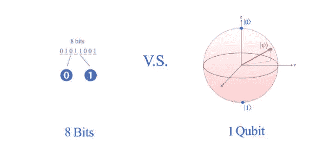
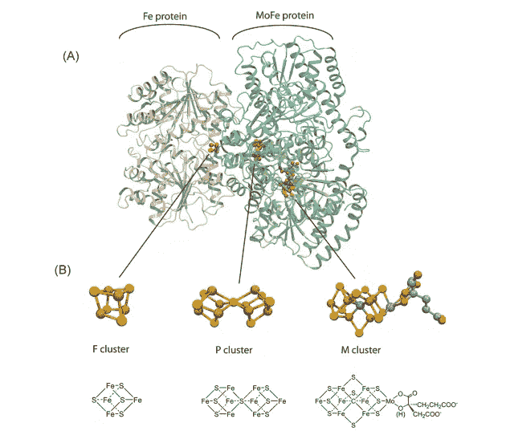

# 量子计算机——第二部分

> 原文：<https://medium.datadriveninvestor.com/quantum-computers-part-2-6e8173d5dc73?source=collection_archive---------8----------------------->

让我们开始观察我们的周围。我们看到的是每一个物体，甚至我们自己，都是由一些组成粒子组成的——原子、细胞、分子等等。然而，量子计算机是由量子位组成的。这个流行词我们很多人都听说过，但并不完全理解它的全部意义。从 bit 开始，我们理解它的意思是 1 或者 0。因此，在一个比特中有两种可能的状态，而在一个量子比特中，下面显示的球体上的所有状态都是可能的，所有的信息都编码在这个微小的组成部分中。

bits versus qubit

因此，很自然地，量子计算机可以被看作是建造能够容纳更多信息的更小计算机的一种方式，但是科学家们不相信在短期内建造量子计算机是可能的。2019 年，最大的通用量子计算机只有 72 个量子比特。

 [## 2019 年即将改变世界的技术|数据驱动的投资者

### 很难想象一项技术会像去年的区块链一样受到如此多的关注，但是……

www.datadriveninvestor.com](https://www.datadriveninvestor.com/2019/01/17/the-technologies-poised-to-change-the-world-in-2019/) 

有趣的是，量子比特极易受到环境变化的影响，需要大量的设备来隔离它们，并且处于非常低的温度下。因此，量子计算机的尺寸不但没有变小，反而变大了。量子计算故事的负面影响。

# **为什么要量子计算？**

1981 年，诺贝尔奖获得者理查德·费曼谈到了他的观察，即在经典计算机上有效地模拟量子系统的演化似乎是不可能的，他提出了量子计算机的基本模型。

让我们借助一个例子来阐述这个难点。化肥生产约占世界能源消耗的 1.2%。目前的哈伯-博世化学合成工艺使用金属催化剂在高温下将氢和氮偶联形成氨。不幸的是，这个过程消耗了大量的能量。土壤中的细菌产生固氮酶，在常温下从空气中吸取氮来制造氨。科学家已经研究这个固氮过程有一段时间了。

[Source](https://pubs.acs.org/doi/pdf/10.1021/cr400641x)

然而，我们目前的系统可以处理数十亿字节的信息(1，000，000 GB)，但它几乎不能模拟氨的形成过程。单个 F 团簇本身只含有 4 个 Fe 原子和 4 个 S 原子。随着星系团数量的增长，相互作用呈指数增长，这很难用经典计算机来处理。那么，我们如何在当前的计算机中提高计算速度呢？

例如，人工智能训练处理大量数据。我们希望尽可能并行处理数据。下面一个双核 CPU，我们可以一次处理两个任务。但即使是 8 核 CPU，这也远远不足以解决许多人工智能问题。因此，人工智能模型是在 GPU 上训练的(例如，计算机的显卡)。但是，这种策略仍然有局限性，因为对于大多数实际问题来说，复杂度随着输入的大小呈指数增长，而不是线性增长。因此，计算的并行化也可能不太有效。

这就是为什么当前使用 GPU 的计算机无法模拟肥料生产过程的原因。如果解决一个问题需要指数数量的数据，那就不好了。因为可能需要指数数量的操作来操纵它们。数据并行化线性地提高了性能，因此它不能解决指数级复杂性的问题。我们需要新的概念来打破诅咒。

那么，量子计算机提供了什么？在自然界中，纠缠和干涉的概念无处不在。量子计算机非常容易地提供它们。我们还可以使用叠加的概念对量子位上的指数数量的数据进行编码，并同时处理这些数据，而不是并行处理。这种量子并行性使我们能够以比现有经典算法更快的速度解决一些问题。

# **下一个**

接下来，我们将更深入地挖掘对于理解量子计算的基础很重要的各种概念。