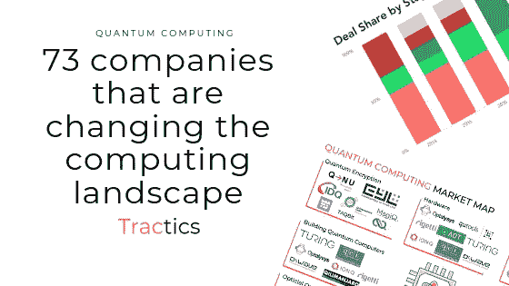
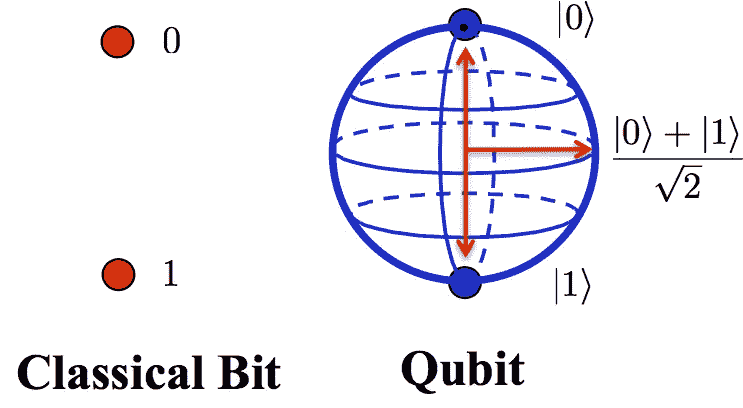
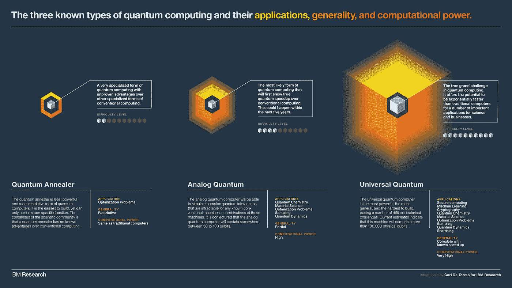
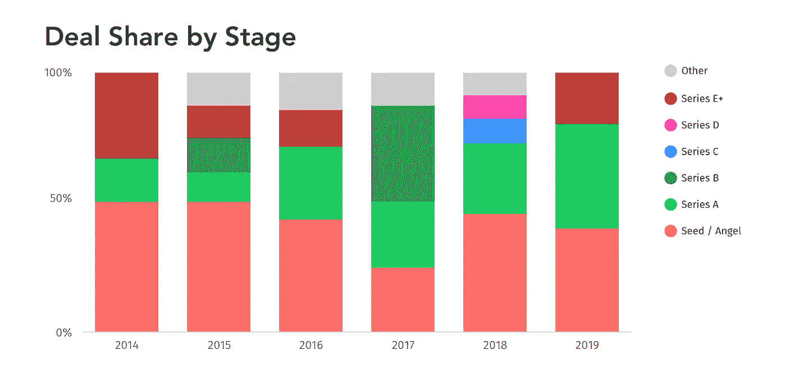
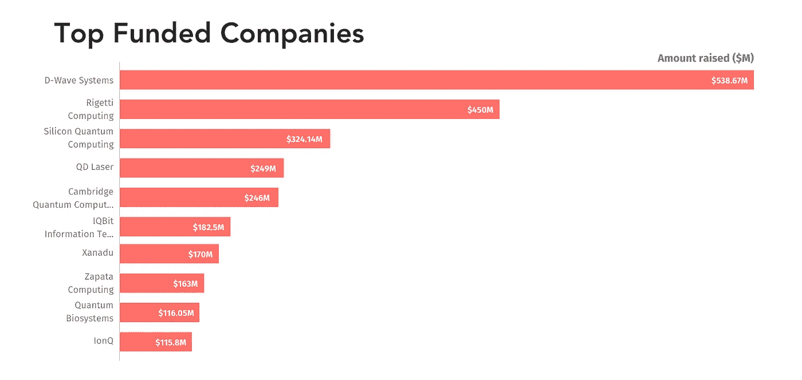
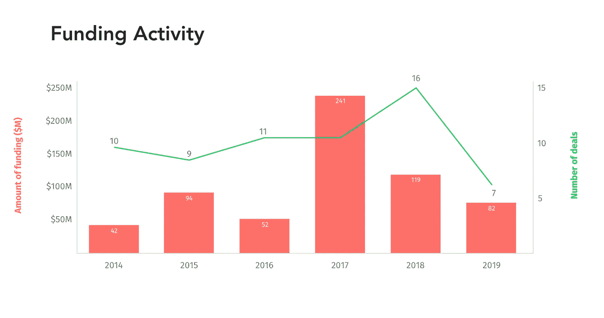
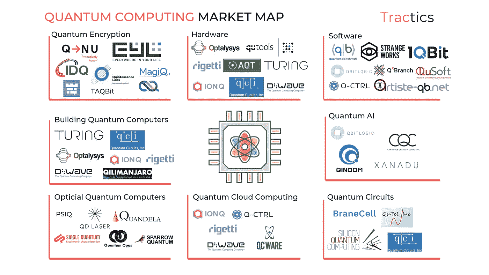

# 量子计算——改变计算格局的 73 家公司

> 原文：<https://medium.datadriveninvestor.com/quantum-computing-73-companies-that-are-changing-the-computing-landscape-f39ebf0ccfee?source=collection_archive---------0----------------------->

很少有人了解量子计算的实际工作原理，但它有望颠覆网络安全、医疗保健、金融、材料科学、先进制造等整个行业。

量子计算凭借其先进的处理能力和处理无限数量变量的能力，可能会改变世界。但是，

*   具体是怎么操作的？
*   量子景观是什么样子的？
*   哪个行业最需要？
*   未来会怎样？

 [## 2019 年即将改变世界的技术|数据驱动的投资者

### 很难想象一项技术会像去年的区块链一样受到如此多的关注，但是……

www.datadriveninvestor.com](https://www.datadriveninvestor.com/2019/01/17/the-technologies-poised-to-change-the-world-in-2019/) 

# 什么是量子计算&它是如何工作的？

量子计算机依靠量子力学的基本原理，在处理海量复杂数据集方面比经典计算机更高效。

为了清楚地理解量子计算机是如何工作的，我们需要看看经典计算机是如何工作的。

经典计算使用晶体管来存储被称为经典位的信息位。这些基本的信息单位储存在晶体管中。基本上，这些是嵌入微芯片的晶体管中的电子开关。芯片上的晶体管越多，计算机处理电子信号的速度就越快。

1965 年，英特尔公司的创始人之一戈登·摩尔观察到，微芯片每平方英寸上的晶体管数量每年翻一番，而成本却降低了一半。这意味着随着时间的推移，计算机变得越来越小，计算能力变得越来越快，以至于不可能在微芯片上添加更多的晶体管。

为了获得指数增长的好处，我们需要找到一种全新的方法来处理信息，这就是量子计算机的用武之地。

与今天的计算机相比，量子计算机在某些类型的计算方面具有巨大的效率优势。量子计算机非常擅长解决需要找到变量和解决方案的最佳组合的问题，这些问题通常被称为优化问题。

优化问题在软件设计、物流、金融、网络搜索、基因组学等各行各业都很普遍。

传统计算机使用经典比特，而这些量子计算机使用量子比特或量子比特。

与只能以 0 或 1 状态存在的经典比特不同，量子比特可以以从 0 到 1 的任何值存在，并且可以同时保持两种状态的属性。

Classical Bit Vs Qubit. Strengths and Weaknesses of Quantum Computing. — Scientific Figure on ResearchGate.

通过利用两种自然发生的量子现象(叠加和纠缠)，这些下一代计算机可以执行巨大的复杂计算。

目前，最先进的量子计算机芯片可以利用 19 个量子位，它正在由伯克利的初创公司 Rigetti Computing 开发。Rigetti 宣布计划在今年年底前建造 128 个量子比特量子芯片。然而，建造大多数量子位的竞赛始于 20 世纪 90 年代。

既然我们对量子计算有了一个很好的概念，让我们看看这些量子计算机的类型。

# 三种类型的量子计算机

基于量子比特、处理能力的需求和商业可行性，我们可以把这些量子计算机放入三个桶中。

# 量子退火

这些量子退火最适合解决优化问题，如飞机机翼上的气流，或优化孟买街道上的交通流量。传统的计算机需要几千年来计算这些问题的乐观解。但量子退火是量子计算中最不强大、最狭隘的应用，我们传统的超级计算机与量子退火机不相上下。

# 模拟或模拟机器

这些机器可以解决传统超级计算机无法解决的问题，如模拟化学反应、模拟蛋白质折叠(最困难的生物化学问题之一)等建模，以帮助推进设计师药物测试、材料科学等。

# 通用量子计算机

最强大也最难建造。理想的通用量子计算机需要大约 100 万个量子位，现在我们正试图达到 128 个量子位。

这种类型的量子计算机建成后，可以计算任何大规模复杂的数据集，并提出快速解决方案(包括退火方程和模拟)。

目前，研究人员正在设计可以与这些计算机一起工作的算法。一些著名的算法是 Shor 算法(用于高级代码破解)和 Grover 算法(用于搜索大量非结构化数据集，如互联网搜索等)。目前，为这些通用量子计算机开发的独特算法有 50 多种。当硬件赶上时，其中一些算法可以用作量子人工智能的构建模块。

Types of quantum computers based on IBM research

# 量子计算的前景是什么样的？

这个行业有 76 家公司，其中一些公司能够筹集约 5000 万至 1 亿美元，这意味着，尽管大肆宣传，这个行业仍处于萌芽状态。

Quantum Computing Deal Share by Stages

自 2013 年以来，四家公司约占该行业总资金的 70%

1.  d 波
2.  里盖蒂计算公司
3.  硅量子计算
4.  剑桥量子计算。

Top funded quantum computers

但交易数量从 2013 年的 7 笔增加到 2018 年的 24 笔。

Funding towards quantum computing in the last 6 years

主流风投和公司已经在投资私人量子计算公司，其中一些公司

*   谷歌风投
*   亚马孙
*   红杉资本
*   A16z
*   DFJ
*   高盛

2019 年 1 月，IBM 在 CES 上宣布了其第一台商用量子计算机，IBM Q 使用了经典和量子组件，具有 20 量子位的处理能力。微软、惠普、英特尔以及咨询公司 Booz Allen Hamilton、雷神等也在这个行业中。

除了这些投资和企业风险，中国和美国正在与他们的主要机构合作，为国防相关项目、材料研究等建立自己的量子计算机。

现在，让我们看看量子空间的公司。为了清晰地描绘出这个景观，我把这个空间分成了八个桶。

Quantum Computing Market Map

*   **量子加密**——像 [ISARA](http://isara.com/) 、 [Crypta Labs](http://cryptalabs.com/) 和 [Cyph](http://cyph.com/) 这样的初创公司提供基于量子力学基础科学的加密。这个桶里有 16 家公司。
*   **硬件**——这些是为量子机器制造硬件组件的初创公司。像 [IonQ](http://ionq.co/) 、 [Optalysys](http://optalysys.com/) 、 [Photon Spot](http://photonspot.com/) 、 [ColdQuanta](http://coldquanta.com/) 和 [Qubitekk](http://qubitekk.com/) 这样的初创公司正在开发和制造构建和维护量子计算所需的硬件。
*   **软件**——为软件工程师开发工具来构建量子应用。固件框架，量子算法的量子模拟软件，可以帮助与先进的计算机接口。[地平线量子](http://horizonquantum.com/)、 [Strangeworks](http://strangeworks.com/) 、[量子基准](http://quantumbenchmark.com/)、 [QuantumWise](http://quantumwise.com/) 、 [QuSoft](http://qusoft.org/) 、[艺人 QB 网](http://artiste-qb.net/)、 [1QBit](http://1qbit.com/) 都是这个细分领域最有看点的公司。
*   **建造量子计算机** —这些是正在建造全栈量子计算机的硬件制造商。像牛津量子、 [IonQ](http://ionq.co/) 、 [Optalysys](http://optalysys.com/) 、 [Rigetti Computing](http://rigetti.com/) 、 [D-Wave Systems](http://dwavesys.com/) 、[图灵量子](https://turingquantum.com/)、[Alpine Quantum Technologies](https://www.aqt.eu/)这样的公司正在致力于量子模拟机器或全栈通用量子计算机。
*   **Quantum AI**—[Qindom](http://qindom.com/)、 [Zapata Computing](http://zapatacomputing.com/) 和 [Xanadu](http://xanadu.ai/) 是这一领域的一些主要参与者，他们正在构建量子算法和硬件，为 Quantum ML/AI 创建可持续的基础设施。
*   **光量子计算** —这些公司开发高速光子探测器，将实现量子光学、光量子计算、单光子通信、低通量生物光子学和遥感领域的下一代实验。 [Sparrow Quantum](http://sparrowquantum.com/) 、 [Fathom Computing](http://fathomcomputing.com/) 、 [Single Quantum](http://singlequantum.com/) 、 [Quantum Opus](http://quantumopus.com/) 是这一细分市场的少数关键玩家。
*   **云**——像 [QC Ware](http://qcware.com/) 和 [Qilimanjaro](http://www.qilimanjaro.tech/) 这样的公司正在为量子计算机开发基于云的平台。
*   **电路** —电路量子计算机的关键组件之一，像 [BraneCell](http://branecell.com/) 这样的公司开发了接近室温的量子计算架构，使量子计算机在商业上可行。其他公司如 [QuTel](http://qutel-inc.com/) 、[牛津量子电路](http://oxfordquantumcircuits.com/)、[硅量子计算](http://sqc.com.au/)和[量子电路公司](http://quantumcircuits.com/)。正在研究类似的技术。

# 未来会怎样？

随着成本的下降和更多的参与者进入这个行业，我们将看到更多的量子计算应用跨行业。现在，这些是可以从量子计算中受益的一些行业。

*   **网络安全** —如今，我们使用加密方法来存储和保护我们的数据。但是量子计算机可以轻易破解这些密码。通过量子加密，我们可以利用纠缠粒子来保护和分发敏感信息。当你测量一个量子系统时，测量的行为会扰乱系统。所以，任何人截获了这些量子纠缠粒子，就会立即显示出揭示了对应的缺口。
*   **医疗保健** —利用基因组学的进步设计药物和个性化药物是经典计算机无法处理的一些事情。然而，量子计算机可以同时组装和分类所有可能的基因变体，并立即找到所有的核苷酸对，使基因组测序的整个过程成倍缩短。
*   **金融** —量子计算机可以帮助消除数据盲点，防止无根据的金融假设造成损失。除此之外，量子计算机可以帮助解决复杂的优化问题，如投资组合风险优化和欺诈检测。

展望未来，量子计算机可以比大多数经典计算机更好地训练人工智能，这可以推动语音识别、机器翻译、高级计算机视觉等复杂技术的发展。

这个行业正在快速发展，专家们一致认为，到 2030 年，我们可以看到量子计算机超过经典计算机。然而，有一些严重的技术障碍，如稳定的硬件、软件开发和分发平台，需要在实现其潜力之前实现。

想要公司的完整列表吗？参观 www.tractics.co