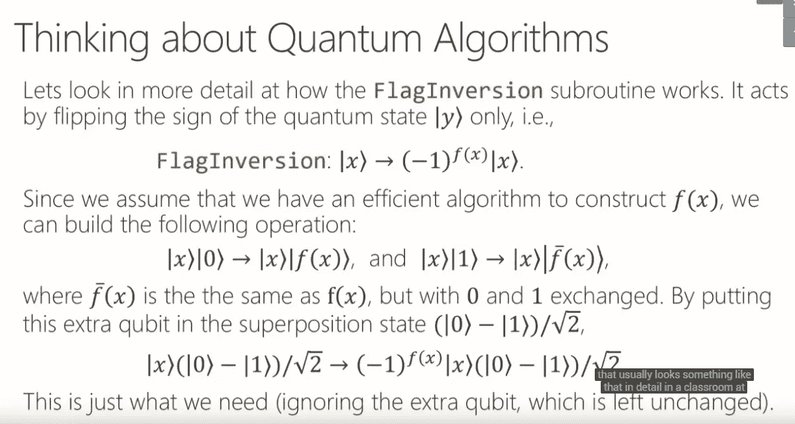
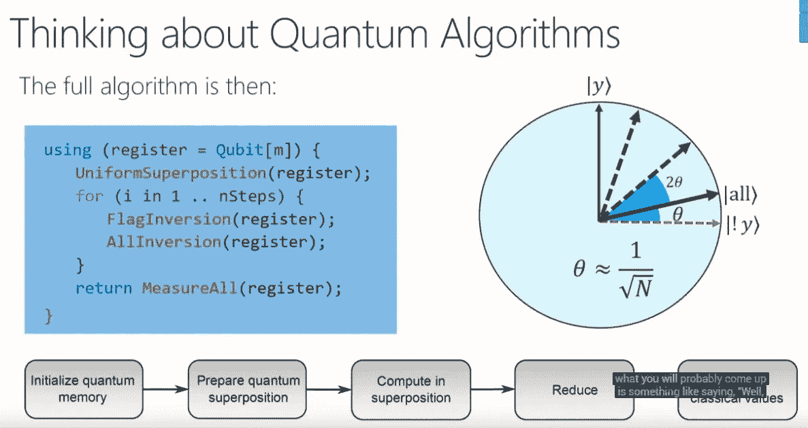
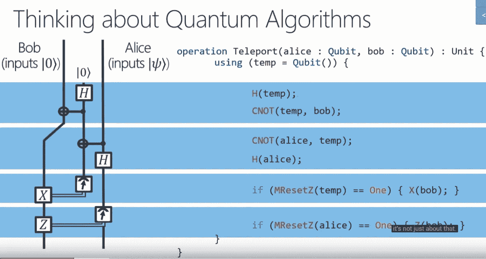
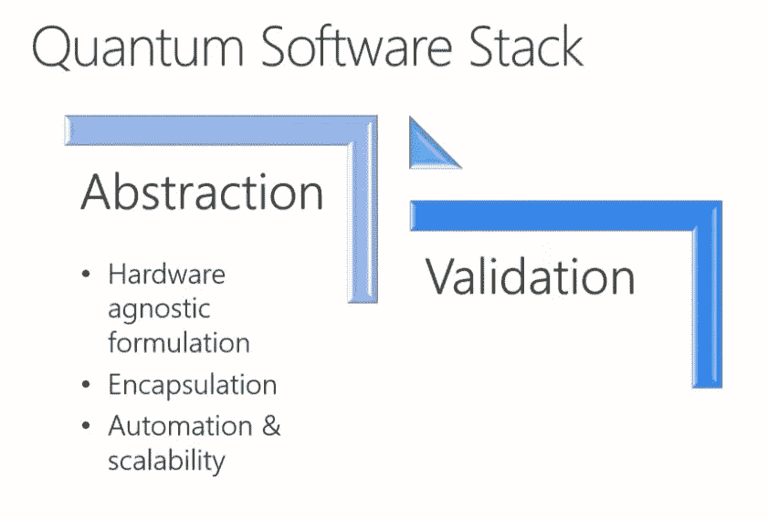
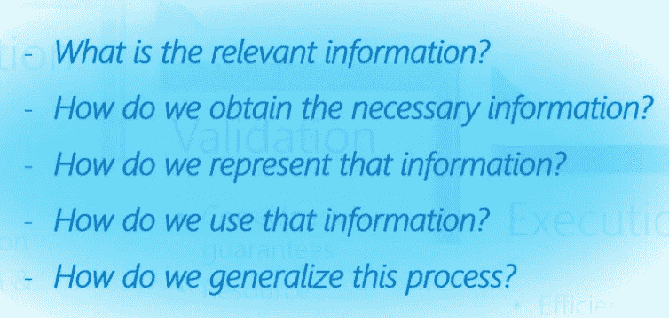
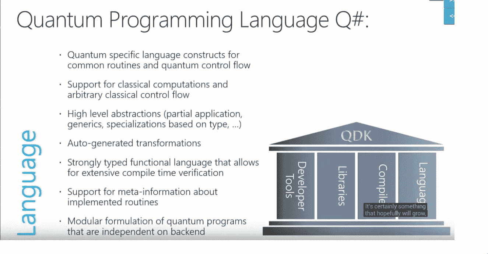
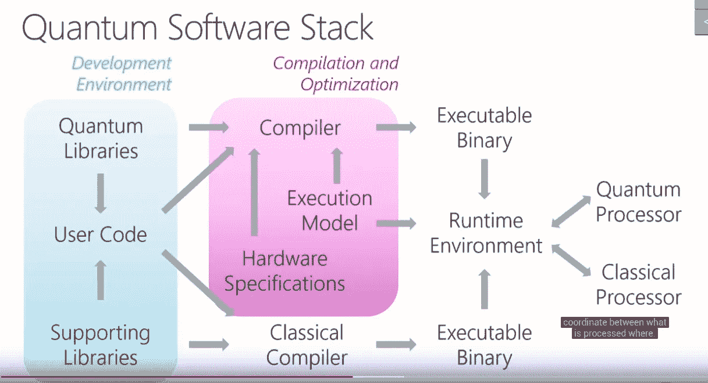
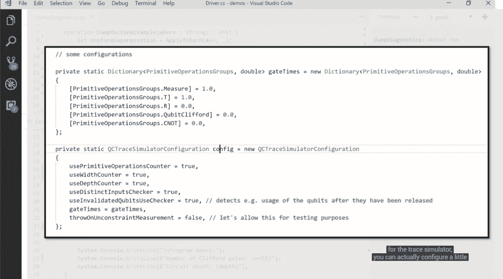
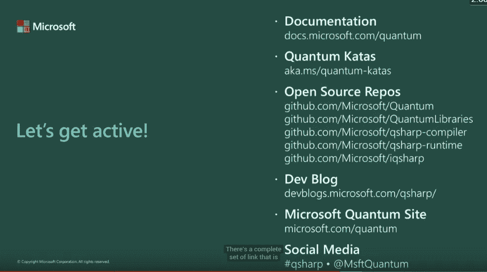
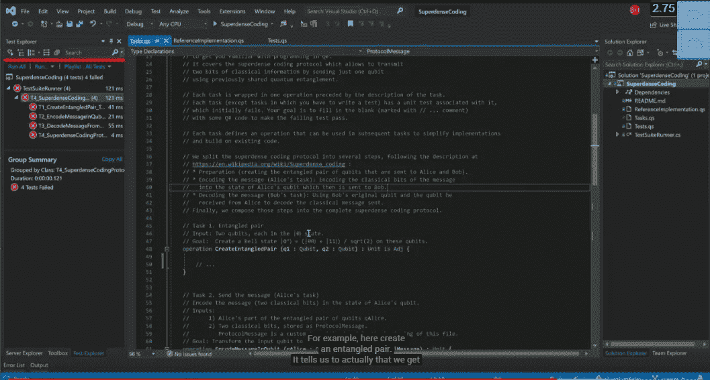

# 量子计算和劳动力、课程和应用开发:开放资源

> 原文：<https://medium.datadriveninvestor.com/quantum-computing-and-workforce-curriculum-and-application-development-open-resources-18c3387b62f2?source=collection_archive---------17----------------------->

现在，这种编程语言是开源的！

一些问题的例子，语言可能是有用的。

什么量子在→教室里面→有哪些看待问题的新方法？

把问题分解成更小的问题→我猜这是在用 Q 位→如何使用 Q 尖语。

 [## 2019 年即将改变世界的技术|数据驱动的投资者

### 很难想象一项技术会像去年的区块链一样受到如此多的关注，但是……

www.datadriveninvestor.com](https://www.datadriveninvestor.com/2019/01/17/the-technologies-poised-to-change-the-world-in-2019/) 

真不敢相信这很快就要进入现实世界了。

它们与其他算法有何不同。(非常复杂的东西)。

我们想要实现什么？(从目标开始思考→开始思考→这是实现伟大的待办事项列表的一种方法)。

保持硬件和软件的质量是好的，但是我们也需要制定一些成功的边界。

我们要回答用户的问题→我们如何传递这些信息？(Q 硬件的正确运行方式是什么？→我们不知道)。

所以他们还在想办法→有些东西可能会消失→或者其他东西会被添加上来。(有意思)。

创建一个 Q 位库是非常困难的。

构建一个 Q 位软件→有很多步骤→在世界上拥有一个 Q sharp 是一件非常困难的事情→因为实际上没有很多人拥有量子计算机。

哇，IDE 非常容易使用→在化学示例中，Q bit 能够加快速度。

还有博客等社交媒体支持。

在 Github 中，→我们实际上可以找到所有这些并立即使用。(超级有趣)→还有一个 jupyter 集成。

它们还支持编程练习，用户必须解决一些小测验等等。