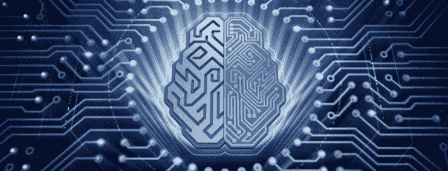

# 量子计算:天使还是恶魔？

> 原文：<https://medium.datadriveninvestor.com/quantum-computing-angel-or-demon-2ab71ee3440f?source=collection_archive---------4----------------------->

Image from www.meritalk.com

如果你没听说过，做好心理准备。世界将不再一样。

大概 AI 和机器学习是现在最热的趋势，不仅是在技术界，也是在所有知识领域。

到目前为止…

> 有一项新技术已经初露端倪，无疑将对人类产生类似的潜在影响:量子计算。为了便于理解，一些专家——我同意他们的观点——将量子计算的重要性和影响力与对原子能量的理解和利用相提并论。

有人甚至声称掌握量子计算的后果等同于核电。就像核能一样，既有巨大的预期利益，也有对世界的可怕威胁。
在本文中，我将尽可能简单地探索所有这些，包括量子计算的基本概念以及潜在的好处和威胁。

**什么是量子计算？**

在高层次上解释量子计算概念并不是一件容易的事情。我会试试看。这并不意味着图示的内容被淡化了。

 [## 准备在 2019 年改变世界的技术-数据驱动的投资者

### 很难想象一项技术会像去年的区块链一样受到如此多的关注，但是……

www.datadriveninvestor.com](https://www.datadriveninvestor.com/2019/01/17/the-technologies-poised-to-change-the-world-in-2019/) 

首先，最重要的是你听说过传统计算的基础知识，这是由单词*二进制*定义的。之所以这么叫，是因为它只有两种可能的状态(1 或 0，真或假，开或关)。一切，绝对是与计算相关的一切(从电脑到智能手机，从 GPS 到视频游戏)都依赖于这个原则。无需更深入地探究，就足以说明当今数字世界的基础有两种可能的状态

> 另一方面，量子计算不是这样工作的。虽然它看起来像巫术，但它是真实的。这甚至很难想象，但是每一位可能呈现多种状态，或者是 1 和 0 状态的叠加。顺便说一下，比特在量子世界中被称为量子比特。

如果你认为这很难理解，你并不孤单，真的很难理解。然而，你不需要担心。跟踪这些内容的顺序并不重要。

> 让我们关注这个品牌和强大的新技术的成果:难以置信和荒谬的强大计算机，以从未想象过的速度支持复杂的处理。这就产生了一种计算能力，可以解决到目前为止还没有解决方案的问题。

出于好奇，它的处理能力如此之强，以至于最敏感的部件都需要一个能够提供接近绝对零度(-459 华氏度)温度的冷却系统。

**预期收益**

量子计算带来的一些最重要的好处，至少对于现在已知的技术来说，与基因研究和操作有关。这可能会导致无法治愈的疾病的预防和治疗。在未来，明显严重的疾病甚至不再存在。

另一个预期受益的领域是食品生产。基因研究和操作可能会以这样一种方式发展，也许有可能养活世界上所有的人口。其他值得一提的例子是太空探索和天气预报。不用说，也许人类的未来取决于太空探索……可以想象，如果有更准确的天气预报，许多人的生命将会得救。

**黑暗面**

你能想象我们的世界面临数字封锁吗？我的意思是大多数电脑和网络意外停机…看起来像一个反主题恐怖电影的情节，不是吗？好吧，量子计算让这看似合理。

为什么？
所有计算机、网络和数字设备都在某种程度上依赖于安全性和加密技术才能正常工作。更不用说企业和个人数据的安全性了。数字安全的一个技术原理是基于安全密钥和从质数的乘法中产生的密码术(记住，对于那些很久以前离开学校的人，比如我:质数是大于 1 的整数，它只能被 1 和它自己除。)除非通过尝试因子，否则没有办法找出创建某个质数的因子(乘数)是什么。密码术基于加密密钥，而加密密钥又基于大素数的乘法运算。在没有已知加密密钥的情况下进行解密需要巨大的处理能力。所有现代和安全的系统都定期改变它们的加密密钥，比目前的计算机能够解码的时间要早。利用现有技术，这一过程可能需要几天、几周甚至几个月。

> 到目前为止……
> 相比之下，量子计算机在几秒钟内就能完成当今最强大的个人计算机需要 1000 年才能完成的计算。秒！这不是错别字！请再读一遍这一段:这是一千年和几秒钟的比率。

因此，结论是，以目前的技术，量子计算机可以破解最强的加密。幸运的是，对于这种特殊情况，隧道的尽头有一线光明:我们可能会考虑使用量子计算来保护数字世界，这样新的现代软件和算法就可以在平等的条件下竞争。

然而，如果你还不够害怕，让我们来看另一个例子。如今，在基因工程中，我们有处理限制来实现更多的“激进部署”有了新的处理能力，几天之内就可以制造出致命病毒的转基因版本……够吓人了吧？如何处理这种风险？很难说。也许(而且很可能)，解决方案会利用新的计算能力在更短的时间内开发出新的有效解毒剂。