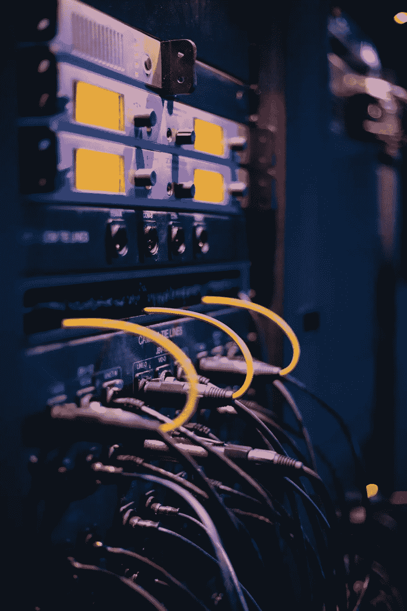
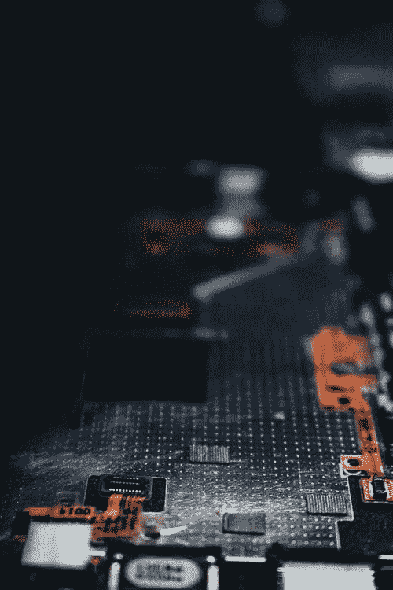
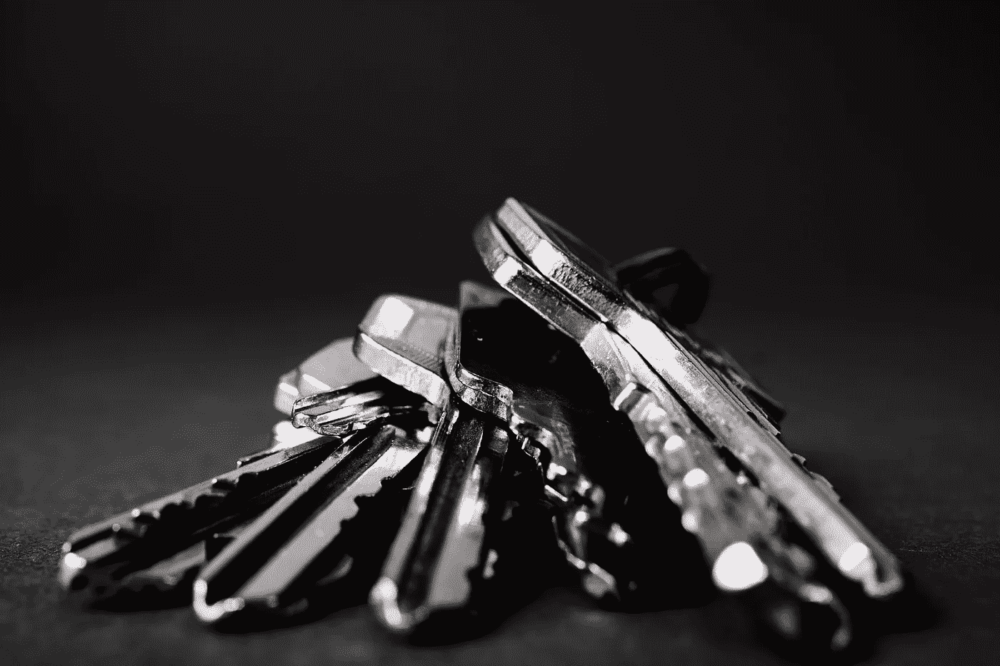
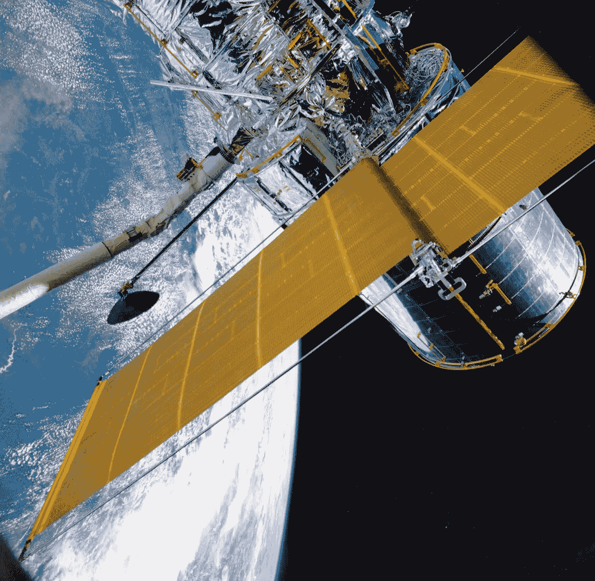

# 量子互联网

> 原文：<https://medium.datadriveninvestor.com/quantum-internet-5c9fc8629c53?source=collection_archive---------2----------------------->

**简介**

互联网有许多问题，如通信可以被截获，并影响我们的日常生活。银行账户和电子邮件中的信息被盗。在互联网上传输量子信息将解决安全问题。量子互联网将提供使用量子通信的新技术。量子互联网将量子设备连接起来，实现比经典设备更多的功能。

Quantum Internet

量子互联网的未来不容易预测。量子互联网将有诸如安全通信、时钟同步、安全识别、数据的高效分发、通信的节约、量子传感器、传感器网络和云中量子设备的安全访问等应用。

**量子计算**

随着物理定律的发现，第一次量子革命开始于 19 世纪的最后十年。海森堡、薛定谔和爱因斯坦科学家提出了新的物理定律。这些定律有助于创造电子设备，如晶体管、激光器和太阳能电池。第二次量子革命是关于将量子规则应用于信息处理。

Quantum Computer

经典位取值为 0 或 1。量子位可以有状态 0、1，并且可以在 0 和 1 中。量子位处于 0 和 1 的状态叫做叠加态。量子位可以相互纠缠。当它们纠缠在一起时，一个粒子的状态可以通过测量另一个粒子的状态来发现。这导致了远距离的相关性。根据“不可克隆定理”，在不改变粒子状态的情况下，量子粒子中的信息永远不可能被完全复制。由于量子位元无法复制，任何修改都很容易被侦测到。基于量子位的通信使互联网适用于安全应用。

 [## 准备在 2019 年改变世界的技术-数据驱动的投资者

### 很难想象一项技术会像去年的区块链一样受到如此多的关注，但是……

www.datadriveninvestor.com](https://www.datadriveninvestor.com/2019/01/17/the-technologies-poised-to-change-the-world-in-2019/) 

量子隐形传态与量子比特的纠缠有关。这是一个量子比特可以从一个位置传输到另一个位置的过程。这发生在没有实际量子位在空间中传输的情况下。这应用在量子信息处理和量子网络中。因此，量子网络有能力以量子位传输信息。量子互联网有助于确保信息交换的安全。交换的信息将用量子叠加态来表示。量子叠加态存储在量子存储器中。量子存储器基于原子系综、原子和离子阱。通过量子互联网在量子计算机上执行计算和访问结果，量子云计算将成为可能。

**量子互联网**

传统的互联网依赖于光缆网络。因为光信号在长距离传输时会失去强度，所以每隔一段时间就会插入中继器。

中继器通过光纤通道提升和放大信号。量子互联网可以通过用光子量子中继器代替中继器来工作。量子中继器是一种可以接收和发送量子信号的设备。信息的传输不会破坏量子态。光子量子是基于光学器件的。光学器件是线性光学元件、单光子源和光子探测器。光子中继器需要光学器件和量子存储器。光子量子中继器在中继器站点存储量子状态。这使得它们容易出错，因为它们理想地需要在低温下操作。

Quantum Communications

空间量子通信是保证星地和星间光链路无条件安全的一种方式。它是通过使用量子信息协议如量子密钥分配来实现的。量子互联网是斯蒂芬·威斯纳在 20 世纪 70 年代发明的。斯蒂芬·威斯纳是纽约哥伦比亚大学的一名研究生，当时他意识到量子力学定律可以用于量子通信。
量子互联网将有六个阶段，将从量子计算平台开始。在第一阶段之后，其他五个阶段是少比特容错、基于量子存储、纠缠产生、基于准备和测量以及可信中继网络。每一个阶段都与以更高的技术挑战为代价的功能增加有关。

Quantum Key Distribution

在少数容错阶段可能出现的应用是时钟同步、连接远距离望远镜以获得更高分辨率的图像和分布式量子计算。基于量子存储器的互联网将具有更高性能的量子计算和使用选举和协议的功能。同样，基于纠缠生成的量子互联网将具有使用设备无关协议的特征。类似地，基于准备和测量量子互联网将为加密应用、量子密钥分发和安全识别提供功能。一个可信的中继器网络在最后阶段将没有通过量子密钥分发的端到端安全性。

量子密钥分发与使用量子力学的力量加密的数据有关。由于基于量子密钥分配的通信不可能被修改，所以干扰被快速检测到。因此窃取量子力学信息会自毁信息。数据交换的成功取决于被动回复反射器的使用。这些回射器安装在卫星上。他们保持长距离光信号完好无损。

Satellite

当卫星在轨道上时，很难进行通信。当它们频繁通过地面站的视线范围时，就可以提供一个安全的量子网络，这个网络可以跨越世界。量子互联网可以成为普通互联网的一种专业化、安全的延伸。它可以由应用程序和设备的子集使用。在地面和高轨道卫星之间进行量子通信是可行的。这有助于扩大新技术的潜在影响。

**下一步是什么**

量子互联网提供了高安全性和量子隐形传态的能力。未来的量子互联网需要全光网络。Lo 和他的团队等研究人员正在为量子互联网奠定基础。这个版本的量子互联网可以解决使用光纤通信远距离传输量子信息的挑战。在未来几年，第一个多节点量子网络将用于量子互联网。

**结论**
距离一个完全可行的量子互联网还有很长的路要走，目前已经有了第一个基于远程量子网络的互联网的计划。有计划开发超低损耗光子电路和大规模图态光子发生器，以扩大基于互联网的完整光量子网络。科学家们正开始研究量子互联网的想法。到目前为止，还不知道它将如何运作。

**参考文献**

1.  [量子互联网联盟](http://quantum-internet.team)
2.  [量子互联网提出课题组](https://datatracker.ietf.org/rg/qirg/about/)