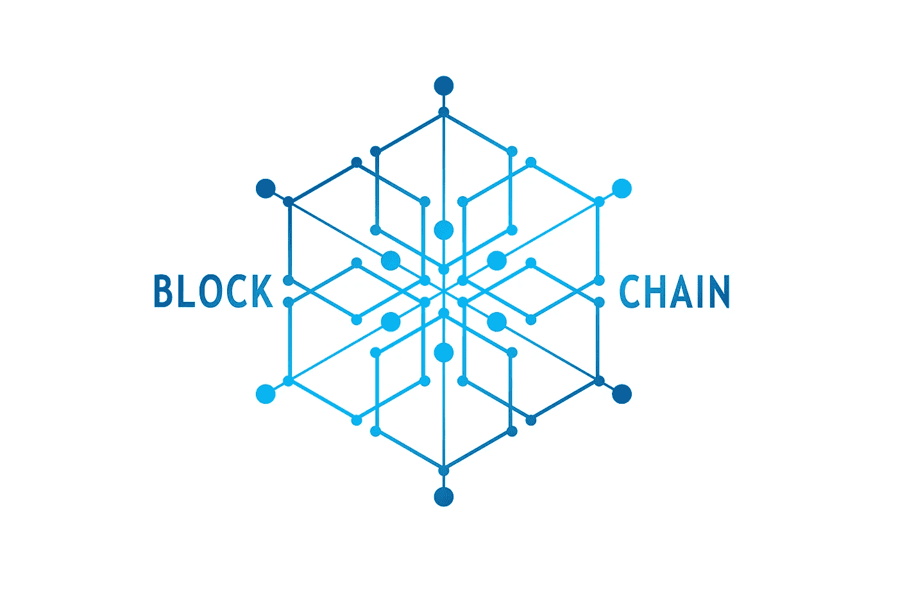

# 抗量子区块链

> 原文：<https://medium.datadriveninvestor.com/quantum-resistant-blockchain-644c8de4a8f2?source=collection_archive---------7----------------------->

**简介**

区块链是一种分散的分类账，记录分布在多个服务器上的货币交易信息。事务被添加到称为块的数据库中。在给定时间段结束时，使用散列函数对块进行加密。哈希函数产生一个唯一的数字，可以用来准确地表示数据。

区块链能够创造新的商业模式。公共区块链具有不可改变的交易记录和安全性。区块链用户需要保护自己的私钥。私钥可以防止黑客破坏他们的数字签名。为了防止恶意交易，区块链有共识算法。共识算法对交易提出了验证要求。没有经过确认，任何交易都不会进入分类账。共识算法防止篡改任何过去的交易。量子计算机出现，区块链安全将面临风险。DES、Triple DES、AES、RSA、Merkle 哈希树签名、Merkle-Hellman 背包加密、Buchmann-Williams 类组加密、ECDSA、HFEv 等功能性密码系统将被量子计算机破解。

**关键词:**后量子密码，抗量子区块链，密码学，区块链

**区块链站台**

Block Chain Platform

区块链平台有公有、私有和联邦三种类型。检查权限(公共或私有)、无权限和受限权限是类型的区别。区块链的智能合同模型，其角色包括合同所有者、团队成员、顾问、持有者以及资产代理、交易所、BMC 令牌和资产令牌的接口。智能合约实现了具有收入的平台钱包和外部地址(如交易所)之间的接口。代币被实现为代币兑换货币工具。他们从持续的贡献者那里获得收益。令牌通过平台资产和代理资产接口连接到平台。资产令牌的智能合约由投资工具结构、费用和资产组成。

**后量子签名链**

Naor Yung 签名链与签署消息相关，该消息将具有用于签署下一个签名的公钥散列。这就产生了一系列相关的信息。链的第一个节点的公钥被用作长期公钥来创建散列地址。验证长期公钥是为了检查它是否属于相应的签名链。很难改变先前创建的签名，因为链接为签名方案提供了前向安全性。

通过签署 n 个而不是一个新的公钥散列来分叉该链。这会产生一个签名树，以便在当前链断开的情况下可以使用先前的分叉。签名的验证发生在签名的公钥散列与它一起发送时。长期地址σlt 的签名是一次性签名和多个公钥散列的元组。

σlt = (σots，pkh0，…，pkhb 1)

需要存储整个签名链，以便可以查找签名链中的每个先前的链接。许多算法依赖于具有密钥生成、签名和验证算法的签名链。

**量子抗性区块链**

BlockChain Network

区块链是记录交易相关信息的分类账。事务按块大小不断增加。在给定时间段结束时，使用散列函数对块进行加密。无公共许可的区块链网络允许破坏集中的玩家。公共区块链确保交易的不可变记录和安全性。量子计算机可以使用 Shor 算法破解哈希签名。为了后量子区块链安全，需要一种后量子安全签名方案。

抗量子账本是一种加密货币，努力保持安全性和功能性的前沿。它的特点是量子抗密码协议和一个定制的股权证明系统。加密货币账本可以抵抗经典和量子计算攻击。它使用基于哈希的抗量子数字签名。在量子计算突然发展的情况下，账本提供了一个超安全的价值备份存储。该链的最初目标是在第一次迭代中提供低量的超安全交易，并保证寿命。

基于量子抵抗 hashtag 的签名树，如扩展的 Merkel 签名方案和低功率利益证明算法，用于量子抵抗分类帐。扩展的默克尔签名使用一次性签名方案。该方案用一个密钥对一条消息进行签名。一次性签名(OTS)密钥用于对两个不同的消息进行签名，这样攻击者就可以为第三个消息生成一个您以前从未签名过的有效签名。攻击者可以生成一个从未被批准的有效交易。每个消息可以使用不同的 OTS 密钥。

量子安全签名方案与基于散列的签名方案结合使用 Naor Yung 链来保护区块链。扩展的 Naor Yung 签名方案具有用于区块链事务块的密钥生成、签名和验证的算法。整个链存储在区块链中，查找具有根公钥的链很容易。散列链受到与具有有限数量的链接相关的限制，当用尽时，需要重新初始化系统。传统的散列链需要被可重新初始化的散列链所取代。可重新初始化的散列链具有这样的属性:如果它的链接用尽。它可以以不可否认的方式被安全地重新初始化，以产生另一个散列链。这个过程可以无限地继续下去，以产生无限长的散列链。因此，无限数量的有限长度散列链被捆绑在一起。

**结论**

后量子密码术正在迎头赶上，四种类型的密码系统椭圆曲线、格子、同源和基于散列的签名正在学术界和 NIST 引起注意。具有 Goppa 码的 McEliece 是可靠的密码系统。利用肖尔算法的变体，量子计算机巩固了区块链的安全。量子密码可以保证区块链和交易的安全。后量子密码量子密钥分发有助于保护区块链。区块链社区正在积极寻求创新技术来解决量子计算处理能力。

**参考文献**

1.  [NIST 邮政量子密码项目](https://csrc.nist.gov/Projects/Post-Quantum-Cryptography)
2.  [区块链量子打样研究所区块链](https://www.blockchainresearchinstitute.org/project/quantum-proofing-the-blockchain/)
3.  [欧洲电信标准协会量子安全密码术](https://www.etsi.org/technologies-clusters/technologies/quantum-safe-cryptography)