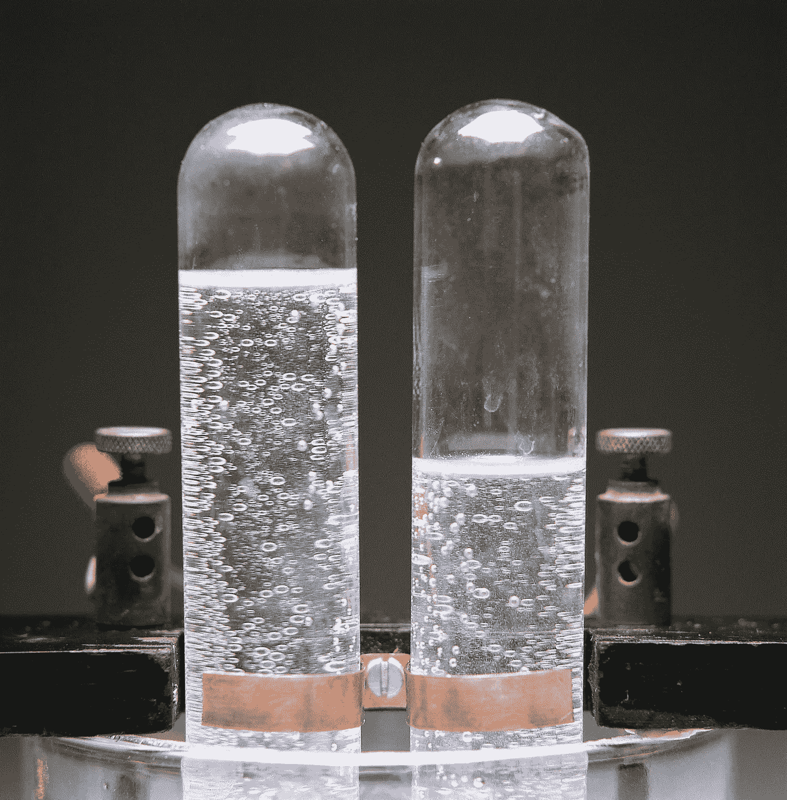

# 氢气有潜力为我们的家庭供暖

> 原文：<https://medium.datadriveninvestor.com/quest-for-drawdown-home-hydrogen-heating-97f32c45fb8?source=collection_archive---------4----------------------->

**系列“寻求缩编”的一部分。**您可能知道，目前我们在许多地方使用“天然气”为建筑物供暖。那么天然气到底是什么？天然气是一种混合物，主要由甲烷(高达 90%)组成，其余通常由乙烷、二氧化碳、氮气、硫化氢和一些其他气体组成[1]。当我们在房子里燃烧甲烷时，它会释放热量、二氧化碳和 H2O。在英国，供暖约占所有直接温室气体(GHGs)的 30%；其中一半发生在家庭部门[2]，另一半发生在商业和工业部门。

> 因此，对于一个普通公民来说，你自己房子的供暖大约占你一生中所有 GHG 排放量的 15%。另外 15%的温室气体来自你购买或接收的服务和商品的生产过程中产生的热量。对于我们当中的纯素食者和素食者来说；这相当于每天吃大约 2 个巨无霸汉堡。你可能会问，我们怎样才能把这个数字降下来？

**氢气**

一种可能性是用热泵(用电)或使用生物质锅炉(取决于生物质来源的可持续性)来加热建筑物。然而，考虑到我们现有的天然气资源基础设施，另一种选择是简单地用另一种不排放温室气体的气体替代该天然气。那会是什么气体呢？输入氢气；H2。氢气不是一种我们可以从地下挖掘出来的资源(不像天然气是通过钻井从地下提取的)，而是必须使用另一种能源供应来制造。有几十种方法可以做到这一点[5]，但我只提到两种:

1.蒸汽-甲烷形成(最广泛使用)。然后使用碳捕获和储存(CCS)技术捕获和储存二氧化碳排放。然而，这继续了天然气(一种化石燃料)的使用，这本身就有问题，我将在后面的文章中讨论。

2.通过电解过程从水中产生氢气。如果这是用可再生能源的电力来完成的，它通常被称为“绿色氢”。

Hydrogen production through electrolysis. When done with renewable energy it is so-called “green hydrogen”. ([Charles D winter via getty](https://www.huffingtonpost.co.uk/entry/hydrogen-production-renewable-energy_n_5822270))

当氢气在氧气存在下燃烧(在建筑物中)时，唯一的产物是水、H2O(即没有温室气体)。

2H2 + O2 → H2O +热量

**飞行员**

目前，在荷兰，使用绿色氢的小规模家庭取暖实验正在罗森堡、阿默兰、胡格文和 Goeree-over fakkee 进行[6]。然而，正在进行的最大规模的项目是在英国利兹[7]，整个城市的燃气基础设施进行了改造，并供应氢气，由蒸汽甲烷和 CCS 形成。这里有一个解释这个项目的[视频](https://www.northerngasnetworks.co.uk/2016/07/12/watch-our-h21-leeds-city-gate-film/)和[文章](https://classic.qz.com/perfect-company-2/1146469/one-companys-ambitious-plan-to-cut-carbon-emissions-for-an-entire-nation/)。

值得注意的一点是将电力转化为氢气(然后燃烧它来获取热量)的效率，大约为 75%，相比之下，热泵系统的效率高达 300%。然而，现有(旧)房屋的全热泵系统的问题在于，它们需要建筑工程来改造房屋。由于这个原因，采用混合热泵[9]，[10]的方法可能是令人感兴趣的:因此，结合标准气体基础设施(在这种情况下，可用于运输和燃烧氢气)使用小型易安装热泵。

**小更新:**

从这份时事通讯开始，我会给你一份环境更新(不幸的是，这往往是坏消息)和一份能源转换/野生动物-土地恢复更新(这往往是好消息)。

环境更新:澳大利亚 1/3 的狐蝠在夏季干旱中灭绝。

**过渡更新:**1 月 8 日，世界上最大的太阳能农场和电池储存设施之一在考艾岛(夏威夷的一部分)竣工。这使得考艾岛超过 50%的能源来自可再生能源。

**参考文献:**

[1]“天然气一致性。”【在线】。可用:[http://www . miningoilgasjobs . com . au/oil-gas-energy/hydrocarbons-and-energy/hydrocarbons/oil-and-gas/downstream/natural-gas . aspx](http://www.miningoilgasjobs.com.au/oil-gas-energy/hydrocarbons-and-energy/hydrocarbons/oil-and-gas/downstream/natural-gas.aspx.)

[2]“发热的碳足迹。”【在线】。可用:[http://research briefings . files . parliament . uk/documents/POST-PN-0523/POST-PN-0523 . pdf .](http://researchbriefings.files.parliament.uk/documents/POST-PN-0523/POST-PN-0523.pdf.)

[3]“脂肪知识:一个芝士汉堡的碳足迹。”【在线】。可用:[http://fat knowledge . blogspot . com/2007/01/carbon-footprint-of-cheese burg . html](http://fatknowledge.blogspot.com/2007/01/carbon-footprint-of-cheeseburger.html.)

[4]“人均碳排放量，按国家|环境| theguardian.com 在线]。可查:[https://www . the guardian . com/environment/data blog/2009/sep/02/carbon-emissions-per-person-capacity。](https://www.theguardian.com/environment/datablog/2009/sep/02/carbon-emissions-per-person-capita.)

[5]“制氢维基百科。”【在线】。可用:[https://en . Wikipedia . org/wiki/Hydrogen _ production #辐解。](https://en.wikipedia.org/wiki/Hydrogen_production#Radiolysis.)

[6]“Stoken op waters tof:deze 5 gemeente doen het gewoon。”【在线】。可用:[https://www . stadszaken . nl/klimaat/energie/1864/stoken-op-waters tof-deze-5-gemeenten-doen-het-gewoon。](https://www.stadszaken.nl/klimaat/energie/1864/stoken-op-waterstof-deze-5-gemeenten-doen-het-gewoon.)

[7]“一家英国公司有一个雄心勃勃的计划，用氢——石英代替天然气。”【在线】。可用:[https://classic . qz . com/perfect-company-2/1146469/one-company ' s-ambiguous-plan-to-cut-carbon-emissions-for-a-entire-nation/。](https://classic.qz.com/perfect-company-2/1146469/one-companys-ambitious-plan-to-cut-carbon-emissions-for-an-entire-nation/.)

[8]“11 peperdure misverstanden over wondermedel waters tof | Duurzaam energienieuws，WattisDuurzaam.nl”。可用:[https://www . wattisduurzaam . nl/15443/energie-be leid/tien-peper dure-misverstanden-over-wonder middel-waters tof/。](https://www.wattisduurzaam.nl/15443/energie-beleid/tien-peperdure-misverstanden-over-wondermiddel-waterstof/.)

[9]“混合热泵系统。”【在线】。可用:[https://smartrenewableheat . com/blog/what-is-hybrid-heat-pump-system-dual-fuel/。](https://smartrenewableheat.com/blog/what-is-hybrid-heat-pump-system-dual-fuel/.)

[10]“热变形金刚——Wij installen hybride warmtepompen。”【在线】。可用:[https://heattransformers.com/.](https://heattransformers.com/.)

[11]“酷热消灭了澳大利亚近三分之一的眼镜狐种群。”【在线】。可用:[https://www . ABC . net . au/news/2018-12-19/heat-wipes-out-三分之一飞狐-species/10632940。](https://www.abc.net.au/news/2018-12-19/heat-wipes-out-one-third-of-flying-fox-species/10632940.)

[12]“夏威夷展示了可能是世界上最大的太阳能+储能系统。”【在线】。可用:[https://www . solarpowerworldonline . com/2019/01/Hawaii-unveils-largest-solar storage-system-in-the-state-and-possible-the-world/。](https://www.solarpowerworldonline.com/2019/01/hawaii-unveils-largest-solarstorage-system-in-the-state-and-possibly-the-world/.)