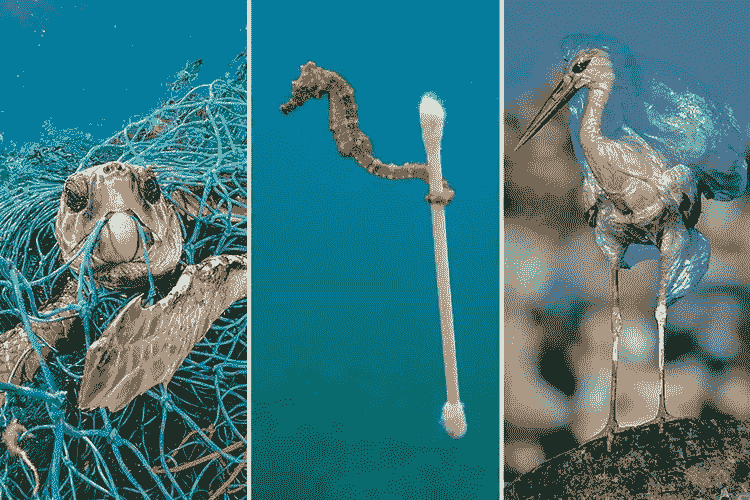

# 环保主义之旅

> 原文：<https://medium.datadriveninvestor.com/quest-for-drawdown-my-journey-into-environmentalism-27fab76ab6f6?source=collection_archive---------24----------------------->

*An orangutan on deforested land, used for palm oil production.* Photo from [Loa Skin](https://loaskin.com/blogs/loa-skin-care/palm-oil-skin-care-causes-massive-deforestation).

我今年 25 岁，从未成为任何领域的积极分子，也从未从事过任何特定的运动。自去年夏天以来，情况发生了变化。让我解释一下…

我一直认为全球变暖导致的气候变化是未来的问题，也是对我来说遥远的土地的问题。在夏季干旱期间，很明显是人类造成的全球变暖比自然气候模式多 30 倍，我意识到我错了。在我的祖国荷兰，空调在几天内就销售一空[【2】](https://www.ad.nl/binnenland/massale-run-op-airco-s-bij-coolblue-zelfs-enaacute-lle-soorten-uitverkocht~a15cee90/)。莱茵河的水位达到有记录以来的最低水平[【3】](https://www.telegraaf.nl/nieuws/2481316/rijn-bij-lobith-op-laagste-stand-ooit?utm_source=google&utm_medium=organic)，导致船只减少他们的货物，否则他们会撞到河床[【4】](https://www.trouw.nl/groen/het-is-door-de-droogte-oppassen-geblazen-voor-de-binnenvaarttanker-~a30d0879/)[【5】](https://www.gelderlander.nl/doesburg/binnenvaart-zucht-onder-droogte-meer-schepen-nodig-minder-ruimte~a1281c65/)。因此需要更多的船只，推高交易成本。桥梁无法开放，因为它们的钢材在高温下膨胀了。在高温下死去的草引发了喂养农场动物的干草短缺，导致从其他国家进口，甚至报告了从其他农场盗窃干草的事件。气候变化来到了我的家门口。现在，这些提到的影响并不那么戏剧化或危险，但它们是即将发生的事情的微妙警告。在我们有生之年还会有更多。

自夏季以来，科学界已经发出了许多危险信号。一份是以论文的形式概述了通向“温室地球”的道路；由我们自身的排放触发的引爆点和正反馈机制的集合[【8】](https://theconversation.com/hothouse-earth-our-planet-has-been-here-before-heres-what-it-looked-like-101413)[【9】](https://www.bbc.co.uk/news/science-environment-45084144)。当达到这些临界点时，即使我们大幅减少我们自己的温室气体(GHG)排放[【8】](https://theconversation.com/hothouse-earth-our-planet-has-been-here-before-heres-what-it-looked-like-101413)[【9】](https://www.bbc.co.uk/news/science-environment-45084144)，这些临界点也会导致森林、永久冻土和海洋的二氧化碳和甲烷净正排放。这可能导致“失控”的全球变暖，或“多米诺骨牌效应”[【8】](https://theconversation.com/hothouse-earth-our-planet-has-been-here-before-heres-what-it-looked-like-101413)[【9】](https://www.bbc.co.uk/news/science-environment-45084144)[【10】](https://www.theguardian.com/environment/2018/dec/20/risks-of-domino-effect-of-tipping-points-greater-than-thought-study-says)。这种“临界点”之前已经讨论过，但存在争议。现在，只有他们能够解释气候科学家正在观察的快速变化。

根据保守机构政府间气候变化专门委员会的说法，我们有 12 年的时间来应对气候变化。到 2030 年，我们的排放量应该减少 45%，到 2050 年减少到零。用 H.J. Schellnhuber(世界领先的气候科学家)的话来说，“气候变化现在正进入最后阶段，很快人类必须在采取前所未有的行动或接受为时已晚并承担后果之间做出选择”[【12】](https://www.theguardian.com/commentisfree/2018/aug/20/politicians-must-set-aside-blinkered-ideologies-in-the-climate-end-game)。

后果包括失去一系列主要的沿海城市，包括迈阿密、上海、香港、大阪、里约热内卢、亚历山大和海牙。夏季热浪成为新的常态，并引发干旱、森林火灾、农作物歉收和人类大规模迁徙。叙利亚难民危机可能只是开始[【16】](http://time.com/5076003/climate-change-migration-trump/)[【17】](https://www.theguardian.com/environment/climate-consensus-97-per-cent/2018/jan/15/study-finds-that-global-warming-exacerbates-refugee-crises)。从经验中我们知道，这为社会中的其他问题铺平了道路。出于这个原因，五角大楼(美国军方)认为全球变暖是一个“威胁倍增器”，增强了恐怖主义和传染病的原有威胁。除非我们现在就采取行动，否则这一切都将在我们有生之年发生。

最重要的是，最近几年，我们正在经历第六次大灭绝[【19】](https://www.researchgate.net/publication/277248016_Vertebrate_biodiversity_losses_point_to_sixth_mass_extiction)[【20】](http://science.sciencemag.org/content/344/6187/1246752)[【22】](http://science.sciencemag.org/content/360/6393/1080.2/tab-pdf)(为了让你了解什么是“大灭绝”，想想恐龙灭绝的时间)。自 20 世纪初以来，灭绝率比背景灭绝率高 100-1000 倍[【19】](https://www.researchgate.net/publication/277248016_Vertebrate_biodiversity_losses_point_to_sixth_mass_extiction)[【20】](http://science.sciencemag.org/content/344/6187/1246752)。这相当于每天有 200 个物种灭绝。原因？美国[【23】](https://edition.cnn.com/2017/07/11/world/sutter-mass-extinction-ceballos-study/index.html)[【24】](https://www.weforum.org/agenda/2017/08/a-sixth-mass-extinction-is-underway-and-its-our-fault/)。这是通过气候变化、不良耕作方式、过度捕捞、栖息地丧失、偷猎、塑料污染、土地退化等方式发生的[【23】](https://edition.cnn.com/2017/07/11/world/sutter-mass-extinction-ceballos-study/index.html)[【24】](https://www.weforum.org/agenda/2017/08/a-sixth-mass-extinction-is-underway-and-its-our-fault/)。这次大规模灭绝的受害者包括长江海豚[【25】](https://www.mnn.com/earth-matters/animals/photos/10-animals-presumed-extinct-in-the-last-decade/baiji-dolphin)，比利牛斯山北山羊[【26】](https://www.telegraph.co.uk/travel/lists/beautiful-extinct-animals/)和西方黑犀牛[【26】](https://www.telegraph.co.uk/travel/lists/beautiful-extinct-animals/)。预计在未来 30 年左右灭绝的物种包括格陵兰雪橇犬[【27】](http://science.sciencemag.org/content/360/6393/1080.1)、非洲象[【23】](https://edition.cnn.com/2017/07/11/world/sutter-mass-extinction-ceballos-study/index.html)、[【28】](https://www.theguardian.com/environment/2016/aug/12/elephants-on-the-path-to-extinction-the-facts)和暹罗鳄[【29】](https://web.archive.org/web/20090328134206/http:/iucncsg.org:80/ph1/modules/Publications/action_plan1998/csiam.htm)。

Composition made by [the Sun](https://www.thesun.co.uk/news/6308904/national-geographic-ocean-plastic-pollution-seahorse/), from National Geographic’s [“Planet or Plastic”](https://www.nationalgeographic.com/environment/planetorplastic/). From left to right, credit to Jordi Chias, Justin Hofman, John Cancalosi.

如果有权力的政府和公司能够认识到我们所处的可怕局面，并采取相应行动阻止局势进一步升级，那么所有这些都不会让我感到如此困扰。事实是他们不是[【30】](https://www.economist.com/leaders/2018/08/02/the-world-is-losing-the-war-against-climate-change)[【31】](https://www.wri.org/blog/2018/11/5-things-you-need-know-about-un-emissions-gap-report)。根据当前的气候政策和为未来计划的行动，本世纪世界气温将上升 3 摄氏度，而不是 1.5 摄氏度(这是估计的地球安全界限)[【31】](https://www.wri.org/blog/2018/11/5-things-you-need-know-about-un-emissions-gap-report)。基于当前政策；森林砍伐将会继续，国家地理杂志估计在 100 年内热带雨林可能会完全消失。在英国，破坏性耕作方式导致的土地退化预计将在 30 至 40 年内导致土壤肥力的根本消失[【33】](https://www.theguardian.com/environment/2017/oct/24/uk-30-40-years-away-eradication-soil-fertility-warns-michael-gove)(没有土壤肥力=没有食物)。

这种情况发生，不是因为它必须这样或出于邪恶的意图来毁灭世界，而是出于冷漠和漠不关心。因为我们很忙。因为生物多样性的破坏和我们气候的不稳定带来了一个我们看不到或者还感觉不到的代价。(注意，关于雨林，这一价格标签估计每年约为 5 万亿美元[【34】](https://www.independent.co.uk/environment/climate-change/5000000000000-the-cost-each-year-of-vanishing-rainforest-2096367.html))。

我并不想夸大其词，但我们必须看到并理解正在发生的事情。我们正处于名副其实的生态危机中，而且越来越严重。

事情不一定是这样的。这场危机是可以解决的，但不是靠任何单一行动或一次性事件就能解决的。这将需要在多年的时间里采取迅速和持续的行动。上面概述的问题是交织在一起的，并不是由一个人造成的。它们是由我们共同创造的。我们都是同谋。它们只能由我们作为一个集体来解决。因此我写作。我写信是为了开始一段对话。因为任何集体行动都是从对话开始的。因为任何没有对话的快速转变都会导致无法回答的问题、担忧、误解和反对。因为对话可以激励每个人。