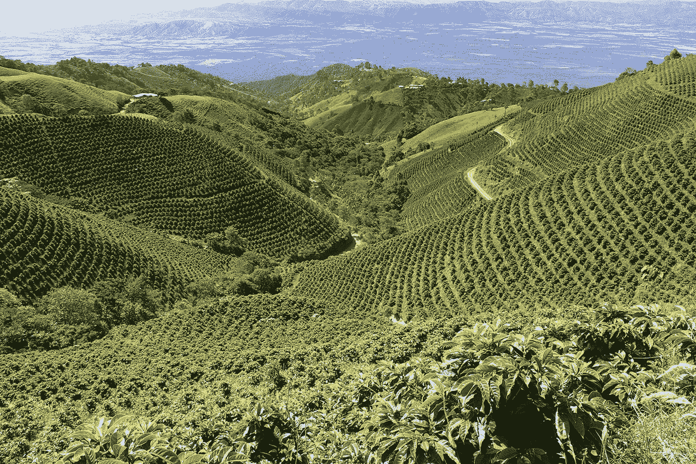

# 寻求缩编:新闻快讯 1

> 原文：<https://medium.datadriveninvestor.com/quest-for-drawdown-newsflash-1-68af665add89?source=collection_archive---------25----------------------->

Coffee plantation. Credit to [Ninjagoat](https://ninjagoatnutrition.com/shop/ninja-goat-ludicrous-blend-100-shade-grown-and-organic-coffee-2/)

大家好，这里有一点关于气候变化和正在进行的第六次大灭绝的最新进展。

**环境更新:**

咖啡树有望灭绝。

2012 年格陵兰冰盖融化速度比 2003 年快 4 倍[【2】](https://www.cbc.ca/news/canada/north/greenland-southwest-ice-melt-accelerating-1.4986064)。

主要的海洋食物来源正在向南向南极撤退(由于海洋变暖)，这可能会破坏生态系统。

海洋变暖相当于每秒引爆一颗原子弹[【4】](https://www.theguardian.com/environment/2019/jan/07/global-warming-of-oceans-equivalent-to-an-atomic-bomb-per-second)。

**技术更新:**

沙特阿拉伯风能创纪录低价，0.02 美元/千瓦时[【5】](https://www.forbes.com/sites/feliciajackson/2019/01/15/wind-power-breaks-new-record-at-0-02-per-kwhr/#ae06ab0272d1)。

新技术显示风能可以储存在北海的岩石中。[【6】](https://www.independent.co.uk/environment/north-sea-rocks-renewable-energy-wind-power-green-nuclear-compressed-air-storage-a8738901.html)

研究表明，必须立即淘汰所有化石燃料基础设施，以阻止气温上升 1.5 摄氏度[【7】](https://edition.cnn.com/2019/01/15/health/climate-change-phase-out-infrastructure-study/index.html)。

澳大利亚最大的社区太阳能农场揭幕。

政治行动:

比利时一万多名学童罢工，要求采取更多的气候行动。

法西之间的 MidCat/STEP 天然气管道关键路段取消[【10】](https://www.euractiv.com/section/energy/news/regulators-kill-key-section-of-planned-france-spain-gas-pipeline/)[【11】](http://www.foeeurope.org/Climate-incompatible-France-Spain-gas-pipeline-cancelled-220119)。

温哥华、康沃尔和伦敦宣布“气候紧急状态”[【12】](https://globalnews.ca/news/4856517/vancouver-city-council-votes-to-declare-climate-emergency/)[【13】](https://www.cornwalllive.com/news/cornwall-news/climate-emergency-declared-cornwall-councillors-2457897)[【14】](https://www.theguardian.com/uk-news/2018/dec/11/london-mayor-sadiq-khan-city-climate-emergency)。

游说团体“商业欧洲”一直反对欧盟的气候行动[【15】](https://unearthed.greenpeace.org/2018/09/19/businesseurope-cbi-eu-climate-paris-agreement/amp/)[【16】](https://www.euractiv.com/section/climate-environment/news/leaked-memo-exposes-business-rift-on-climate-change/)，反对 1.5 摄氏度目标的措施。该集团由包括喜力、飞利浦、脸书、谷歌、埃森哲和荷航在内的 67 家公司出资。

柏林 35000 名抗议者抗议带来农业革命。他们呼吁更可持续的耕作方法。

特朗普提名前煤炭游说者担任环境保护局局长。

**行动号召:**

目前，在欧盟内部，更多的(肮脏的)棕榈油被用作生物燃料，而不是其他任何用途。我们正在烧毁其他国家的雨林和猩猩的家园来清理我们自己的数量。欧盟委员会目前有一周的时间来决定是否逐步淘汰棕榈油燃料。在这里签署请愿书，帮助他们决定。

**链接:**

[1]“世界上最受欢迎的咖啡物种正在走向灭绝。科学家说这是我们的错。”【在线】。可用:[https://edition . CNN . com/2019/01/16/health/coffee-species-extinction-climate-study-trnd/index . html](https://edition.cnn.com/2019/01/16/health/coffee-species-extinction-climate-study-trnd/index.html.)

[2]“研究称| CBC 新闻报道，由于格陵兰岛冰融化速度加快，预计东海岸会出现更多极端飓风。”【在线】。可用:[https://www . CBC . ca/news/Canada/north/格陵兰-西南-融冰-加速-1.4986064。](https://www.cbc.ca/news/canada/north/greenland-southwest-ice-melt-accelerating-1.4986064.)

[3]“南极磷虾:关键食物来源南移——BBC 新闻。”【在线】。可用:【https://www.bbc.co.uk/news/science-environment-46953652.】T4

[4]“每秒钟全球海洋变暖相当于原子弹爆炸。”【在线】。可用:[https://www . the guardian . com/environment/2019/Jan/07/global-warming-of-oceans-equivalent-to-a-atomic-bomb-per-second。](https://www.theguardian.com/environment/2019/jan/07/global-warming-of-oceans-equivalent-to-an-atomic-bomb-per-second.)

[5]“风力发电打破每千瓦时 0.02 美元的新纪录。”【在线】。可用:[https://www . Forbes . com/sites/Felicia Jackson/2019/01/15/wind-power-breaks-new-record-at-0-02-per-kwhr/# AE 06 ab 0272d 1。](https://www.forbes.com/sites/feliciajackson/2019/01/15/wind-power-breaks-new-record-at-0-02-per-kwhr/#ae06ab0272d1.)

[6]“储存能量岩石北海。”【在线】。可用:[https://www . independent . co . uk/environment/north-sea-rocks-renewable-energy-wind-power-green-nuclear-compressed-air-storage-a 8738901 . html](https://www.independent.co.uk/environment/north-sea-rocks-renewable-energy-wind-power-green-nuclear-compressed-air-storage-a8738901.html.)

[7]“阻止气温上升的一个简单方法。”【在线】。可用:[https://edition . CNN . com/2019/01/15/health/climate-change-phase-out-infra structure-study/index . html](https://edition.cnn.com/2019/01/15/health/climate-change-phase-out-infrastructure-study/index.html.)

[8]“澳大利亚最大的社区太阳能农场。”【在线】。可用:[https://www . PV-magazine-Australia . com/2019/01/23/Australia s-biggest-community-solar-farm-invites-all-canberrans-to-sun-in-the-benefits-of-energy-transition/。](https://www.pv-magazine-australia.com/2019/01/23/australias-biggest-community-solar-farm-invites-all-canberrans-to-bask-in-the-benefits-of-energy-transition/.)

[9]“成千上万的人再次翘课去比利时抗议气候变化——华盛顿邮报。”【在线】。可用:[https://www . Washington post . com/world/Europe/millions-skip-school-again-go-to-Belgium-climate-declaration/2019/01/17/9 c 30 e 5 fc-1a 50-11e 9-b8e 6-567190 c2fd 08 _ story . html？utm_term=.481020b4f9b0\.](https://www.washingtonpost.com/world/europe/thousands-skip-school-again-to-go-to-belgium-climate-protest/2019/01/17/9c30e5fc-1a50-11e9-b8e6-567190c2fd08_story.html?utm_term=.481020b4f9b0.)

[10]“监管机构否决规划中的法国-西班牙天然气管道的关键部分—euractiv . com .”[在线]。可用:[https://www . euractiv . com/section/energy/news/regulators-kill-key-section-of-planned-France-Spain-gas-pipeline/。](https://www.euractiv.com/section/energy/news/regulators-kill-key-section-of-planned-france-spain-gas-pipeline/.)

[11]“气候不相容的法国-西班牙天然气管道被取消|地球之友欧洲。”【在线】。可用:[http://www . foe Europe . org/Climate-compatible-France-Spain-gas-pipeline-cancelled-220119。](http://www.foeeurope.org/Climate-incompatible-France-Spain-gas-pipeline-cancelled-220119.)

[12]“温哥华市议会投票宣布‘气候紧急状态’| global news . ca .”[在线]。可用:[https://global news . ca/news/4856517/Vancouver-city-Council-votes-to-declare-climate-emergency/。](https://globalnews.ca/news/4856517/vancouver-city-council-votes-to-declare-climate-emergency/.)

[13]“康沃尔宣布进入气候紧急状态，但一些议员不相信气候变化——康沃尔实况。”【在线】。可用:[https://www . Cornwall live . com/news/Cornwall-news/climate-emergency-declared-Cornwall-counters-2457897。](https://www.cornwalllive.com/news/cornwall-news/climate-emergency-declared-cornwall-councillors-2457897.)

[14]“伦敦市长公布应对‘气候紧急事件’的计划”|英国新闻|卫报。”【在线】。可用:[https://www . the guardian . com/uk-news/2018/dec/11/London-mayor-sadiq-Khan-city-climate-emergency。](https://www.theguardian.com/uk-news/2018/dec/11/london-mayor-sadiq-khan-city-climate-emergency.)

[15]“包括脸书、谷歌在内的贸易团体‘反对’欧盟的气候努力。”【在线】。可用:[https://unoutned . Greenpeace . org/2018/09/19/business Europe-CBI-eu-climate-Paris-agreement/amp/。](https://unearthed.greenpeace.org/2018/09/19/businesseurope-cbi-eu-climate-paris-agreement/amp/.)

[16]“泄露的备忘录暴露了气候变化问题上的商业裂痕——euractiv . com”。可用:[https://www . euractiv . com/section/climate-environment/news/leaved-memo-exposes-business-rift-on-climate-change/。](https://www.euractiv.com/section/climate-environment/news/leaked-memo-exposes-business-rift-on-climate-change/.)

[17]“as group—我们的合作伙伴公司| BusinessEurope。”【在线】。可用:[https://www . business Europe . eu/about-us/as group-our-partner-companies。](https://www.businesseurope.eu/about-us/asgroup-our-partner-companies.)【访问时间:2019 年 1 月 21 日】。

[18]“柏林农业抗议者”【在线】。可用:[https://www . eco watch . com/Berlin-抗议-农业-可持续发展-2626620890。](https://www.ecowatch.com/berlin-protest-agriculture-sustainability-2626620890.)

[19]“特朗普提名煤炭游说者安德鲁·惠勒(Andrew Wheeler)担任环境保护署署长| Time。”【在线】。可用:[http://time . com/5498307/Andrew-wheeler-coal-说客-epa-head/。](http://time.com/5498307/andrew-wheeler-coal-lobbyist-epa-head/.)

[20]“我的油箱里没有棕榈油！”【在线】。可用:[https://act.wemove.eu/campaigns/1119.](https://act.wemove.eu/campaigns/1119.)