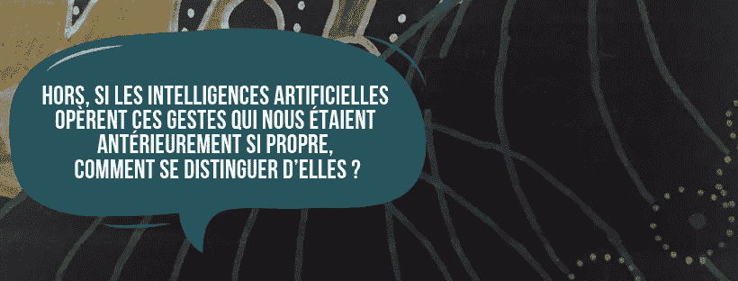
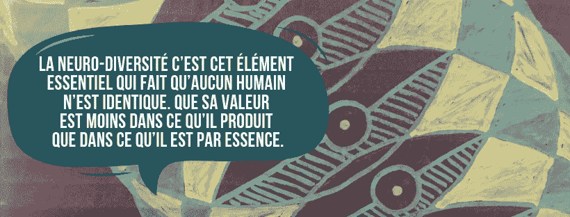

# AI:探索奇点可能开启人类奇点时代。

> 原文：<https://medium.datadriveninvestor.com/quest-of-singularity-may-open-time-of-human-singularities-f4e8fadaa7f0?source=collection_archive---------20----------------------->

我们在二十年后，你们未来的生活已经鹤立鸡群。你可以想象它被 21 世纪的新技术震撼了。在所有这些应该改变你日常生活的变化的中心，奇点就在这里。有些人害怕它。有些人被迷住了。奇点接受了我们逃避成为当代傀儡的借口，在任何情况下，我们都不会放弃。

如果人工智能奇点已经在宣告人类奇点的回归呢？

在生产力和效率文化引领下的几个世纪之后，人类几代人在劳动范式和机械姿态中成长。我们的身体被教育成有组织的、被强迫的、被计时的。我们还没有在我们的生物行为和我们的文化建设之间找到可持续的平衡。学校，公司，所有社会化的地方仍然是基于等级地位，有效的任务和最终的结果。

**但是，如果人工智能产生了所有被认为是人类特有的手势和任务，我们如何区分彼此？**因为这里是重点！当工具获得了本应属于我们的独特性:智能时，人性是什么？

并且，在任何事情之前，如何理解什么是智能。当*联系学家*的研究正在揭开 Isis 的人工智能面纱时，精神分析正在通过非典型人物发现新闻研究。ASD、HP、天才、Hyper，所有这些描述另一种性质的奇怪名称揭示了将自身翻译给其他人的需要有多深。如果研究仍然是新生的，有时它知道非法科学的方法指责，这可能是可怕的停止现在正在出现的东西！

事实上，如果我们更好地理解人类的多样性，我们可能会找到抑制所有对奇点的恐惧的答案。

**神经多样性研究可能让我们揭示关于人类物种的新认识，而不仅仅是智力表现。**

神经多样性是证明每个人都不同的核心要素。人的价值不在于一个人能生产什么，而在于他的本性。在那个时代，当人类为了展示他们自己的价值观而战斗和移动，他们试图按照旧的范式来标准化，也许是时候接受这一点了:除了自己的独特性，没有人有任何价值。

通过接受神经奇点，我们可以拒绝被困在医疗解决方案中。与众不同，在社交场合之外表现自己，并不是一种必须治愈的疾病。这也是一种方式来拒绝文化和语言的奇异性只是消失在帝国主义的论点下，说:“纳布科多诺索也做到了”。最后，是一个可行的答案，让人类走出人机天堂，想象我们自己是一个新的人类。

但是这个生物会是什么呢？通过接受它的独特性不需要放在一个社会尺度上，它会成功地哀悼它的自我吗？它会找到一种方法来容忍更少的计划寿命和非线性破碎寿命吗？我们会接受这个巨大的空虚的无意义的尘世生活吗？

**因为为他们自己展望未来的活动，为改变你而学习，为集体贡献而关注他人，这是另一种范式。**

拒绝做一个被奴役的人，也意味着禁止任何人成为奴隶。我们当代的人类真的准备好接受这种变化了吗？还是他们会轻易地被当成他们认为是独一无二的机器的物品？