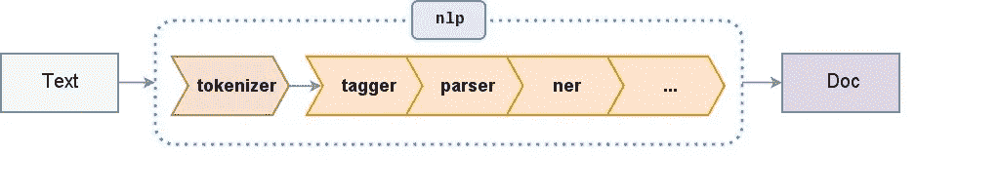
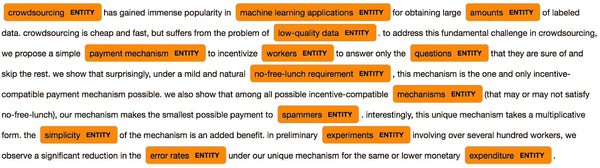

# 快速和肮脏—实体识别

> 原文：<https://medium.datadriveninvestor.com/quick-and-dirty-entity-recognition-e48853cb4fc?source=collection_archive---------10----------------------->

Source: [spaCy Language Processing Pipelines](https://spacy.io/usage/processing-pipelines)

## 人工智能从概念到原型。

*如果你曾经在一家初创公司或科技世界呆过很长时间，你一定会***遇到一些，如果不是所有的话:“敏捷软件开发”、“原型制作”、“反馈循环”、“快速迭代”等等。**

**硅谷的这些技术术语可以归结为一个简单的概念，这恰好是许多成功企业家的口头禅:尽快检验你的想法，然后随着时间的推移不断完善它。更直白地说，在你投入精力和金钱为一个问题创建一个尖端的解决方案之前，使用现成的技术为你的任务获得一个基线性能可能对你有好处。一旦你确立了低成本、简单方法的功效，你就可以戴上埃隆·马斯克的帽子，朝着#创新和#颠覆的方向前进。**

**一个具体的例子可能有助于说明这一点:**

# *介绍*

## *实体提取*

*假设我们的目标是创建一个自然语言系统，有效地允许人们与学术论文交谈。这项任务可能是开发自动化科学发现工具的第一步。以后社会可以感谢我们。*

*但是我们从哪里开始呢？嗯，解决方案的一部分必须处理[知识提取](https://en.wikipedia.org/wiki/Knowledge_extraction)。为了创建一个理解科学论文的对话引擎，我们首先需要开发一个实体识别模块，幸运的是，这就是我们笔记本的主题！*

*“什么是实体？”你问？问得好。看看下面这句话:*

> **Abraham 博士是这篇论文的第一作者，内科专业的医师。**

*现在，对于一个说英语的人来说，挑选出这句话中的重要概念应该是相对简单的:*

> ****【亚伯拉罕博士】*** *是***本* ***【论文】*** *，还有一个* ***【医师】*******【专科】******

****这些单词和/或短语被归类为“实体”,因为它们代表现实世界中突出的思想、名词和名词短语。实体的子集可以被“命名”，因为它们对应于特定的*地点、人、组织等等。一个[命名的实体](https://en.wikipedia.org/wiki/Named_entity)对于一个常规实体，就像“亚伯拉罕博士”对于一个“医生”一样。好医生是一个真实的人，是“医师”类的一个实例，因此被认为是“有名字的”。命名实体的例子包括“谷歌”、“尼尔·德格拉塞·泰森”和“东京”，而常规的、普通的实体可以包括刚才提到的列表，以及像“狗”、“报纸”、“任务”等事物。*****

*****让我们看看能否让计算机运行这种分析，从句子中提取重要的概念。*****

## *****任务*****

*****对于我们的对话式学术论文项目，我们不会满足于简单地捕获命名实体，因为我们需要理解一般概念以及实际事物、地点等之间的关系。不幸的是，尽管大多数开箱即用的文本处理库都有一个相当有用的**命名实体识别器**，但它们很少或根本不支持通用的**实体识别器**。*****

*****这是因为一个微妙但重要的约束。*****

*****正如我们已经讨论过的，实体对应于命名实体的超集， ***应该*** 使它们更容易提取。事实上，盲目地从一个文本源中提取所有实体实际上很简单，但遗憾的是它并不那么有用。为了证明这种做法的正确性，我们需要开发一种实体提取方法，这种方法局限于或认识到某些特定的领域，例如，神经科学、心理学、计算机科学、经济学等。这种矛盾的复杂性使得创建一个通用但有用的实体识别器并不容易。因此，大多数处理自然语言处理的开源库缺乏支持。*****

****为了在很大程度上简化我们的任务，我们必须从一篇科学论文中生成一组实体，即比命名实体的简单列表*大，但比所有实体的庞大列表*小，仅限于所讨论的特定论文的领域。******

*****呀。你有点出汗吗？因为我是。*****

*****让我们用一点聪明才智、简单的开源代码和大量的启发来制作一个原型，而不是去找一些布洛芬和深度学习药丸。希望通过这个过程，我们也能了解一些文本处理管道，它将理解自然语言带入了可能的领域。*****

*****闲聊够了。我们开始吧！查看下面的[完整 Jupyter 笔记本](https://nbviewer.jupyter.org/github/SudoSharma/entity_extraction/blob/master/entity_extraction.ipynb):*****

*****

[Quick and Dirty — Entity Extraction Jupyter Notebook](https://nbviewer.jupyter.org/github/SudoSharma/entity_extraction/blob/master/entity_extraction.ipynb)*****