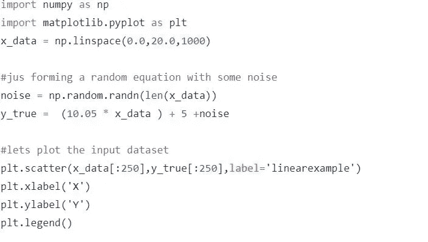
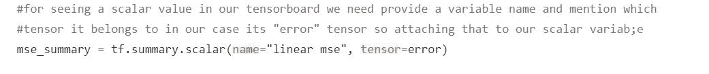
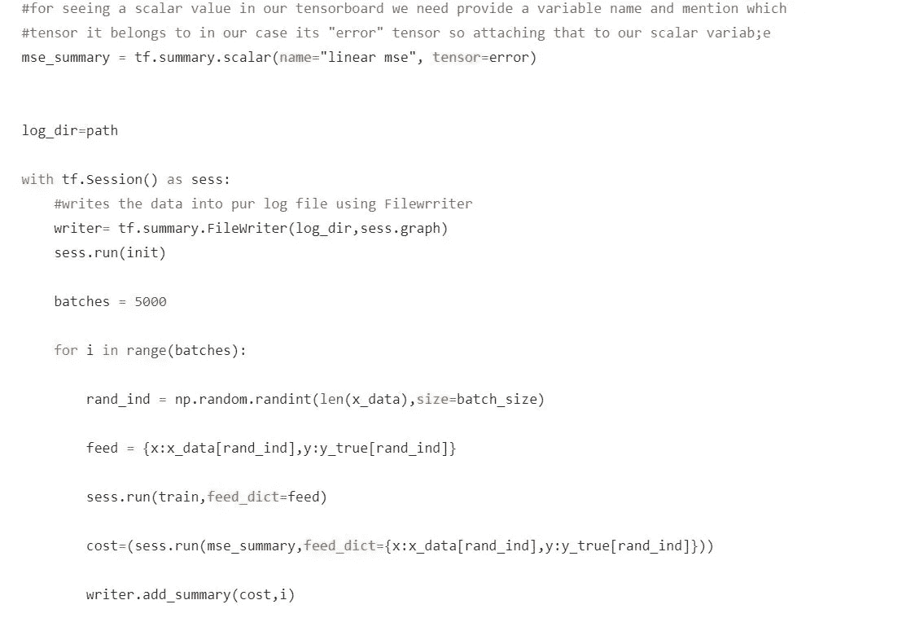
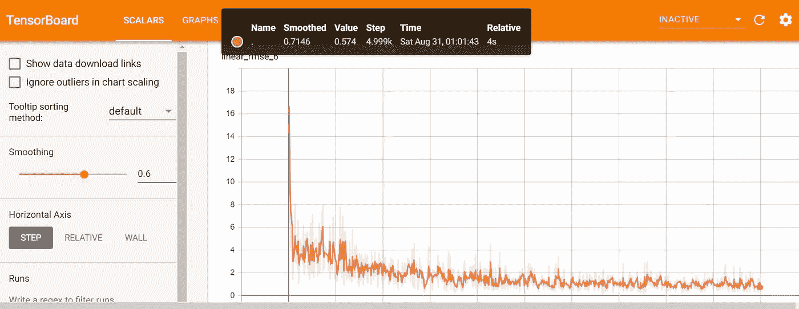

# 快速简单的张量板可视化

> 原文：<https://medium.datadriveninvestor.com/quick-and-easytensorboard-visualization-aba753117fd7?source=collection_archive---------9----------------------->

在这篇文章中，我们将从我们的模型和参数中学习如何使用张量板可视化

**什么是 Tensorboard？**

谷歌的 Tensorflow 已经成为开发人员在深度学习用例中帮助他们的最佳开源深度学习库之一。Tensorboard 是一个网络应用程序，它可以帮助我们可视化我们的模型细节，并帮助我们在我们的模型上进行模式实验，以获得最佳结果。

**为什么冲浪板很重要？**

作为机器学习/深度学习工程，我们在我们的模型中做了大量的预处理，如清理数据、清洗数据、编码它们、识别要传递给我们的模型的正确特征等。可视化数据是如此重要，以至于对给定的数据集有了基本的了解。在我们的探索性数据分析中，我们使用公共库 matplotlib 或 seaborn 等做了大量的绘图。因为这为我们提供了我们将要使用的数据的关键见解。例如建模期间的情况。

 [## 深度学习用 7 个步骤解释-更新|数据驱动的投资者

### 在深度学习的帮助下，自动驾驶汽车、Alexa、医学成像-小工具正在我们周围变得超级智能…

www.datadriveninvestor.com](https://www.datadriveninvestor.com/2019/01/23/deep-learning-explained-in-7-steps/) 

对我们来说，可视化我们的模型和创建模型一样重要。在任何深度学习算法中，调整参数的实验在实现完美模型中占有很大的权重。因此，在 TensorFlow 中，我们拥有 tensorboard 工具包的额外优势，这使我们的工作变得更容易、更好。我们可以看到我们的学习率是如何影响历元/迭代的，或者我们的初始模型权重或偏差项是如何在达到最佳值之前得到更新的。可视化帮助我们了解我们是否有局部最优问题，以及我们在建模过程中面临的许多其他常见问题。

**如何？**

有了 Tensorboard，可视化标量、直方图或分布、图像或我们的模型图等实际上非常简单。

让我们来看一个如何做到这一点的基本例子。对于这个例子，我们将考虑一个基本的线性方程 y=mx+c。

现在我们已经获得了输入数据，让我们开始构建张量流模型:

现在我们将添加 **tf.summary.scalar** 方法来创建一个变量，用于存储我们的变量。在本例中，我们将为每次迭代添加我们的 MSE 分数

让我们开始 tensorflow 会话，并通过一个 **tf.summary.FileWriter** 方法传递要写入的标量，该方法帮助我们添加标量并在会话中调用变量(mse_summary)。

运行模型。万岁！！！我们已经将标量变量和图形存储到指定的 logpath 中。现在让我们想象同样的情况。

打开命令提示符，导航到我们保存日志的文件夹路径。

现在在命令提示符下传递以下命令

**tensor board—logdir = filename—端口 6006**

这里 6006 是 tensorboard 的默认端口。一旦点击，我们可以看到，我们将获得一个网址#例如 [http://xyz:6006](http://xyz:6006) #复制网址，并在浏览器中打开

干得好！！！我们可以看到每次迭代的 Mse 值是如何变化的。此外，导航到 graph 选项卡并查看我们的模型图。您可以随意尝试添加不同的标量，或者更改模型图并将其可视化。

**请在这里找到相同的完整代码:**

 [## rrajkumar1990/Tensorboard -标量和图形可视化

### 此时您不能执行该操作。您已使用另一个标签页或窗口登录。您已在另一个选项卡中注销，或者…

github.com](https://github.com/rrajkumar1990/Tensorboard--Scalar-and-graph-visualvalization/blob/master/tensorboard_scalar_vis.py) 

此外，请随意查看我的**张量板直方图示例**中的相同数据集:

 [## rrajkumar 1990/tensor board _ 直方图

### 此时您不能执行该操作。您已使用另一个标签页或窗口登录。您已在另一个选项卡中注销，或者…

github.com](https://github.com/rrajkumar1990/Tensorboard_histogram)