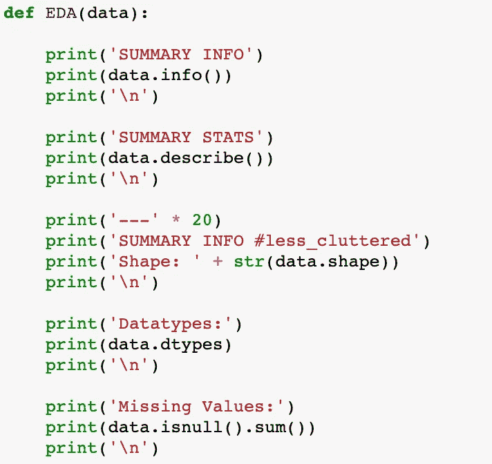

# 快速和肮脏的 EDA

> 原文：<https://medium.datadriveninvestor.com/quick-dirty-eda-ac3a53e43755?source=collection_archive---------10----------------------->


Source: [https://betanews.com/2016/10/13/twitter-replaces-moments-with-explore/](https://betanews.com/2016/10/13/twitter-replaces-moments-with-explore/)

在 EDA 过程中，你是否厌倦了一遍又一遍地输入相同的命令？

如果你和我一样，那么是的。在任何给定的数据集中，探索您的数据是绝对必要的，以了解您将使用什么，并有效地回答您的数据科学问题。为了解决这种冗余，让我们创建一个快速而简单的 EDA 函数，我们可以在第一次查看数据时使用它。

我们可以立即使用几个函数和属性来获得数据的概览。

其中包括以下内容:

*   `df.info()`
*   `df.describe()`
*   `df.isnull()`
*   `df.shape`
*   `df.dtypes`

还有许多其他的，包括但不限于:

*   `df.head()`
*   `df.tail()`
*   `df.corr()`
*   `df.value_counts()`
*   `df.sort_values()`

在这篇博客中，我们将只使用前五个数据来探索我们的数据，因为它们更全面。

## `df.info( )`

这个函数本身已经返回了很多信息(字面上)。它告诉我们数据的类别(pandas.core.frame.DataFrame)。我们的数据帧有多大(985 行 12 列)。如果数据为空，它甚至会输出列名，以及每一列的数据类型。

```
SUMMARY INFO
<class 'pandas.core.frame.DataFrame'>
RangeIndex: 985 entries, 0 to 984
Data columns (total 12 columns):
street       985 non-null object
city         985 non-null object
zip          985 non-null int64
state        985 non-null object
beds         985 non-null int64
baths        985 non-null int64
sq__ft       985 non-null int64
type         985 non-null object
sale_date    985 non-null object
price        985 non-null int64
latitude     985 non-null float64
longitude    985 non-null float64
dtypes: float64(2), int64(5), object(5)
memory usage: 92.4+ KB
None
```

## `df.describe( )`

此函数详细描述了数字类型的列的汇总统计信息。它计算并返回计数、平均值、标准差、最小值、最大值和百分位数(25%、50%、75%)。

```
SUMMARY STATS
                zip        beds       baths       sq__ft          price  \
count    985.000000  985.000000  985.000000   985.000000     985.000000   
mean   95750.697462    2.911675    1.776650  1312.918782  233715.951269   
std       85.176072    1.307932    0.895371   856.123224  139088.818896   
min    95603.000000    0.000000    0.000000  -984.000000 -210944.000000   
25%    95660.000000    2.000000    1.000000   950.000000  145000.000000   
50%    95762.000000    3.000000    2.000000  1304.000000  213750.000000   
75%    95828.000000    4.000000    2.000000  1718.000000  300000.000000   
max    95864.000000    8.000000    5.000000  5822.000000  884790.000000   

         latitude   longitude  
count  985.000000  985.000000  
mean    38.445121 -121.193371  
std      5.103637    5.100670  
min   -121.503471 -121.551704  
25%     38.482704 -121.446119  
50%     38.625932 -121.375799  
75%     38.695589 -121.294893  
max     39.020808   38.668433
```

## `df.shape`

此属性还包含在`.info(),`中，返回行数和列数。

```
Shape: (985, 12)
```

## `df.dtypes`

另一个已经包含在`.info()`中的函数，它返回列或特征名及其各自的数据类型。

```
Datatypes:
street        object
city          object
zip            int64
state         object
beds           int64
baths          int64
sq__ft         int64
type          object
sale_date     object
price          int64
latitude     float64
longitude    float64
dtype: object
```

## `df.isnull( ).sum( )`

作为 EDA 的一部分，最有利于清理数据的是寻找丢失的值。因为`.info()`返回一个布尔值，所以我们将它与`.sum()`结合起来，得到每个变量缺失值的总数。

```
Missing Values:
street       0
city         0
zip          0
state        0
beds         0
baths        0
sq__ft       0
type         0
sale_date    0
price        0
latitude     0
longitude    0
dtype: int6
```

结合在一起，我们可以将所有这些放在一个函数中，并使用该函数返回一个快速而粗略的摘要，以开始 EDA 过程。



是维奥拉！