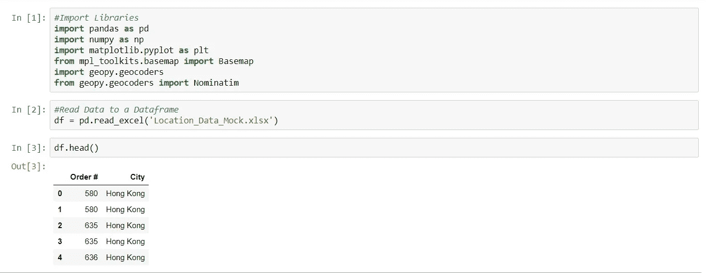
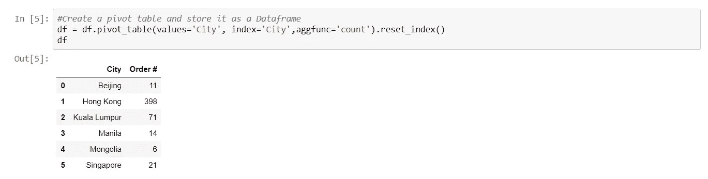
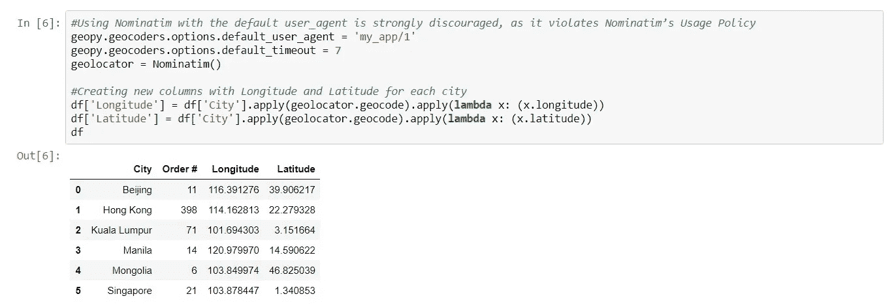
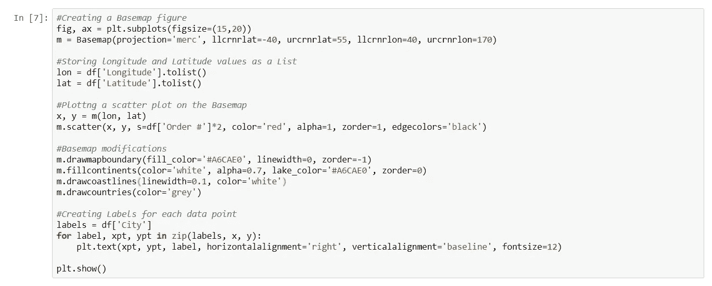
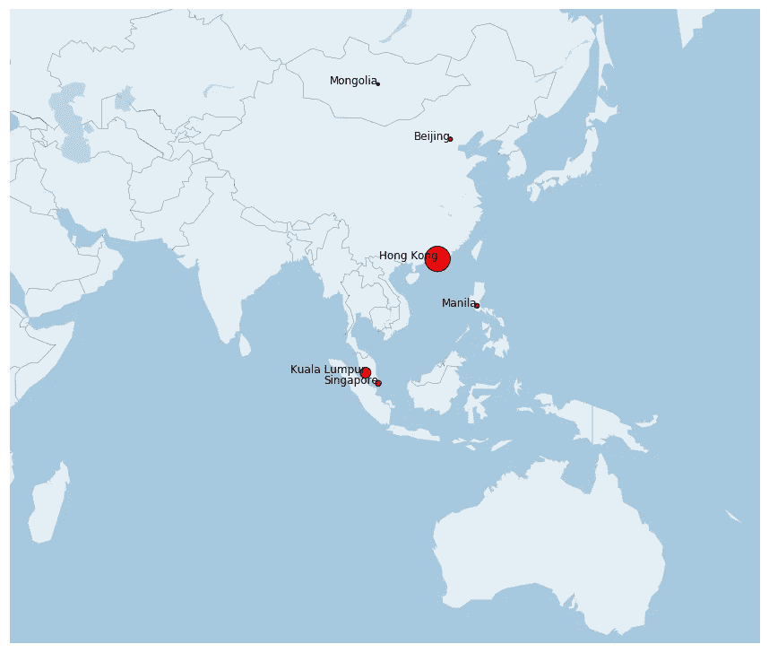

# 快速地理可视化您的客户群

> 原文：<https://medium.datadriveninvestor.com/quick-geographical-visualization-of-your-customer-base-7f8d9e01b9ac?source=collection_archive---------6----------------------->

在我以前的文章中，我解释了年轻的初创公司如何轻松地利用他们的数据，而不需要雇用数据分析师。即使您的数据库大小适中，数据也可以帮助您做出决策。

在这篇文章中，我将引导您通过一个简单的地理可视化您的客户群，您可以在几分钟内编码，并可用于销售和营销决策。

 [## 数据科学和软件工程哪个更有前途？-数据驱动型投资者

### 大约一个月前，当我坐在咖啡馆里为一个客户开发网站时，我发现了这个女人…

www.datadriveninvestor.com](https://www.datadriveninvestor.com/2019/01/23/which-is-more-promising-data-science-or-software-engineering/) 

**获取数据**

我已经为 GROM 在 APAC 地区的客户群使用了模拟数据。数据提取和存储取决于您的数据库基础架构。在本例中，我提取了处方数据中每个订单的位置，并将其存储在一个 Excel 文件中。我使用 Python 上的 Pandas 库将数据读入数据帧。

**整理数据**

如果您的数据大小适中，在 Excel 文件中手动清理它会更容易。否则，使用 python 进行数据清理。为了获得每个城市的订单数量，我使用数据透视表函数按城市对数据进行分组，并创建了一个新的 dataframe。

**添加每个城市的经度和纬度**

此代码使用的底图需要每个位置的经度和纬度值。我使用 Geopy 的 geolocator 为每个城市创建经度和纬度值，并将它们添加到新列下的数据集中。

**创建并绘制底图**

为了在地理上直观显示数据，我在世界地图上创建了每个城市的经度和纬度值的散点图，并根据订单的数量更改了每个散点图的大小。

这种可视化提供了我们客户的大致情况，以及他们在总订单量中的贡献程度。它可以用于决策，特别是销售和市场营销。我们应该在新兴市场分配更多资源以增加交易量，还是在当前市场分配更多资源以减少客户流失？在像蒙古这样较小的孤立市场投入时间和金钱值得吗？现在是进入澳大利亚等全新市场的正确时机吗？

在 GROM，我们听从直觉，用数据来验证。也许，这就是为什么我们在过去的一年里观察到高达 172%的同比增长。这种方法并不能防止你犯错，但它肯定会让任何初创公司的不确定之旅变得更加确定。