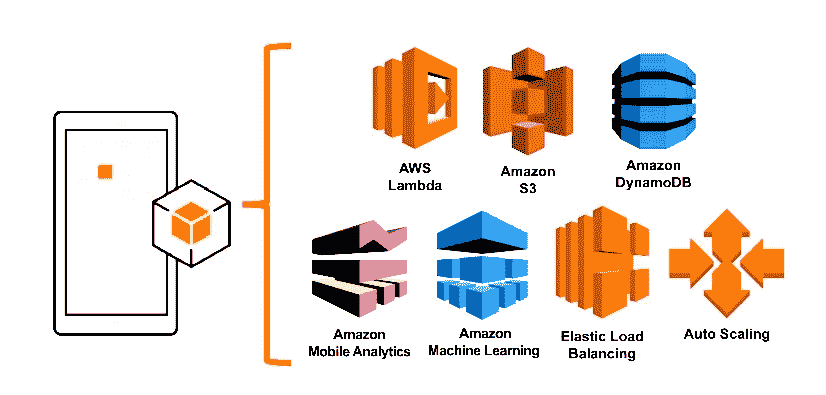
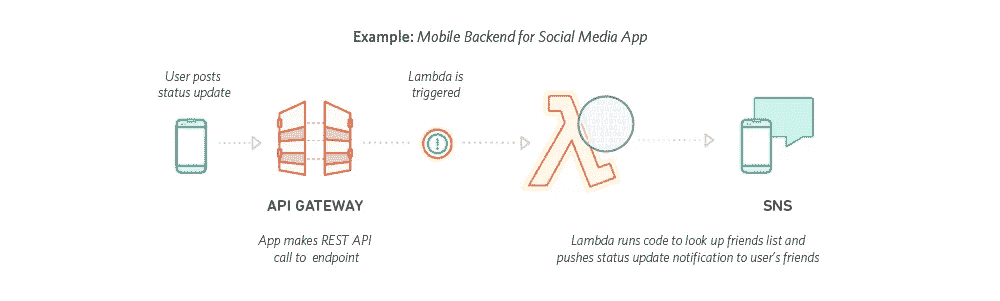
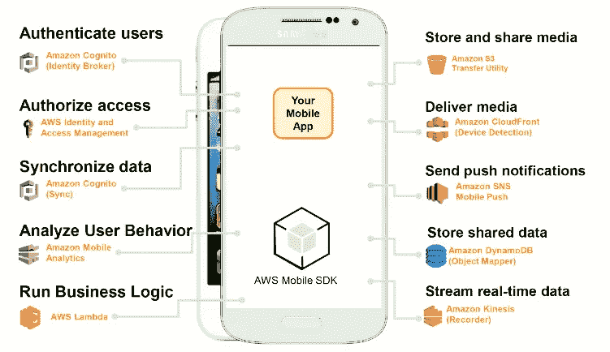
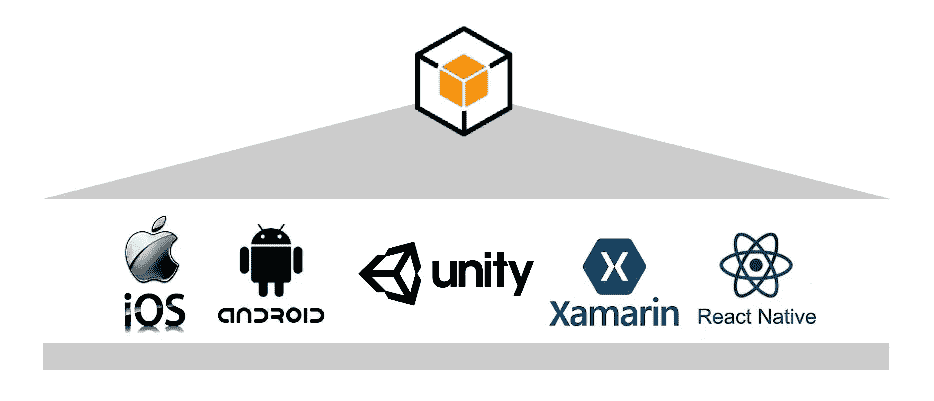

# AWS Mobile SDK 快速参考

> 原文：<https://medium.datadriveninvestor.com/quick-references-to-aws-mobile-sdk-ced46db304cc?source=collection_archive---------19----------------------->

Quick Introduction to AWS Mobile SDK

我们将快速查找以下主题

1.  概观
2.  移动应用程序开发
3.  支持的平台

## 以下是选择 AWS 移动服务的要点

1.  更高效地构建移动应用
2.  跨平台支持
3.  针对移动操作系统优化的原生 SDK
4.  随着最新的平台增强而不断更新

## 1.概观

AWS 提供广泛的服务，如 [AWS lambda](https://aws.amazon.com/lambda/features/) 、[亚马逊 S3](https://aws.amazon.com/s3/getting-started/) 、[亚马逊 DynamoDB](https://aws.amazon.com/dynamodb/) 、[亚马逊移动分析](https://docs.aws.amazon.com/mobileanalytics/index.html#lang/en_us)、[亚马逊机器学习](https://aws.amazon.com/machine-learning/)、[弹性负载平衡](https://aws.amazon.com/elasticloadbalancing/)、自动伸缩。

A***WS Lambda***使我们能够创建无服务器应用程序存储库，帮助我们快速部署代码示例、组件，只需点击几下鼠标即可完成应用程序。我们还可以发布我们自己的应用程序，并在我们的团队内部或与整个社区共享。AWS 开发工具，如 AWS 无服务器应用程序模型(SAM)或 Cloud9，可帮助您开发无服务器应用程序。

A***WS S3***提供访问专门为构建移动应用而设计的服务、针对移动优化的与流行的 AWS 数据流、存储和数据库服务的连接器，以及访问一系列其他 AWS 服务。

A***mazon dynamo db***帮助您的用户构建体验流畅的个性化移动应用。DynamoDB 负责运营任务，这样我们就可以专注于我们的应用程序。

A***mazon Mobile Analytics***让我们衡量应用程序的使用情况和收入。此外，移动分析扩展了这一功能，使开展有针对性的活动变得更加容易，从而推动用户参与移动应用。亚马逊移动分析帮助我们了解用户行为，定义目标用户，确定发送哪些消息，安排发送消息的最佳时间，然后跟踪您的活动结果。

A***mazon Machine Learning(ML)***是一项让所有技能水平的开发者都可以轻松使用机器学习技术的服务。SDK for mobile 提供了一个简单的高级客户端，旨在帮助我们与亚马逊机器学习服务进行交互。客户端使我们能够调用 Amazon ML 的实时 API 从我们的模型中检索预测，并使我们能够构建请求预测并对预测采取行动的移动应用程序。它还使我们能够检索 ML 模型的实时预测端点 URL。

E 弹性负载平衡随着我们应用的流量随时间变化而扩展我们的负载平衡器，并且可以自动扩展到绝大多数工作负载。

一个 uto 伸缩帮助我们确保我们有正确数量的 Amazon EC2 实例来处理我们应用程序的负载。我们创建 EC2 实例的集合，称为*自动缩放组*。我们可以指定每个自动缩放组中的最小实例数，Amazon EC2 自动缩放确保您的组永远不会低于这个大小。

## 2.概括地说，移动应用程序开发

## 3.AWS 支持的移动操作系统

