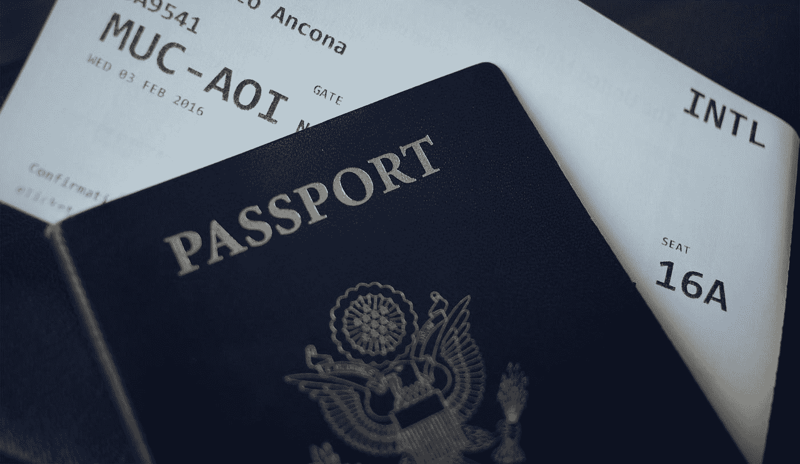
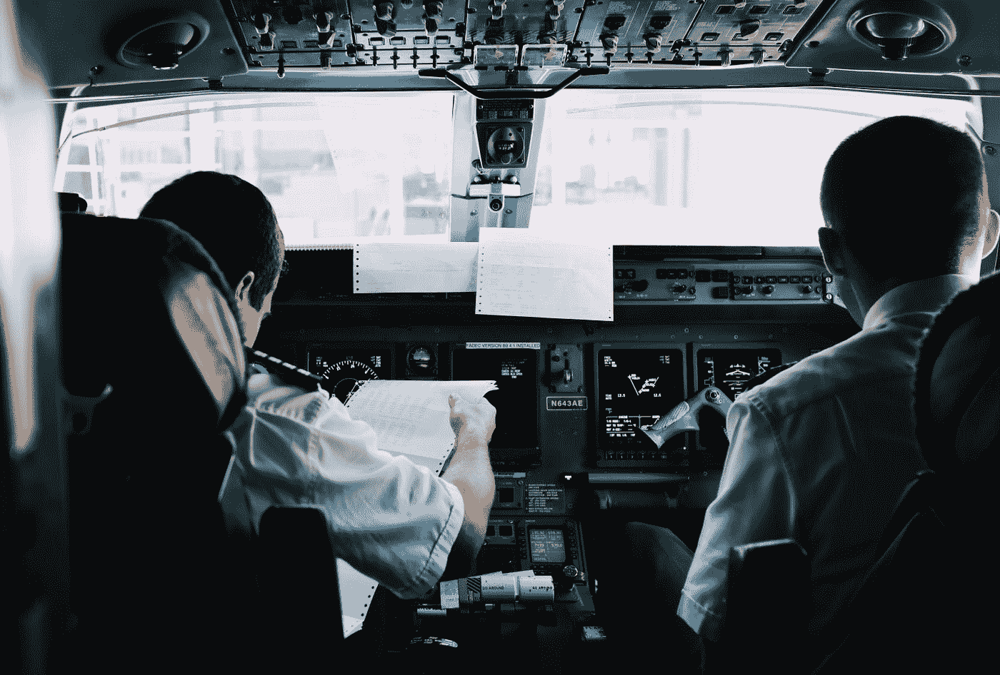

# 航空业人工智能和物联网快速回顾

> 原文：<https://medium.datadriveninvestor.com/quick-review-of-artificial-intelligence-and-iot-in-the-aviation-industry-15cfdccce060?source=collection_archive---------1----------------------->

By [JESHOOTS.COM](https://unsplash.com/@jeshoots?utm_source=medium&utm_medium=referral) on [Unsplash](https://unsplash.com?utm_source=medium&utm_medium=referral)

在过去的几年里，人工智能(AI)和物联网(IoT)主导了科技界的对话。这些新兴技术被认为是第四次工业革命的一部分。它们正以这样或那样的形式改变着每一个行业，航空业也不例外。今天，人工智能和物联网正在重塑航空的技术和人类方面。

在本文中，我试图介绍这些技术在行业中的一些应用。

# **人工智能在航空业的应用**

By [Nicole Harrington](https://unsplash.com/@nicolegeri?utm_source=medium&utm_medium=referral) on [Unsplash](https://unsplash.com?utm_source=medium&utm_medium=referral)

## **票务系统**

飞行距离、竞争、购买日期、季节性、油价、航空公司声誉等因素都会影响机票定价。机票市场几乎和金融市场一样复杂。自然，它是基于人工智能的算法优化价格点以提供更好的收入管理的绝佳候选。人工智能正在帮助航空业实施诸如[预期边际座位收入(EMSR)](https://www.cnn.com/travel/article/airline-pricing-secrets/index.html) 和辅助价格优化等模型。它帮助行业节省资金，同时为客户提供更好的服务。

## **飞行维护**

飞机维修是一件复杂的事情。飞机总是在世界各地移动，机械部件不容易移动。因此，航空公司必须精心计划他们的维护时间表。任何计划外的维护都会导致航班取消和延误，代价高昂。这使得航空公司使用基于人工智能的预测分析来确定飞机各部分的维护需求。这些工具可以在故障发生前预测故障。它可以为航空业节省数百万美元。[达美航空已经在使用预测性维护](https://www.forbes.com/sites/kevinmichaels/2018/09/25/the-delta-way-how-it-took-on-conventional-wisdom-and-slashed-maintenance-cancellations)来减少航班取消。此外，基于人工智能的工具正在帮助地面维护人员进行维修。IBM Watson 关于航空的电视广告让我们得以一瞥这种人工智能维护的未来。

## **燃油效率**

喷气燃料是航空公司最大的运营成本之一。此外，飞机产生的二氧化碳占人类导致的二氧化碳排放总量的 2%。因此，减少燃油浪费是航空业的一个重要目标。燃料负载会影响使用量并影响底线，因此携带最佳数量的燃料可提高效率。航空公司可以使用机器学习算法来收集和分析有关飞机重量、飞行路线、距离、高度、乘客数量等数据。这可以帮助航空公司确定每次飞行所需的最佳燃油量。航空公司已经采取措施。例如，西南航空公司与通用电气航空数字解决方案公司合作，利用大数据和人工智能节省了 1 亿美元的燃料费用。

## **船员管理**

航空业依赖于一个复杂的人际网络。失踪的机组成员，包括飞行员、空乘人员和工程师，可能会产生连锁反应。重新安排一名船员并不简单。需要解决许多因素，如资格、证书、可用性和时间安排冲突。这可以通过利用机器学习系统来解决。杰佩森是一个基于人工智能的[船员排班系统](http://ww1.jeppesen.com/documents/aviation/commercial/JeppesenCrewRostering.pdf)的例子，该系统正在帮助行业更好地管理他们的船员分配。

# **物联网在航空业的应用**

By [Blake Guidry](https://unsplash.com/@blakeguidry?utm_source=medium&utm_medium=referral) on [Unsplash](https://unsplash.com?utm_source=medium&utm_medium=referral)

## **飞行健康检查和维护**

罗尔斯·罗伊斯是飞机发动机的高级制造商。[罗尔斯·罗伊斯与 Azure 物联网解决方案](https://customers.microsoft.com/en-US/story/rollsroycestory)合作，利用物联网设备和云的力量聚合数据进行预测性维护。物联网设备作为端点来检查引擎的健康状况。维珍大西洋航空也采取了类似的方法，通过物联网设备将波音 787 的每个飞机部件连接到飞机的无线网络。它使飞机能够实时监控组件。

## **飞行体验管理**

经济实惠的物联网设备正在帮助航空业使用创造性的解决方案来实现飞行体验。例如， [EasyJet 已经在机组成员的制服上贴上了物联网 led 和麦克风](https://mashable.com/2015/11/10/easyjet-wearable-tech-uniform)。LED 显示屏提供航班号和紧急引导等信息。麦克风帮助机组人员直接与乘客沟通。

## **行李追踪**

跟踪乘客行李是航空运输的一个重要方面。一般来说，大多数航空公司仍然使用纸质标签进行行李跟踪。但是，汉莎航空公司正在利用物联网技术的力量向前发展。他们开发了 RIMOWA 电子标签系统，它看起来像一个纸质标签，但以电子方式显示信息。乘客可以通过蓝牙设备连接到标签，并设置所有的值机参数。

## **机场管理**

[迈阿密国际机场](https://www.nytimes.com/2016/03/29/business/using-apps-to-ease-the-hassle-of-navigating-airports.html)实施了基于物联网的信息系统，使用 500 个信标进行室内导航。该系统像谷歌地图一样为乘客提供通往指定登机口的方向。[伦敦城市机场](https://www.cnn.com/travel/article/london-city-airport-internet-of-things/index.html)率先实施物联网技术来改善机场交通监控。此外，相机和传感器等物联网设备也用于机场的安全目的。

# 仅仅是开始

航空业只是在使用 AI 和 IoT 的初级阶段。鉴于在收入管理、调度、预测性维护和更好的客户体验中使用这些新兴技术的巨大优势，在航空业使用人工智能和物联网的趋势将继续上升。