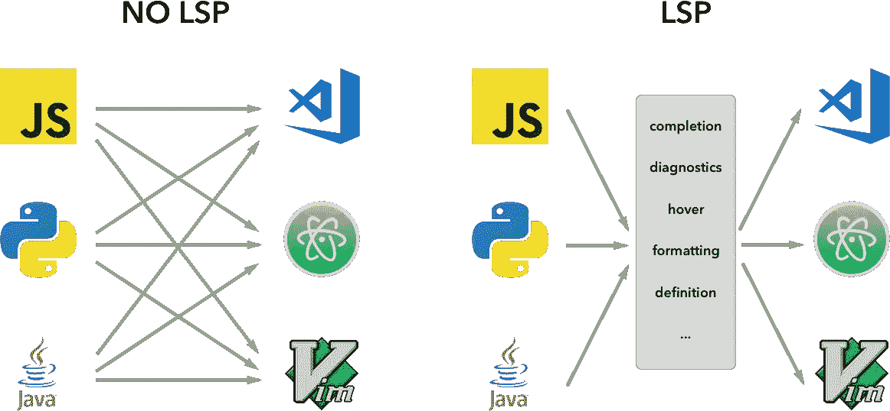
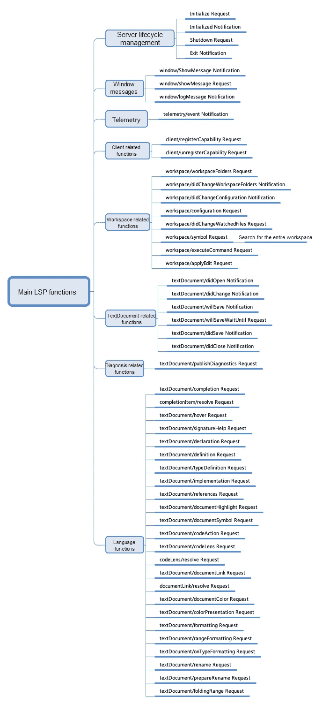

# VSCode 插件快速入门:语言服务器协议(LSP)

> 原文：<https://medium.datadriveninvestor.com/quick-start-to-vscode-plug-ins-language-server-protocol-lsp-a1faf5a355f4?source=collection_archive---------1----------------------->

[语言服务器协议(LSP)](https://microsoft.github.io/language-server-protocol/?spm=a2c41.13494494.0.0) 是 VSCode 实现的一个协议，用来解决一些语言扩展痛点。LSP 是一个基于 JSON RPC 的协议。下面的数字给出了这方面的一点想法。



让我进一步解释一下。因此，一般来说，LSP 之前存在三个主要问题:

1.  与语言相关的扩展是用它们的母语编写的，因此不容易集成到插件中。这是一个问题，因为现在有大量的语言。
2.  与语言扫描相关的任务负载非常消耗 CPU 资源，这使得在单独的进程中甚至在远程服务器上运行这项工作比在 VSCode 中运行更好。

[](https://www.datadriveninvestor.com/2019/02/21/best-coding-languages-to-learn-in-2019/) [## 2019 年最值得学习的编码语言|数据驱动的投资者

### 在我读大学的那几年，我跳过了很多次夜游去学习 Java，希望有一天它能帮助我在…

www.datadriveninvestor.com](https://www.datadriveninvestor.com/2019/02/21/best-coding-languages-to-learn-in-2019/) 

3.如上图左侧所示，在没有协议的情况下，每个语言服务都需要适应多个源代码编辑器。同样，每个编辑也需要各种语言服务。这浪费了大量的资源。

LSP 解决了所有这些问题。它更好地集成和采用了扩展，也有助于更均匀地分配任务负载。

# 从 LSP 协议开始

了解一点 LSP 协议，让我们先来看一个例子:

```
Content-Length: ...\r\n
\r\n
{
    "jsonrpc": "2.0",
    "id": 1,
    "method": "textDocument/didOpen",
    "params": {
        ...
    }
}
```

`jsonrpc`是 JSON-RPC 协议的报头。再次记住，LSP 是一个基于 JSON RPC 的协议。LSP 主要定义了`method`和`params`。

请求从服务器发送到客户机，客户机返回响应。然后，客户端发起通知。下图显示了 LSP 目前支持的功能:



最大的部分是语言功能，这是一个也可以通过本地提供者和其他方法实现的部分。

# 让我们看看生命周期管理

当客户机发送一个`initialize`请求时，服务器的生命周期开始。负载是一个`InitializeParameter`对象:

```
interface InitializeParams {
    /**
     * The process Id of the parent process that started
     * the server. Is null if the process has not been started by another process.
     * If the parent process is not alive then the server should exit (see exit notification) its process.
     */
    processId: number | null; /**
     * The rootPath of the workspace. Is null
     * if no folder is open.
     *
     * @deprecated in favour of rootUri.
     */
    rootPath?: string | null; /**
     * The rootUri of the workspace. Is null if no
     * folder is open. If both `rootPath` and `rootUri` are set
     * `rootUri` wins.
     */
    rootUri: DocumentUri | null; /**
     * User provided initialization options.
     */
    initializationOptions?: any; /**
     * The capabilities provided by the client (editor or tool)
     */
    capabilities: ClientCapabilities; /**
     * The initial trace setting. If omitted trace is disabled ('off').
     */
    trace?: 'off' | 'messages' | 'verbose'; /**
     * The workspace folders configured in the client when the server starts.
     * This property is only available if the client supports workspace folders.
     * It can be `null` if the client supports workspace folders but none are
     * configured.
     *
     * Since 3.6.0
     */
    workspaceFolders?: WorkspaceFolder[] | null;
}
```

此后，服务器返回服务器的功能:

```
interface InitializeResult {
    /**
     * The capabilities the language server provides.
     */
    capabilities: ServerCapabilities;
}
```

`ServerCapabilities`的定义如下。注意，它主要对应两类 API，分别是`workspace`和`textDocument`，如下图所示:

```
interface ClientCapabilities {
    /**
     * Workspace specific client capabilities.
     */
    workspace?: WorkspaceClientCapabilities; /**
     * Text document specific client capabilities.
     */
    textDocument?: TextDocumentClientCapabilities; /**
     * Experimental client capabilities.
     */
    experimental?: any;
}
```

客户端收到`InitializeResult`后，根据三次握手原则，返回初始化消息进行确认。至此，服务器-客户端通信的生命周期已经建立。

# 实施 LSP 协议

除了整个协议的详细描述，微软还为我们准备了 LSP SDK。源代码可从[https://github.com/microsoft/vscode-languageserver-node](https://github.com/microsoft/vscode-languageserver-node)获得

我们首先解释 LSP SDK 在服务器方面的用法。我们可以通过下面的 LSP 函数来实现:

*   创建连接

服务器首先需要获得一个连接对象，通过`vscode-languageserver`提供的`createConnection`函数创建一个连接。

```
let connection = createConnection(ProposedFeatures.all);
```

LSP 消息封装在连接中。例如:

```
onInitialize: (handler) => initializeHandler = handler,
        onInitialized: (handler) => connection.onNotification(InitializedNotification.type, handler),
        onShutdown: (handler) => shutdownHandler = handler,
        onExit: (handler) => exitHandler = handler,
...
        onDidChangeConfiguration: (handler) => connection.onNotification(DidChangeConfigurationNotification.type, handler),
        onDidChangeWatchedFiles: (handler) => connection.onNotification(DidChangeWatchedFilesNotification.type, handler),
...
        onDidOpenTextDocument: (handler) => connection.onNotification(DidOpenTextDocumentNotification.type, handler),
        onDidChangeTextDocument: (handler) => connection.onNotification(DidChangeTextDocumentNotification.type, handler),
        onDidCloseTextDocument: (handler) => connection.onNotification(DidCloseTextDocumentNotification.type, handler),
        onWillSaveTextDocument: (handler) => connection.onNotification(WillSaveTextDocumentNotification.type, handler),
        onWillSaveTextDocumentWaitUntil: (handler) => connection.onRequest(WillSaveTextDocumentWaitUntilRequest.type, handler),
        onDidSaveTextDocument: (handler) => connection.onNotification(DidSaveTextDocumentNotification.type, handler), sendDiagnostics: (params) => connection.sendNotification(PublishDiagnosticsNotification.type, params),
...
        onHover: (handler) => connection.onRequest(HoverRequest.type, handler),
        onCompletion: (handler) => connection.onRequest(CompletionRequest.type, handler),
        onCompletionResolve: (handler) => connection.onRequest(CompletionResolveRequest.type, handler),
        onSignatureHelp: (handler) => connection.onRequest(SignatureHelpRequest.type, handler),
        onDeclaration: (handler) => connection.onRequest(DeclarationRequest.type, handler),
        onDefinition: (handler) => connection.onRequest(DefinitionRequest.type, handler),
        onTypeDefinition: (handler) => connection.onRequest(TypeDefinitionRequest.type, handler),
        onImplementation: (handler) => connection.onRequest(ImplementationRequest.type, handler),
        onReferences: (handler) => connection.onRequest(ReferencesRequest.type, handler),
        onDocumentHighlight: (handler) => connection.onRequest(DocumentHighlightRequest.type, handler),
        onDocumentSymbol: (handler) => connection.onRequest(DocumentSymbolRequest.type, handler),
        onWorkspaceSymbol: (handler) => connection.onRequest(WorkspaceSymbolRequest.type, handler),
        onCodeAction: (handler) => connection.onRequest(CodeActionRequest.type, handler),
        onCodeLens: (handler) => connection.onRequest(CodeLensRequest.type, handler),
        onCodeLensResolve: (handler) => connection.onRequest(CodeLensResolveRequest.type, handler),
        onDocumentFormatting: (handler) => connection.onRequest(DocumentFormattingRequest.type, handler),
        onDocumentRangeFormatting: (handler) => connection.onRequest(DocumentRangeFormattingRequest.type, handler),
        onDocumentOnTypeFormatting: (handler) => connection.onRequest(DocumentOnTypeFormattingRequest.type, handler),
        onRenameRequest: (handler) => connection.onRequest(RenameRequest.type, handler),
        onPrepareRename: (handler) => connection.onRequest(PrepareRenameRequest.type, handler),
        onDocumentLinks: (handler) => connection.onRequest(DocumentLinkRequest.type, handler),
        onDocumentLinkResolve: (handler) => connection.onRequest(DocumentLinkResolveRequest.type, handler),
        onDocumentColor: (handler) => connection.onRequest(DocumentColorRequest.type, handler),
        onColorPresentation: (handler) => connection.onRequest(ColorPresentationRequest.type, handler),
        onFoldingRanges: (handler) => connection.onRequest(FoldingRangeRequest.type, handler),
        onExecuteCommand: (handler) => connection.onRequest(ExecuteCommandRequest.type, handler),
```

协议中的所有消息都被封装。现在，我们来看看`onInitalize`函数。

*   初始化

通过`createConnection`创建连接对象后，我们可以调用`connection.listen()`来监听客户端。但是在实现监听之前，我们需要设置处理监听事件的`callback`函数。为此，第一个是`onInitialize`，它是一个处理`initialize`消息的函数。正如本教程前面所讨论的，主要任务是通知客户端服务器的功能:

```
connection.onInitialize((params: InitializeParams) => {
    let capabilities = params.capabilities; return {
        capabilities: {
            textDocumentSync: documents.syncKind,
            // Tell the client that the server supports code completion
            completionProvider: {
                resolveProvider: true
            }
        }
    };
});
```

根据三次握手原理，客户端也会将初始化后的通知作为通知返回。服务器可以通过处理该通知的返回值来执行一些初始化。考虑下面的例子来看看这是如何工作的:

```
connection.onInitialized(() => {
    if (hasWorkspaceFolderCapability) {
        connection.workspace.onDidChangeWorkspaceFolders(_event => {
            connection.console.log('Workspace folder change event received.');
        });
    }
});
```

从上面的例子中，你可以看到三次握手的原理在起作用。客户端返回通知的初始化通知。好了，这就是你使用 LSP 和 VSCode 的一些基本方法！

***作者:徐伦***

# 原始资料

[](https://www.alibabacloud.com/blog/quick-start-to-vscode-plug-ins-language-server-protocol-lsp_595294?spm=a2c41.13494494.0.0) [## VSCode 插件快速入门:语言服务器协议(LSP)

### 刘谦 2019 年 8 月 27 日 171 语言服务器协议(LSP)是由 VSCode 实现的协议，用于解决一些…

www.alibabacloud.com](https://www.alibabacloud.com/blog/quick-start-to-vscode-plug-ins-language-server-protocol-lsp_595294?spm=a2c41.13494494.0.0)