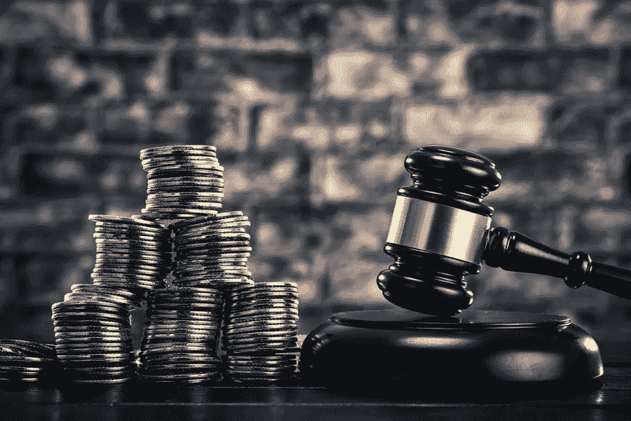
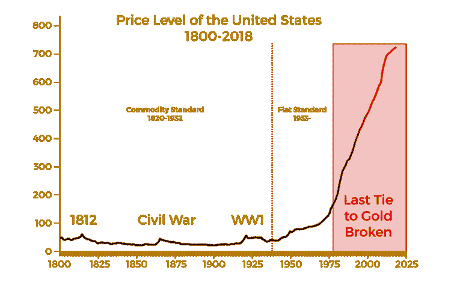
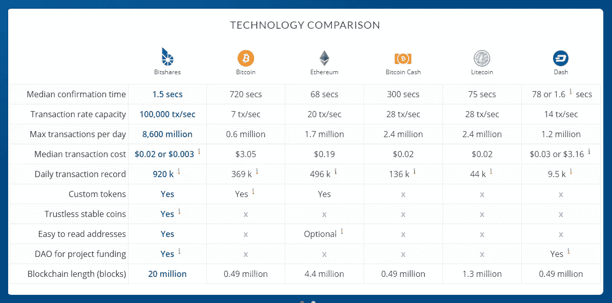
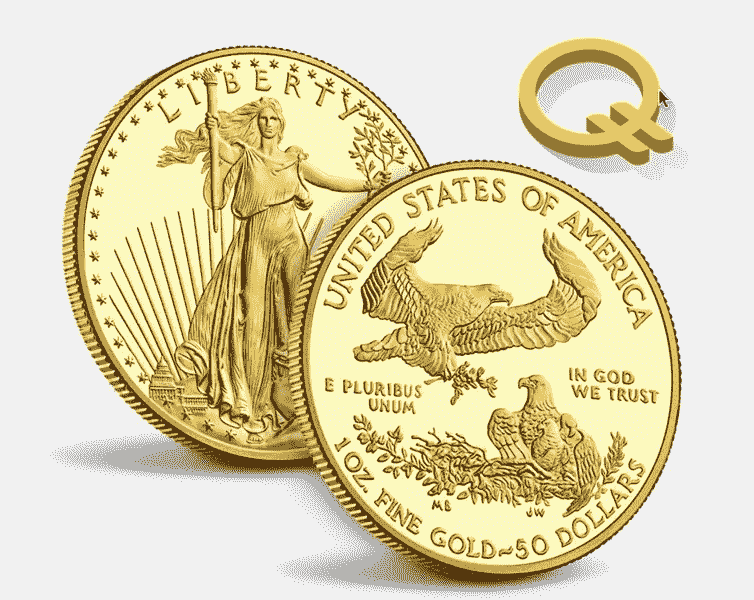
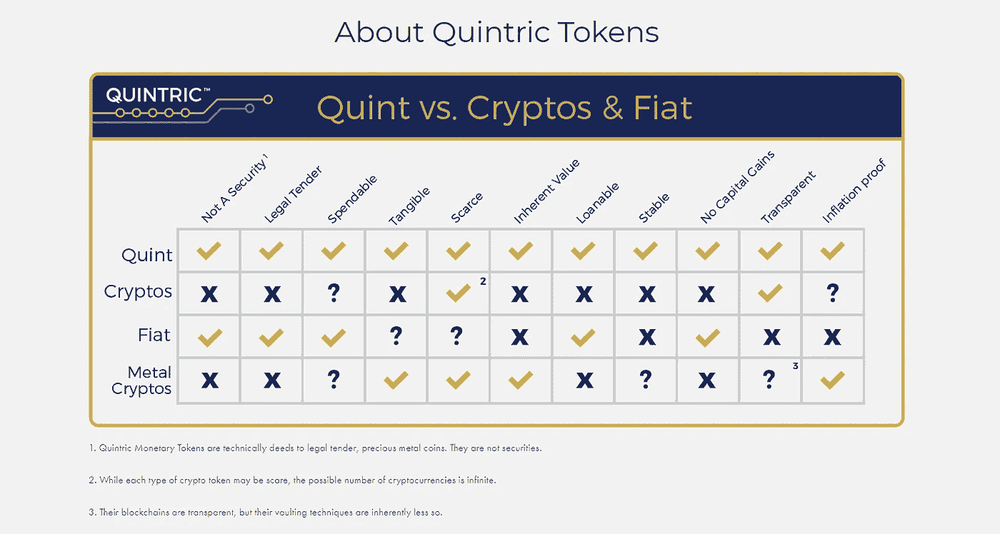

# Quintric:法定货币解决方案。

> 原文：<https://medium.datadriveninvestor.com/quintric-a-legal-tender-d6850532d129?source=collection_archive---------2----------------------->

自 1971 年美元脱离黄金支撑以来，当前的货币体系一直处于衰落状态。自那以后，中央集权的管理当局随意印刷钞票，使得美元的价格水平失去控制。

自那以后，没有一种法定货币能够提供与美元“分叉”黄金之前相同的力量。对经济和物价水平的影响被称为尼克松休克综合症。

***随着比特币的出现***

2009 年，比特币白皮书及其附带的区块链技术蓝图凭空出现，改变了从摄影、音乐到支付的几乎所有行业。一枚数字硬币的价值在短短 4 年内从不到 1 美分飙升至 1000 美元，这一事实让人们瞠目结舌，特别是最近比特币的价值飙升至每枚硬币近 2 万美元。

最近，似乎每个人都想成为区块链行业的一部分，各大公司推出 ICO 以获得市场相关性，并分享密码行业的资金热潮。

**交易速度转变**

在比特币诞生后的几年里，以太坊和石墨烯等其他生态系统试图改善区块链的使用方式。石墨烯的发明者 Dan Larimer 创造了一个每秒可以处理 100，000 多笔交易的区块链，比纳斯达克、万事达和 Visa 加起来还快。

**商业用例**

快进到 2018 年，在建立了 Cryptonomex、Bitshares 和其他领先的区块链风险投资公司后，石墨烯发明者之父斯坦·拉里默(Stan Larimer)成为了 Quintric 的董事。

stan[和其他董事](https://quintric.com/about/)认为美元不再由黄金支持非常令人担忧，因此他们将拉里默的区块链的速度，以及由金银支持的增值结合在基于硬币的代币中:金特、QuintS、iQuint IQuintS 和 Quintx。

由此概念，[五五货币体系](https://quintric.com/system-overview/)诞生。金特的每一件作品都以金银为衬。事实上，每一枚金特硬币都值 1/20 盎司。银色的。银器将按 20 英镑的增量按需支付。

金特是区块链的法定货币，也是由贵金属支持的。还有一些其他基于黄金的加密货币，但没有一种完全由贵金属支持，更不用说法定货币黄金了。由于这些硬币是由美国政府铸造的，它们具有特殊的法律地位，这一地位已经在联邦法院得到了检验和证明。从本质上讲，金币和美联储纸币一样合法(可以说更合法，因为金特在宪法上是健全的货币)。

American Gold Eagle — Legal Tender

金特代币的价值与金币的价格挂钩(由美国铸币局制定)，这种新货币预计将随着时间的推移保持更高的价值和稳定性。[*来源 upma.org](https://www.upma.org/newsroom/2018/3/13/why-quint-may-be-one-of-the-last-cryptocurrencies)

再一次，我们有黄金和白银支持的货币。这是真金白银。然而，与以前美元仍由黄金支撑不同，我们拥有每秒 10 万多笔交易的速度，并有能力通过智能合约，在独立的金融网络上向全球任何地方的任何人发送交易。

**Quintric 填补了美元和比特币的空白**

美元的通货膨胀将继续失控。这在一个随意印钞的系统中是显而易见的，它没有考虑到它给我们的经济带来的持续的通货膨胀损害。

五元货币代币是一种值得研究的替代方法，可以用来转移和储存金银支持的货币。这是将老派的常识、合理的货币政策与未来的革命性技术结合起来。

[在 Quintric](https://escrow.quintric.com/#/register/create-account) 设置你的托管账户，看看 Quintric 货币系统能为你提供什么，而其他法定货币、贵金属或加密货币不能。你可能会感到惊讶。

作者不是律师或财务顾问。作者希望读者注意，他是 Quintric 的联合创始人和董事会成员。呈现的任何内容都不应被解释为投资建议或法律建议。