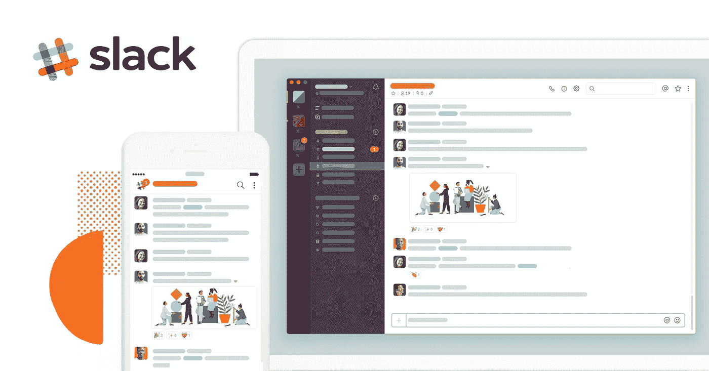
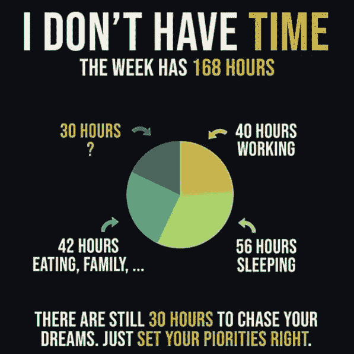

# 退出借口！这就是为什么你今天需要开始一个副业。

> 原文：<https://medium.datadriveninvestor.com/quit-excuses-heres-why-you-need-to-start-a-side-project-today-1b96cf055744?source=collection_archive---------5----------------------->

[www.money24hr.com](https://money24hr.com/start-a-side-project-today/)

上周，我和我的一个高中好友 Sourav 一起吃饭，他目前在一家大型 IT 公司工作。他绝对过着奢侈的生活，收入可观。

然而，当我问他生活如何时(只是一个随意的问题，无意知道答案)，他听起来有点沮丧。Sourav 说，虽然他的工资很高，但他并不觉得工作很有挑战性。然而，他并不打算离开这份工作，因为他对一天工作不到一个小时、一个工作九个小时就能拿到报酬的工作很满意。简而言之，Sourav 觉得他的工作很无聊，但他没有心情离开它。

在了解了他的情况后，我建议 Sourav 为什么不开始一个他热爱的副业项目。这将使他保持参与，他可能会获得新的经验和知识。

我不知道 Sourav 对我的建议有多认真。然而，我相信有很多人都有类似的情况。如果你环顾四周，你会很容易发现许多人

*   不觉得他们的工作有挑战性，对日常工作感到厌倦。
*   没有机会从现有的工作中创造好的东西或为人们的生活增加价值
*   想学习一些新的技能和经验。
*   或者只是有一个不错的想法，但却不能放弃这份工作…

对于所有这些人来说，开始一个兼职项目可能是一个很好的步骤。在本帖中，我们将讨论为什么这些人今天需要开始一个兼职项目，以及它如何能显著改变他们的生活。

# 为什么你今天需要开始一个副业？

首先，我想提一下，很多热门的创业公司都是以副业起家的。很少有大牌是 Product hunt，Groupon，Twitter，Craigslist，Unsplash，Appsumo，Occulos，Khan Academy，Git Hub，Instagram，Buffer，Slack 等。(也可阅读: [**成为百万美元创业公司的 21 个副业项目(你的也可以)**](https://www.inc.com/jeff-haden/21-side-projects-that-became-million-dollar-startups-and-how-yours-can-too.html)

甚至谷歌的许多著名产品，如 Adsense、谷歌地图、Gmail 等，也是由谷歌员工作为兼职项目开始的(谷歌鼓励他们的员工从事兼职项目)。

这就是为什么，如果你也是那些计划在未来建立一个大帝国的人之一，最好在辞职前先把它作为一个辅助项目来启动。这将给你一个机会，在你完全投入之前建立一个基础。

尽管如此，即使你对建立一个大的创业公司不感兴趣，开始一个副业项目仍然有很多重要的好处。以下是几个至关重要的问题:

# 1.它可以加速你的学习

做副业可以帮助你更快地学习新技能。

例如，如果你打算学习编码，为什么不选择一个与之相关的副业呢？(我记得我在 19 岁时建立了我的第一个网站，只是为了测试我当时学到的新的 web 开发技能。)

你可以通过实践来更好地学习新技能，而不是仅仅从书本上学习。此外，建立一个副业项目也让你接触到新技术，让你跟上最新的趋势。

# 2.正确利用时间

大多数人说，在他们朝九晚五的工作之后，他们没有多少时间来做他们的副业。然而，这里有一个信息图表显示，在完成所有必要的活动后，你每周还有大约 30 个小时的剩余时间(这甚至不包括作为假期的周末)。

当你没有从事任何兼职项目时，这 30 个小时通常是用来看网飞的电视连续剧、去购物中心或者只是在电视机前的沙发上睡着。

然而，一旦你开始做一个副业，你就可以有效地利用这段时间去做一些你喜欢的或者能给人们的生活增加价值的事情。

# 3.尝试并释放你的创造力

从事兼职项目的最大好处之一是，它给你一个机会去测试新事物，释放你的创造力。

在这里，你不怕失败，也不怕因为做事与众不同而被老板责骂。你可以在你的副业上体现你所有的创造力。

# 4.它促进你的心理健康

你的副业让你从日常工作中解脱出来，有助于提高你的工作效率。

此外，做你的兼职项目也给你一个机会去认识新的人，就你的想法和主意进行健康的对话。总的来说，这是一个促进你心理健康的绝佳选择。

另请参阅:

*   “个人品牌”时代——你准备好了吗？
*   [品牌的力量是如何引爆你的创业的！！](https://money24hr.com/power-of-branding/)
*   [为什么大公司会失败？颠覆性创新的故事。](https://money24hr.com/tale-of-disruptive-innovation/)

# 如何开始你的副业？

现在你已经理解了开始一个副业的重要性，下一个大问题是如何开始？

你可能很少想到开始一个兼职项目，构建软件、应用程序、网站、博客、Youtube 频道、出版物、播客等。然而，如何开始呢？

这里有一些基本的提示，可以帮助你开始你的副业。

# 1.从小处着手

当你开始你的副业时，从小事做起是至关重要的。也许你有一个想法，想在你计划开发的应用程序上添加数百个功能。但重要的是，你要把它限制在最基本的方面。这有助于在开发产品时避免很多复杂性。

简而言之，要极简。

没必要为你的第一个副业造一艘泰坦尼克号。如果你造一艘能容纳四名乘客的小船，那没问题。此外，一旦你对你的项目更加严格，你总是可以扩展你的副业，让它变得更大。

# 2.知道你想要什么

你听过爱丽丝梦游仙境的故事吗？这是一个关于一个年轻女孩最终来到一个叫做仙境的奇怪世界的故事。最能说明问题的一个瞬间是她在哪里遇到了岔路口。在这里，她遇到了柴郡猫，并发生了以下对话:

> 爱丽丝:“我该走哪条路？”，
> 柴郡猫:“你想去哪里？”
> 答:“我不知道”
> CC:“那没关系。”

底线是:如果你不知道你想要它带你去哪里，你做什么都没用。

当开始一个副业时，要知道你想从中得到什么。如果你希望把它作为一个业余爱好/非营利项目，或者你想赚一些额外的现金，或者你想在未来取代这个项目作为你的全职工作。

你不需要一开始就知道所有的事情。然而，在开始你的兼职项目时，对你想要什么有一个粗略的想法是很重要的。

# 3.不要有压力

最后，你开始这个副业是出于对你产品的热爱。

你不想承担不必要的压力，让它变成另一项工作。利用这个兼职项目来学习、成长和挑战自己。

# 结束语

做兼职项目会给你一个机会，把“你喜欢做的事情”和“你想培养的技能”结合起来。

开始一个兼职项目的最大好处是它不涉及任何风险，你可以承受失败，并且没有完成工作的最后期限。此外，最大的满足感是你仅仅是因为喜欢做你的产品而做这个兼职项目，而不是因为你必须做。

最后一个建议，把你的懒蛋从沙发上挪开，现在就开始做你的副业。快乐的忙碌！！

# [本文原贴于此。](https://money24hr.com/start-a-side-project-today/)

# 顺便说一下，👏🏻*鼓掌*👏🏻如果你喜欢这篇文章，请举手。它鼓励我继续写作，并帮助其他人找到它:)

***保重。继续努力。***