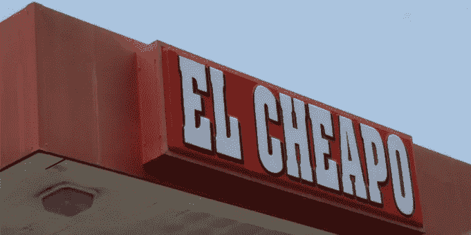

# 住手，小气鬼！

> 原文：<https://medium.datadriveninvestor.com/quit-it-el-cheapo-42bd7ae2fe3b?source=collection_archive---------0----------------------->

“I TRY TO SHOW EVERYTHING I DO, TO SHOW MY DIVERSITY”

通常从拥有品牌中获益的人通常对他们提供的服务相当满意。因此，如果你是那些允许客户决定他们愿意支付给你多少钱、事后猜测你的价格，或者经常觉得有必要验证你的收费的小型服务企业主之一，那么你的价值很可能会很低。

最近，我有幸与一位非常有才华的摄影师打交道，他努力有效地推销自己的业务。但是随着我们谈话的展开，很明显他的营销失败了，因为他的品牌缺乏焦点。他涉足各种不同类型的摄影，但在一个特定的领域真正脱颖而出，同时试图在这种混乱中瞄准所有人，并不得不讨价还价以适应他将获得的客户。

当你的价格低于平均水平时，你会吸引愿意支付低于平均水平价格的客户，作为一个小型服务企业，如果你把营销努力集中在每个人身上，你将吸引不到任何人。

我有什么资格做出这些强有力的声明？

当我刚开始创业时，我“缩小”了服务范围，获得了一些客户，赚了一些钱，但我越是关注我的品牌中客户看重的部分，我就能够将真正的注意力注入到我的营销中，从而更有效地吸引愿意支付我要价的客户。服务企业主的概念是，专注于一件事会以某种方式从展示他们的多样性中“带走”,这是不正确的。如果有什么不同的话，缩小范围有助于带来更多的对话。对我来说的确如此。一个简单的例子:客户来找我要单页网站，为他们提供的服务增加一些可信度，从而增加他们的知名度。但是有几样东西与这个目标协同工作，比如一个独特且容易记住的域名，(而不是一个过于描述性的域名，如*、*、*、*需要更小的东西，如名片或信笺。以更线性的方式做事，有助于客户更容易接受你的其他服务。

一个缺乏对其提供的价值的理解的品牌，不能不表现出来。如果你展示它，客户会看到它，你最好相信他们会利用它。到那时，你可能会陷入“但是我不想拒绝一个付费的顾客”的模式来保持灯亮着。考虑到这一点，如果他们愿意贬低你的服务，那就不是正确的客户，你陷入这种混乱是因为你发出了所有错误的信息。

例如:我的一位客户需要一些独特的手工设计。所以，她打电话给我，雇我来做这项工作。我们已经共事多年，关系很好，但她突然开始拒绝我的定价。当然，她完全不在我的服务范围内，但出于对我们一起工作多年的尊重，我决定“帮她一个忙”。大错特错！我得到了一个又一个的推荐，所有的推荐都附在客户身上，期待着越来越多同样的废话。除了我自己，我没有人可以责怪，因为我塑造了我希望人们看到我的品牌的方式。

这不是我们想要的透明版本。除非你喜欢让你的生意不受你的控制，否则理解不利用你最有价值的资产而便宜自己的代价是很重要的。不要为了你的顾客出卖自己，因为没有人会赢。客户找不到他们想要的专家，你也失去了成为业内权威的机会。

我是**品牌桶的创始人和视觉品牌策略师**