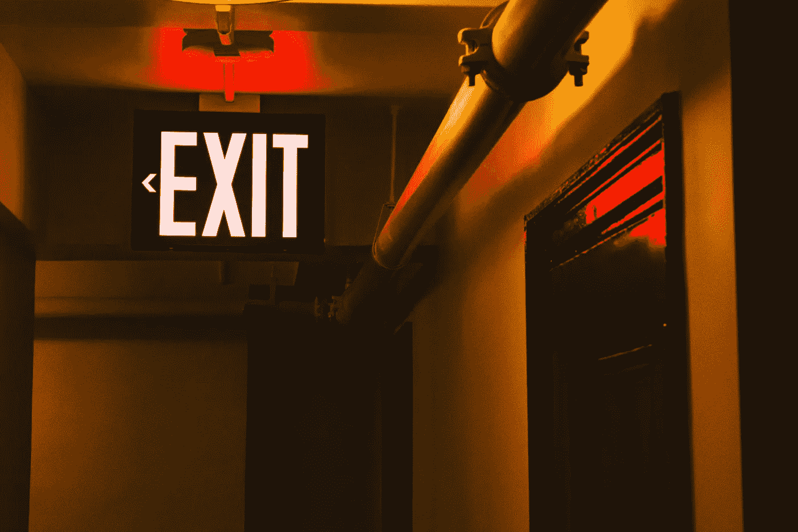
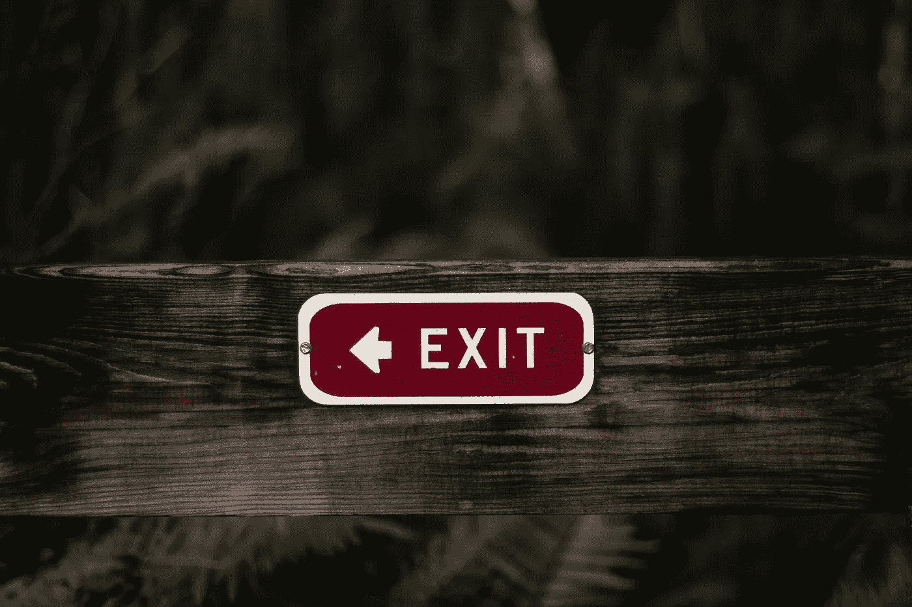

# 退出退出退出。然后再退出。

> 原文：<https://medium.datadriveninvestor.com/quit-quit-quit-then-quit-again-acc6b1d604d9?source=collection_archive---------21----------------------->

我决定辞去在一家银行担任财务和管理总监的全职工作。

我的整个家庭都震惊了。

为什么这个年轻人要浪费这么好的机会去一家好公司(银行)工作呢？)以及随之而来的职业机会？

开始在家做自由职业者——这个男孩一定是疯了！他怎么能再找到另一份工作呢？没人会雇佣他！

(顺便说一句，后来我确实有了另一份工作。似乎这个星球上至少有一个人决定雇佣我。此外，他们雇用我是因为我曾经是一名自由职业者！讽刺的是，我没有忘记…)

我已经考虑了很久很久，权衡了所有的利弊。**我决定是时候继续前进了。**

事实上，几个月前我就打算辞职了，同时一直在做我在 T4 的副业。

当我把这个计划提交给父母时，他们支持我的决定。他们只是不太明白。换句话说:他们支持了正确的人做出的错误决定。

我一直都在戒。

我甚至不羞于承认。事实上，我已经成为戒烟大师。我戒书戒文，戒歌戒电影戒电视剧。还有晚上外出，恋爱，项目和工作。

从很小的时候起，我们就被告知励志名言，特别教导我们不要放弃。

也许你听过这句话:“胜利者从不放弃，放弃者永远不会胜利。”

“当你想放弃的时候，想想你为什么开始”怎么样

我可以写满一整篇关于不要放弃的励志名言。然而，在我看来，他们对放弃的定义与我不同。

> 放弃不同于拖延或接受失败。这相当于优先权的转移。

我们人类唯一有限的资源就是时间。成为戒烟高手让我们有时间去追求其他我们感兴趣的事情。

# 为什么戒烟这么难？

研究表明，人类大脑有强烈的欲望去完成我们开始的任务。我们不喜欢留下未完成或部分完成的事情。这就是所谓的[蔡加尼克效应](https://en.wikipedia.org/wiki/Zeigarnik_effect)。

这就是为什么很难停止看电视节目的原因。即使你知道这是永远不会变得更好，并已有其最好的几季前。如果这部剧只有一季的话，就更是如此。

> 你越接近完成任务，退出就越复杂。我们的大脑需要完成任务的结束。

一整季 24 集 20 分钟(或者 12 集 40 分钟)是在抢你 8 个小时的时间。你可以利用这段时间开始一个新的节目。或者做任何你想做的事。

同样的原则也适用于书籍。每一个可以想象的主题都有成千上万的书。如果你正在读的书让你睡着了，那就把它停下来，开始一本可能会给你带来快乐和灵感的书。如果你需要一些推荐，你可以[选我的](http://www.dansilvestre.com/book-notes/)。

事实上，如果你不喜欢这篇文章，你应该马上停止阅读。合上标签就可以走了。我会难过一段时间，但我会恢复的。

当我们离开某样东西时，我们会感到内疚。

然而，有一个简单的方法。给你:把它从你的硬盘上删除，或者，如果它是实体的东西，卖掉它，捐赠它或者扔掉它，继续前进。如果[物品看不见了](http://www.dansilvestre.com/cant-miss-dont-know/)，它将不再打扰你，直到你完全忘记它。

让我们看看另一个例子，更难戒掉的东西:工作。如果你还年轻——任何 40 岁或更小的人——你完全没有理由不去找另一份工作，继续前进。

我们在工作上花费了将近 50%的时间，有时甚至更多。做一些我们害怕的事情会对我们以后的生活产生多米诺骨牌效应——我们的关系、爱好和幸福。反过来也是正确的:拥有一份我们热爱的工作会对我们的余生产生巨大的连锁反应。

研究表明，对工作最满意的人也是最成功的人。他们变得更有效率、更快乐，这些都不是拥有他们热爱的工作的原因，而是结果。

生命太短暂了，不能把时间浪费在我们不喜欢或不关心的事情上。

以下是你可以马上戒掉的十件事:

*   停止攀比，删除你的社交媒体账户。你不会错过你不知道的。
*   不看新闻了。反正他们是邪恶的。
*   晚上不要使用电脑。你会睡得更好。
*   不要等待一切都变得完美。约那个女孩出去，给你已经失去联系的朋友发短信，开始你告诉你的朋友你会做的事情。在你准备好之前开始。
*   戒掉有劣质食物的餐馆。不会一夜之间变好。
*   戒掉你不喜欢的电影、电视节目和书籍。
*   戒掉坏习惯，比如喝咖啡或者看很多电视。专注于[培养新习惯](http://www.dansilvestre.com/develop-habit-30-days-less/)。

同样重要的是要注意到**戒烟并不是绝对的。**

你总是可以重新拿起这本书，看你停下来的电影或者重燃旧情。

> 放弃只是简单地说:“我现在对这个不感兴趣，所以我不会去追求它。”

如果某物——一本书、一个朋友、一份工作等。—不是现在让你成为一个更好的人，或者帮助你达到你需要的结果，然后迈出这一步，说再见。

不喜欢你正在看的电视节目？你拿起的书很无聊？你对新工作非常兴奋，但你现在发现它很无聊？有一个朋友，你总是给予多于回报？

是时候退出了。

我已经戒了一辈子了。

这正是让我前进的动力。

*原载于 2017 年 10 月 18 日*[*【www.dansilvestre.com*](http://www.dansilvestre.com/become-master-quitting/)*。*

# 您可能还喜欢:

 [## 如何提高工作效率:10 种让工作更聪明的方法

### 更聪明地工作，而不是更努力。以下是我从反复试验中学到的 10 条经验，以及你如何将它们融入其中…

medium.com](https://medium.com/swlh/how-to-be-productive-10-ways-to-actually-work-smarter-16fea8087ead)  [## 简化生活:你能去除什么？

### 为了简化生活，考虑减法，而不是加法。当你一直质疑你可以删除什么，你设计了一个…

medium.com](https://medium.com/@dsilvestre/simplify-life-what-can-you-remove-b4bd8b050197)  [## 埃隆·马斯克疯狂成功的 10 大生产力秘密

### “我觉得普通人选择不平凡是有可能的。”来自最大的生产力秘密…

medium.com](https://medium.com/swlh/top-10-elon-musk-productivity-secrets-for-insane-success-dae584c88e03)