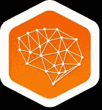
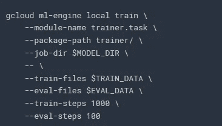

# qwikilabs—基线:数据、ML、AI

> 原文：<https://medium.datadriveninvestor.com/qwiklabs-baseline-data-ml-ai-7424313d64ae?source=collection_archive---------2----------------------->

The Badge I went for!

我一直想了解更多关于谷歌云平台(GCP)的信息，一位谷歌社区经理向我展示了这个网站，在这个网站上，他们有几个所谓的“任务”。这些任务中的每一个都可以让你更多地了解 GCP 或者 AWS。我花了一些时间做一个任务，选择了做[基线:数据，ML，AI](https://www.qwiklabs.com/quests/34?catalog_rank=%7B%22rank%22%3A2%2C%22num_filters%22%3A0%2C%22has_search%22%3Atrue%7D&locale=en&search_id=2094071) 任务。

**概述**

没有解释为什么我开始这个探索，因为它对我来说将是梦幻般的，看看在 GCP 有什么数据，ML 和 AI 特性。这是一次很棒的学习体验，还附带动手实验(需要购买积分来激活大多数动手实验)。在这个特定的任务中，它允许您简要地查看 BigQuery (SQL)和 BigTable (NOSQL ),以便您可以学习基本的 SQL。您可以体验 Google 的实体识别和语音转文本功能，以及数据转换/准备和报告创建。不忘最本质的，谷歌的 ML 引擎。

 [## 金融中的机器学习——数据驱动的投资者

### 在我们讲述一些机器学习金融应用之前，我们先来了解一下什么是机器学习。机器…

www.datadriveninvestor.com](https://www.datadriveninvestor.com/2019/02/08/machine-learning-in-finance/) 

动手实验在有限的时间内有效，并且他们将为每个实验创建练习帐户。虽然实验是有时间限制的，但是您有足够的时间来完成它们。到目前为止，我的经验是他们给了大约 20%到 30%的缓冲，足够去洗手间休息一下了。

对于某些部分，他们确实提供了“后续步骤/了解更多”，我鼓励您尝试一下。

下面是动手实验的概述和一些想法，以帮助读者进行自己的学习。您可以跳过这一部分，直接进入结论部分，在这里，我将为数据科学家分享关于 GCP 有趣特性的快速想法。

**章节**

总共有 13 个部分，我花了大约 1.5 个日历日来完成，所以读者可能需要一个周末来浏览这些部分。

**1-big query 和云 SQL 的 SQL 介绍**

你将学习这个层次结构，项目->数据库->表格。在这里，您将学习 SQL 的一些基础知识，如何使用 Select、From 和 Where 子句编写简单的查询，排序和创建汇总统计数据。还有一个子部分表管理，如 Union 和 Insert Into 子句。

我的建议:试着利用实验室的机会看看其他条款。更多信息可以去 [W3 学校](https://www.w3schools.com/sql/)在实验室练习(记得是用学分的)。

**2-大查询:Qwik 开始**

BigQuery 是 GCP 的企业数据仓库(EDW)。对于本实验，它提供了一个 Web 界面或命令行来与 BigQuery 交互。我尝试了命令行，因为我想让自己再次熟悉它，而不是很难复制的点击式操作。

在这里，您将学习如何访问表的元数据，列出项目中可用的数据集。另一个有趣的实践(至少对我来说)是关于创建数据集(“babynames”)和将原始文件加载到表中的部分(names2010)。随后，您将在已经加载的表上执行一个简单的 SQL 查询。

**我的建议:**尝试将其他原始文件加载到数据集中，进行一些重复的练习，加载其他年份的原始文件，有助于“内化”您的学习。

**3-BigTable: Qwik Start**

BigTable 是 GCP 的 NoSQL 数据库。在本实验中，您将连接到云 BigTable 实例，执行基本的管理任务，并在表中读取和写入数据。

对我来说，这里有一个有趣的概念，叫做“柱族”，它将多组柱定义在一起。我不是 CS 出身，除了从数据库中提取数据之外，我不经常使用数据库，这对我来说是一个有趣的点，我将进一步研究它。

**我的备注:**不幸的是，我觉得实验时间太短了，如果可能的话，本可以让参与者动手尝试查询 NoSQL 数据库。总的来说，这是一个相当短的实践。

**4-云自然语言和云语音 API**

这是一个非常有趣的实验室，两者都是，但尤其是云自然语言 API。

在云自然语言 API 中，您可以通过“gcloud”命令传入一个句子，并使用 API 来识别语句中的实体。当然，自然语言 API 可以做的不仅仅是实体识别，像情感分析、语法分析等等。至少让我感兴趣的是，如果它识别的实体上有维基百科页面，那么链接也会被提供。

对于云语音 API，有一个现成的音频文件，您将获得编码细节。详细信息将被输入到一个 JSON 文件中，您将把这个文件和密钥一起“卷曲”到 API 中。

我觉得缺乏这种动手实践，因为我更喜欢 Qwiklabs 指向一个站点来创建更多的音频文件，并使用这些音频文件以及作为进一步练习提供的编码细节。

**我的注意:**对于云自然语言 API，当我解析不同的句子来看看这个 API 有多好的时候，我觉得更有趣…当然，仅限于我尝试的例子。所以想出其他的句子，并从中获得乐趣。对于云语音挑战，我面临着进一步尝试的技术挑战，此外，实验室进行进一步实验的时间非常短。

**5-DataProc (GUI 或命令行)**

DataProc 是一个云服务，用于旋转 Apache Spark 和 Apache Hadoop 集群。这是一个直接的实践，需要领域细节来设置计算集群。您还将被要求更改“工人”的数量。这是一个非常简单的实验，没有太多的变化可以让实践变得更有趣(例如，更多的学习点)。

**6-数据准备**

DataPrep 是一个数据服务，用于可视化地探索、管理和准备用于分析的数据。这是一个位于 GCP 的第三方软件。该软件被称为“ [Trifacta](https://www.trifacta.com/) ”不透露太多，但你将建立一个数据流，这是非常好的视觉效果，看看采取什么步骤来转换数据。我喜欢它的一点是，你可以探索数据，并记录下你想要的数据转换步骤。数据可视化非常有助于确定数据在特定转换后的状态。与编程语言相比，它减少了很多确定如何清理数据的工作(不是说它不好，只是它有这个弱点)。如果需要，您还可以在同一个界面中进行快速汇总统计。

**我的备注:**实验室给出的时间很充裕，因此在完成最后一项任务后，请尝试浏览并摆弄您创建的数据管道/流程。

**7-谷歌云数据实验室**

在这一部分，它将展示 GCP 在其环境中使用笔记本电脑的能力。此外，您仍将拥有 git 功能，如提交和推送等。

**8 云 ML 引擎**

所以这是整个探索过程中有趣且关键的部分…机器学习！在这里，您可以从 Tensorflow 训练一个现成的模型，并在本地或云中运行它(但我糟糕的计算机科学背景仍然无法区分，因为它们都在云上运行。有人能给我解释一下吗？).

在这一部分，实验室使用一个熟悉的数据集，美国人口普查收入数据…你知道高于 50K 或低于 50K…那个数据集？记住…..？所以如果你熟悉数据集，我们正在做一个分类问题。在实验室中，只使用一个模型，那就是[dnncombinedlaneclassifier](https://www.tensorflow.org/api_docs/python/tf/contrib/learn/DNNLinearCombinedClassifier)。你不会学到很多关于机器学习的东西，只是让你先知道，而是更多关于 GCP 的 ML 函数和特性…只是让你知道。您还将部署您已经培训过的模型。

GCP 提供 TensorBoard(当然！)供您查看您的模型培训进度，以便您可以了解是否需要进一步调整或管理培训流程。

我查看了这些步骤，并试图寻找实现其他分类模型的方法，但是没有看到我可以在哪里改变它。我怀疑我必须纳米/vim 成教练。任务？所以如果可以尝试使用 TensorFlow 提供的其他机器学习模型。

This was the command used to start training the model.

**9-数据工作室**

Data Studio 是您可以构建报告或仪表板的地方(顺便说一下，它是免费使用的)。在实际操作中，您可以从 BigQuery 中提取一个数据集来创建一个时间序列数据，然后对报告进行样式化处理(它只是在视觉效果中添加了一个背景色)，并在“报告”的顶部添加一个文本框。我能感觉到推出 Data Studio 并不是整个探索的重点，所以他们只展示了很少的功能。很漂亮……如果你问我的话。确实有很多机会来展示如何快速创建和布局仪表板。

无论如何，界面与 QlikSense 和 SAS Visual Analytics 非常相似。我首选的可视化工具还是 R 或者 Python。但是点按式界面肯定会有市场。

**10-谷歌基因组:Qwik 开始**

在这里，您将被要求使用云基因组管道 API。我并不经常从事基因组学的工作，所以我对它没有太多的了解，但我还是顺应潮流，完成了这个实验室，因为我想完成这个探索！:)

**11-数据流**

在本节中，参与者将设置 Python 开发环境并实现 Python 代码。再说一次，实验室更多的是通过运动来完成。我更希望他们让参与者从 Google Drive 下载 python 代码，上传然后执行。它更接近真实的环境，并且建立了一个更具体和相关的体验。

**12 云文件存储**

就我个人而言，我觉得这部分更多的是关于数据工程而不是数据科学。我认为在业务场景/环境中进行实验非常好，这样参与者就能理解为什么要采取某些步骤。了解这一点将有助于参与者理解 Filestore 的价值。

对于这一任务的最后一部分，我们大致经历了清除它的过程，并了解了文件存储的功能。不幸的是，由于缺乏数据工程背景，这里的学习经验并不“坚持”。

**学习小技巧**

下面是我的一些建议，让这成为一次很好的学习经历。

*   手边准备一个记事本，你需要记录一些实验的细节
*   不要急于动手，试着理解每一步背后的原因。谷歌是你的学习伙伴。
*   在进行实验之前，请先阅读几行说明
*   实验的时间是充裕的，通过引入一些“变化”来利用它。

**结论**

虽然有些部分更多的是在走过场，但我仍然很喜欢，并且对 GCP 有了更好的了解。在某些领域，我可以像 DataPrep 一样看到它的易用性。可视化真正实现了更好更快的数据准备。这个任务也让我想提高我的“命令行”技能。(我从 DOS 时代开始，但很快就转向了 Windows)。我喜欢关于 DataPrep、ML 引擎、自然语言和语音 API 的部分。

在必要的支持和可用的资源下，我肯定会热衷于完成其他任务。如前所述，我(和一群朋友一起)经营着一个科技社区，我看到科技公司和对该领域感兴趣的读者对 GCP 有更高的兴趣，请尝试一下 Qwiklabs 来熟悉 GCP。

此外，我有幸与来自以下团体的成员一起领导了一次云研究聚会。分别是 [BigDataX](https://www.facebook.com/bigdatax/) 、 [DataScience SG](https://www.facebook.com/groups/dataScienceSG/) (我联合创办的数据科学社区)和 [PyData Singapore](https://www.facebook.com/groups/pydatasg/) 。这是一次很棒的经历，我从中获得了很多乐趣。:)

我希望这个博客对你有用。我希望所有读者有一个有趣的数据科学学习之旅，并访问我的其他博客文章和 LinkedIn 个人资料。