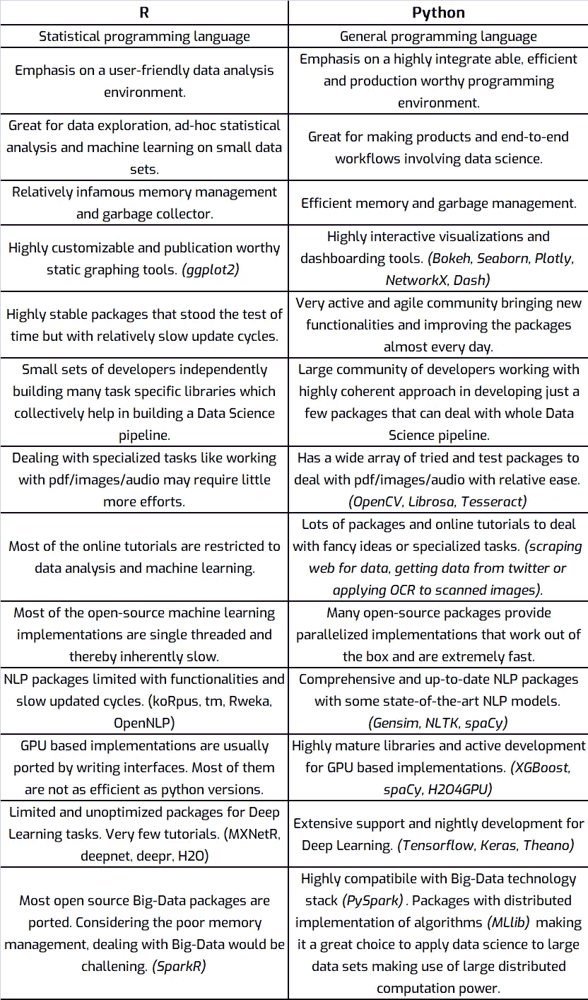
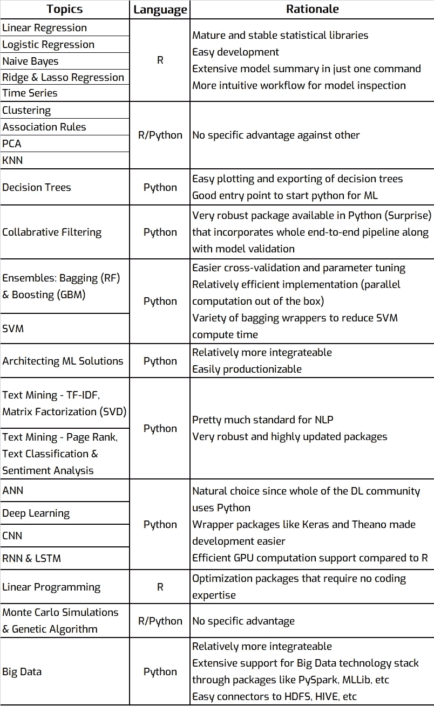
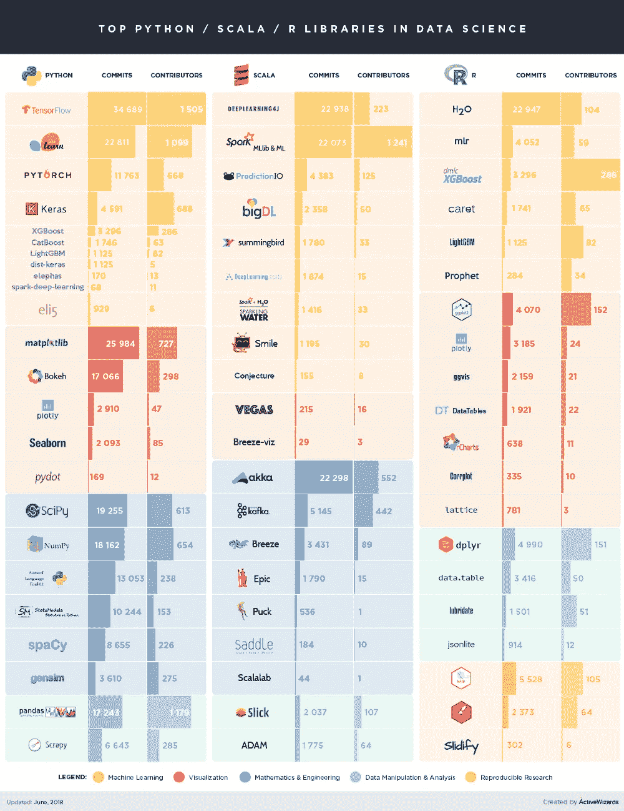
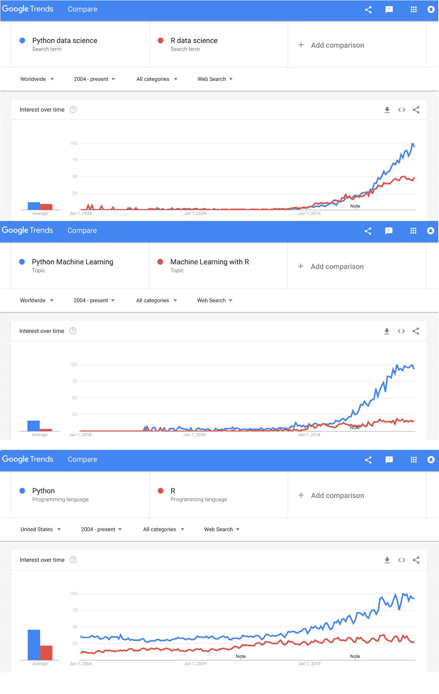
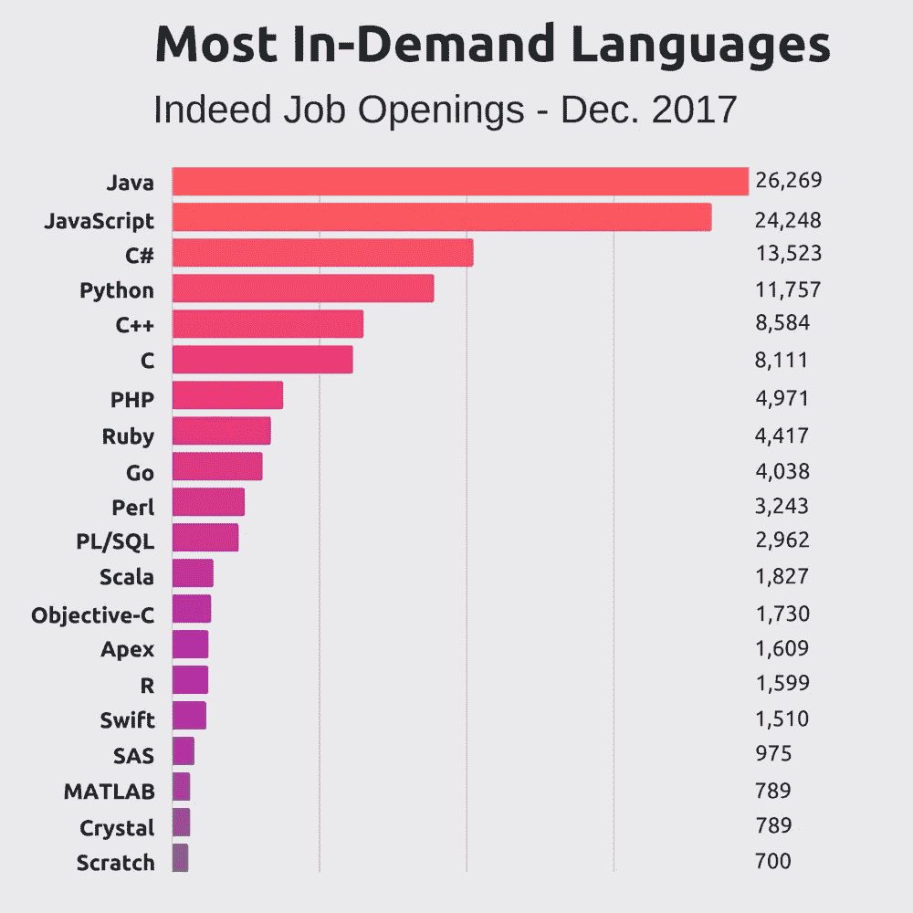

# 数据科学领域的 R vs Python

> 原文：<https://medium.datadriveninvestor.com/r-vs-python-for-data-science-f6f251583c13?source=collection_archive---------10----------------------->

## 一般比较

## 机器学习主题比较

## 包装统计

## 结束语

r 多年来一直被市场信任为特别统计数据分析和机器学习概念验证的伟大工具。它在企业投资中占有相当大的份额，对于传统的数据分析师职位来说，它无疑是一项抢手的技能。

**但是随着行业的成熟**

*   根据对小数据的特别数据分析(<5GB) to large-scale Big Data solutions
*   from POCs to productionization of ML systems and online-analytics
*   from statistical analysis and machine learning to AI and Deep Learning

Python becomes a quintessential language. In fact, the past few years have seen a great surge in python packages development, tutorials, questions on stack overflow, google search trends and possibly even jobs…

## Some info-graphics justifying my perception…

## Indeed job stats

**注** —上图中的 python 统计数据包括所有类型的 python 开发工作，因此不能作为确凿的证据来证明数据科学工作更喜欢 Python 而不是 r。但是，这足以表明 Python 技能具有更广泛的应用领域和相对安全的就业市场。

信息图形学分—activewizards.com | trends.google.com | indeed.com