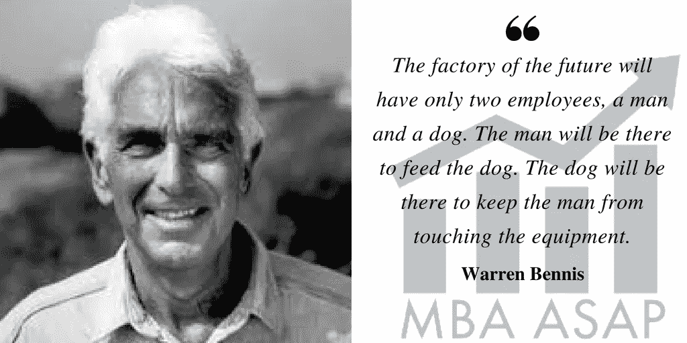

# 与机器赛跑，或者拥抱机器

> 原文：<https://medium.datadriveninvestor.com/race-or-embrace-the-machines-8c563da04ba6?source=collection_archive---------4----------------------->

## 人类对人类的利用

beep beep

商业和工作正在以深刻的方式变得自动化。很快，他们将不得不把部门名称从人力资源部改为 HRR:人力和机器人资源部。

机器人和人工智能以及其他电子人相关工人的崛起正在改变管理、劳动和商业的基本结构。我们正在走向这样一个未来:许多企业可以利用无形产品快速扩张，服务可以被无限复制。

计算机程序和算法可以更有效地执行与客户的接口。很快，我们将通过电话与 Siri 和 Alexa 等聊天机器人进行互动，而不会意识到我们正在与计算机交谈。这些交互将满足[图灵测试](https://en.wikipedia.org/wiki/Turing_test)。

> 艾伦**图灵**于 1950 年开发的**图灵测试**，是一种**测试，测试机器表现出与人类同等或不可区分的智能行为的能力。**

好消息是，我们将不再面临处理“如果你想要什么什么按一个……”和糟糕的等待音乐和重复循环“你的电话对我们很重要……”的挑战，我不会错过任何一个。总算摆脱了糟糕的垃圾。

这些趋势对我们如何看待工作以及价值和生产力的本质有着深远的影响。呼叫中心将很快从隔间农场转变为服务器机架。

# 人类对人类的利用

我们与自动化的关系不仅会影响我们对业务模式和运营杠杆的看法，还会影响我们对自己和职业生涯发展的看法。机器人、自动化和人工智能的发展对我们的自我价值感以及我们如何赋予生活意义有着广泛的影响。

近几十年来，随着机器人系统取代了工厂车间和装配线上的工人，制造业的蓝领工作受到了影响。重复性的任务代表相对简单的过程，并且有助于自动化。现在，整个工厂都由少数监控电脑屏幕的工人操作。正如领导力大师沃伦·本尼斯(Warren Bennis)所预言的:“未来的工厂将只有两个员工，一个人和一条狗。那个人会在那里喂狗。这条狗会在那里，防止那个人碰设备。”

灵巧的可编程机器取代了体力劳动，这是工人失业的第一波浪潮。随着人工智能在实际系统中的应用越来越广泛，工人置换 2.0 正在进行中。人工智能将像一个世纪前的电力一样改变世界。

虚拟个人助理 Siri 是人工智能系统的一个很好的例子，它通过语音进行交互，并结合了语言识别和响应。Siri 通过搜索和检索信息来执行任务，并采用语音激活的用户界面。

在以前被认为不受自动化影响的领域，白领工作正在被取代。会计师、律师、医生和其他专业领域；科学和工程工作；法院和呼叫中心都受到影响。当我们面对自动化和计算能力不断侵蚀的先见之明时，我们选择训练什么以及我们如何定位自己和思考我们的优势和技能组合将受到考验。

认识、预测和适应这一不可避免的变化将是我们的任务。我们的任务是与新的 itools 建立富有成效的联盟，并以富有成效的方式利用对我们的优势和利益的新的关注。

换句话说，我们与机器人和人工智能的关系，以及配备人工智能的机器人将越来越多地决定我们未来有多幸福、满足和满意。

konichiwa

这个勇敢的新世界提供了将平凡重复的任务甚至基于规则的思考任务委托给机器的机会。我们可以外包肮脏和危险的工作。机器不会出现黑肺或者四肢被压碎。

混合模型中创新和互补的机器和人类配对允许企业以新颖和高效的方式处理任务。我们已经认识到，对我们人类来说很难的任务对机器来说往往很容易，相反，对我们来说容易的任务在软件和机械系统中实现起来往往很复杂。我认为这种情况是一个释放创造力和能量的机会。

# 含义和准备

公司的实施归结为资本支出与运营支出的财务决策。随着这一新现实的展开，我们必须准备在不久的将来为被打乱的劳动力提供经济安全网。

全民收入是解决即将到来的混乱的一个可能的方法。在不久的将来，由于大多数例行的、基于规则的任务正由机器人更加高效和有效地完成，可能不会有那么多工作，这并不是一件坏事。

这可以解放我们所有人，让我们追随自己的兴趣和激情，而不必将直接的商业模式强加于他们。为所有潜在的创造力提供一个表达的出口，并消除因现在不表达而被压抑的挫折感，可能会使人口在生理和心理上更加健康。谁知道这样的游戏会带来什么奇妙的发现和发明。

减少当前对执行我们不想做的工作的挫折感也将减少当前在组织中兜售的消极进取的半生不熟的工作产品。

这里有一篇有趣的[文章，关于扯淡的制造工作岗位](https://strikemag.org/bullshit-jobs/)及其对个人和社会的影响。