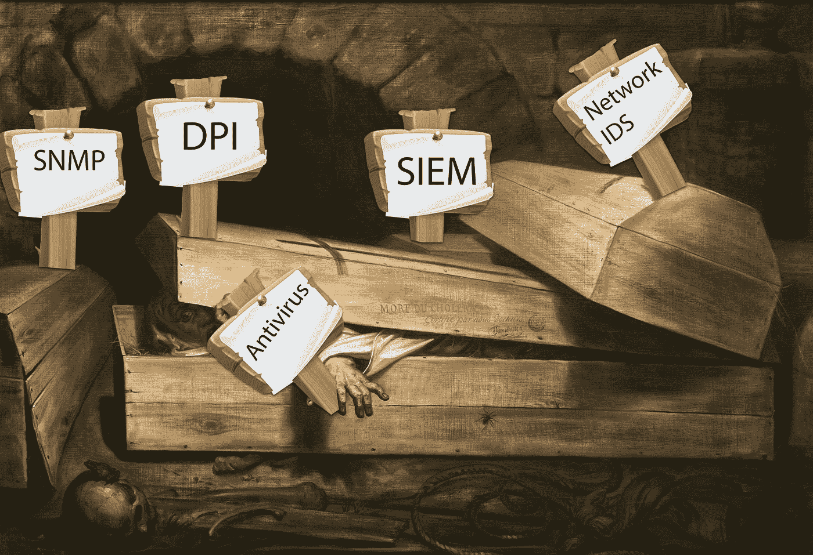

# 愤怒反对光的消亡:DPI 和 SNMP 下降

> 原文：<https://medium.datadriveninvestor.com/rage-against-the-dying-of-the-light-dpi-and-snmp-descending-54ec2f616916?source=collection_archive---------0----------------------->

*深度数据包检测和简单网络管理协议如何被网络遥测取代*

*“不要温柔地走进那良夜，老年应该在黄昏时燃烧和狂欢；愤怒，对光的消亡的愤怒。”* —威尔士诗人狄兰·马尔莱斯·托马斯在 1914 年写下的一首热情洋溢的颂歌，歌颂了人类精神的不屈不挠，它无法更好地描述我在过去二十年里所看到的反病毒和网络入侵检测等传统安全解决方案的悄然过时。

这些解决方案在 20 世纪初找到了它们的最终归宿，将被更新、更智能的方式所取代，无论是移动推送通知取代密码，网络威胁分析取代网络 id，机器学习取代签名，加密协议取代未加密协议，还是现在的遥测数据取代深度数据包检测(DPI)和简单网络管理协议(SNMP)。虽然仍然存在 DPI 和 SNMP 版本 1、2 或 3 非常适合的情况，但事实是旧版本正在被新版本迅速取代。

**伊朗伊斯兰共和国新闻部**

深度数据包检测是指从数据报的最外层报头(以太网报头)到包含应用程序数据的有效载荷的尾部，对穿过网络的数据包进行分析。随着网络上南北向和东西向加密流量的不断增长，DPI 正迅速变得过时，这种流量现在占互联网流量的 73%以上。

 [## 网络安全非营利组织帮助中小企业打击网络犯罪-数据驱动的投资者

### 一个名为全球网络联盟(GCA)的非营利组织发誓要改善…

www.datadriveninvestor.com](https://www.datadriveninvestor.com/2019/02/22/cybersecurity-non-profit-to-help-smes-fight-against-cybercrime/) 

DPI 是在统一威胁管理(UTM)和网络入侵检测系统(IDS)的早期出现的，它们将入侵检测系统(IDS)和入侵防御系统(IPS)的功能与传统的状态防火墙相结合。这种结合使得检测 IDS/IPS 或状态防火墙本身无法检测到的某些攻击成为可能。有状态防火墙虽然能够看到数据包流的开始和结束，但不能自己捕捉事件，因为它们会超出特定应用程序的范围。支持 DPI 的设备能够查看 OSI 模型的第 2 层和第 3 层以外的内容。在某些情况下，甚至可以调用 DPI 来查看 OSI 模型的第 2-7 层。这包括报头和数据协议结构以及消息的有效载荷。

话虽如此，但当在命令和控制(c2)中使用加密时，如果攻击是在 VPN 隧道内进行的，或者如果 web 应用程序攻击是通过 SSL 执行的，那么 DPI 从数据包的浅层报头一直检查到其有效负载的本质就变得无能为力了。事实是，随着像 HTTP、telnet 和 FTP 这样的未加密协议被 HTTPS、SSH 和 SFTP 所取代，DPI 最终只会成为我这一代人和我之前几代人的美好回忆，他们都记得它。

一个人的遥测和另一个人的不一样

*“一个人的垃圾是另一个人的财富*”这个词的词源已经失传，但最好地描述了网络遥测到底是什么缺乏标准化。Juniper 通过其专有的“Junos 遥测接口(JTI)”来定义它，该接口使用 Google 的 Protobuf 消息，而 Cisco 最近在讨论由 YANG 建模语言支持的基于模型的遥测时，认为遥测数据是 NetFlow、IPFIX 和来自现有基础设施设备(如路由器、交换机、防火墙、代理和端点)的其他类型的流数据的通用总称。

再见 SNMP，是你，不是我

SNMP 代表简单网络管理协议，通常用于监控可用性、吞吐量、利用率、延迟以及在设备、接口、链路、内存和 CPU 上收集的错误。但是，问任何渗透测试人员，她都会告诉你，在她执行的每个渗透测试中，每个渗透测试中最常见的发现是默认使用 SNMP 社区字符串(实际上，是用于读写访问的 SNMP 密码)。SNMP 在历史上从来都不是最安全的实现，常常是最常见的配置错误的服务，其中供应商的默认社区字符串在投入生产后从未更改过。

除了漏洞和错误配置，SNMP 还有严重的可扩展性问题——SNMP 在当今的高密度平台上确实无法扩展。虽然 SNMP 可以在发送陷阱时执行推送，但最常见的配置和普通 SNMP 客户端每 5–30 分钟执行一次拉取，这使得任何类型的实时监控都不尽如人意。虽然 SNMP 版本 3 实现了版本 1 中急需的安全性，但是可以写一整篇文章来讨论 SNMP 的失败，所以我离题了。

进入网络遥测

网络遥测越来越成为许多网络和安全工程师的“热门话题”，他们已经厌倦了 SNMP MIB pull 和 Cisco 的命令行界面(CLI)命令进行监控。与 SNMP 不同，网络遥测是一种连续的实时流馈送，称为订阅。此外，与使用 SNMP 的 MIB 不同，[模型驱动遥测](https://www.cisco.com/c/en/us/solutions/service-provider/cloud-scale-networking-solutions/model-driven-telemetry.html) (MDT)使网络设备能够向外界精确描述它们的能力——描述它们暴露的数据类型(例如，接口统计、配置选项等)；数据类型(字符串、整数等)；对数据的任何限制(可选或必需等)；甚至数据支持哪种操作。数据模型就像一个契约，一个遵守符合模型的指令并根据模型的规则将数据返回给请求者的协议。

借助 CLI，管理员可以记住 show 命令。使用 SNMP，管理员需要一个 MIB。使用 MDT，管理员指定包含他们想要的数据的 YANG 模型。实际上，这意味着使用 NETCONF 从路由器实时检索支持的模型，或者从 [github](https://github.com/YangModels/yang/tree/master/vendor/cisco/xr) 获取它们，并使用 [pyang](https://github.com/mbj4668/pyang) 等工具离线探索它们。

我不仅是总裁，也是客户

如果说我非常相信网络遥测是使用 NTA 解决方案或安全分析平台(如 [SAS Cybersecurity](https://www.sas.com/en_us/software/cybersecurity.html) 模式匹配有效载荷)进行网络威胁检测的更有效的基础事实，这将是一种轻描淡写的说法。毕竟，我并不羞于宣扬暹罗之死。

我已经看到了未来，它描绘在系统和网络遥测的 Hadoop 数据湖中，由 ML 支持的 NTA 解决方案提供，其事件由安全分析平台理解，其自主响应通过 SOAR 实现。

我在事件响应和取证中遇到的最大的高级持续威胁(APT)攻击是一家大型生物技术公司的入侵。这种危害的指标是网络流量，由于对手将数据囤积到分段服务器，网络流量的链路利用率突然飙升至接近全部。没有 IDS 签名被用于那个的有效负载。

思科的 Stealthwatch(前身为 Lancope)从能够生成 Netflow 数据的现有网络设备中获取网络遥测数据，通过其机器学习模型结合思科的身份服务交换(ISE)处理元数据，以回答用户和设备使用网络的人、事、地点、时间和方式，它将网络称为“网络作为传感器”，将网络上能够生成 NetFlow、IPFIX 和其他类型的流数据的每一个设备转换为来自路由器、交换机、防火墙和代理的一个大规模传感器。

通过监控遥测数据进行网络行为分析对于监控加密的南北和东西流量也至关重要，因为它不需要 DPI 仅依赖数据包报头中的元数据，思科亲切地称之为[加密流量分析](https://www.cisco.com/c/en/us/solutions/enterprise-networks/enterprise-network-security/eta.html)。

摘要

总之，随着我们进入 2020 年，21 世纪的头 20 年将很快结束，虽然最伟大的网络安全进步是在过去 20 年里取得的，但我想不出比今晚在巴黎发生的事情更及时的寓言来传递“没有什么是永恒的”这一信息。现在，全世界都在关注这座历经数百年历史的巴黎圣母院，它在纳粹和两次世界大战的战火中幸存下来。但是，虽然昨天的旧技术让位于人类对技术进步的持续追求，但我们当时取得最大成就的古老遗迹最终将被重新想象、重建并变得更好。

**Like 和 Reshare！**

像往常一样，如果你喜欢这篇文章，请点击“喜欢”来支持我，并与你自己的 feed 分享！这是你支持我和我继续研究的最好方式。如果任何人对这篇文章有任何补充或评论，请在评论区与下面的每个人分享！在 www.alissaknight.com、 [LinkedIn](http://www.linkedn.com/in/alissaknight) 的主页上了解更多关于我的信息，在我的 [YouTube 频道](http://www.youtube.com/c/alissaknight)上观看我的视频博客，收听我每周的[播客片段](http://alissaknight.libysyn.com/)，或者在 Twitter [@alissaknight 上关注我。](http://www.twitter.com/@alissaknight)

**关于我**

我是 [Aite Group](http://www.aitegroup.com/) 的高级分析师，通过评估行业趋势、创建细分分类、确定市场规模、准备预测和开发行业模型，对影响金融服务、医疗保健和金融科技行业的网络安全问题进行重点研究。我通过公正、客观和准确的研究和内容开发，为这些行业提供网络安全市场的联合和定制市场研究、竞争情报和咨询服务。根据我对当今影响这些行业的当代网络安全问题的研究，我撰写研究报告和白皮书，并提供咨询服务，包括询问、简报、咨询项目、研究结果演示以及预约演讲，我经常在每年的网络安全会议、研讨会和圆桌会议上发表主题演讲。