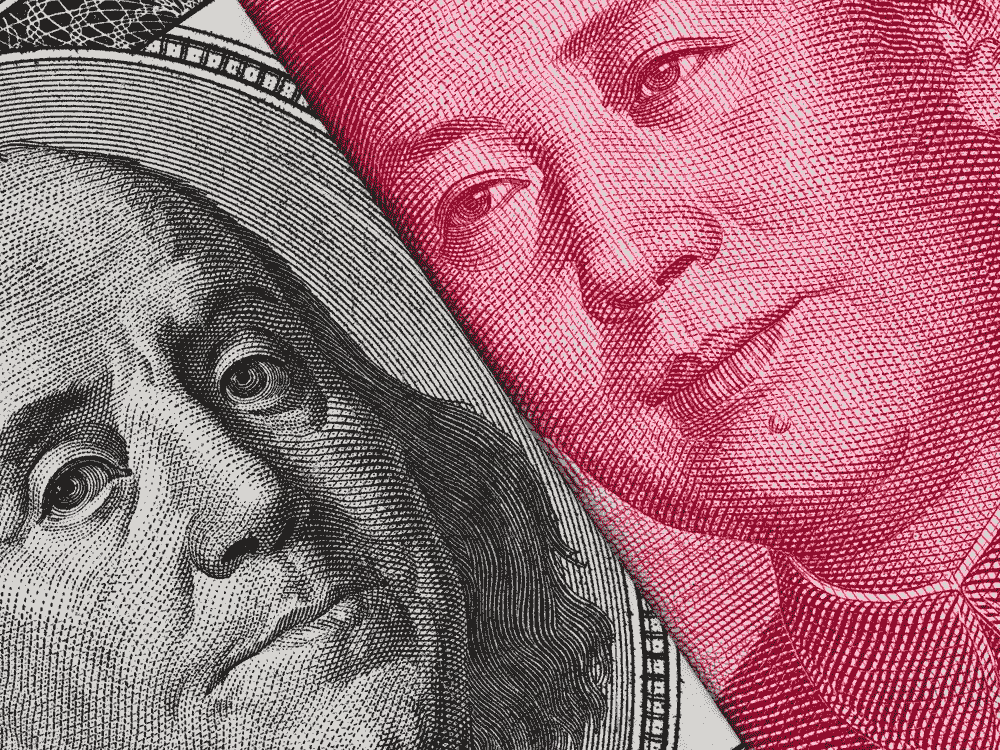
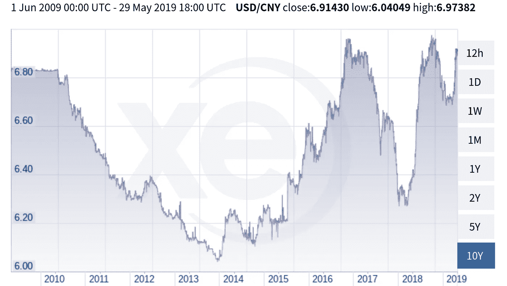
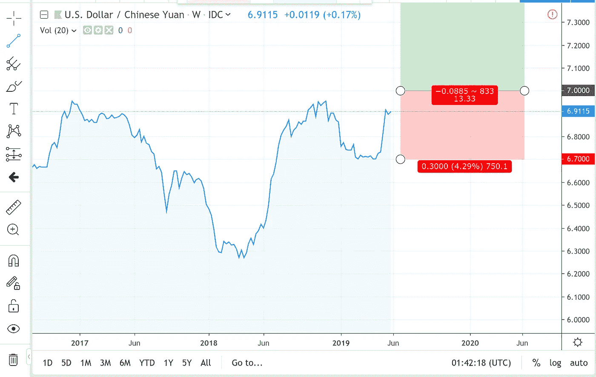

# 本周交易理念:在 7.00 买入美元/CNH

> 原文：<https://medium.datadriveninvestor.com/rain-trading-idea-of-the-week-buying-the-usd-cnh-at-7-00-9bd6196f54c?source=collection_archive---------9----------------------->

The Yuan is Approaching An Important Resistance Point

两周前，我们发表了一篇文章[讨论当前快速发展的美中贸易战](https://medium.com/datadriveninvestor/the-us-china-trade-war-is-spooking-the-stock-markets-58aacba2434d)。它强调了一个事实，尽管贸易战可能会让[觉得应该支持，但实际上，它会损害经济，并可能导致毁灭性的后果。1930 年](https://www.thebalance.com/what-is-trade-protectionism-3305896)[斯穆特-霍利关税法](https://en.wikipedia.org/wiki/Smoot%E2%80%93Hawley_Tariff_Act)的通过是“渴望关税”情况恶化的一个例子，该关税法最初是通过对欧洲进口农产品征收关税来帮助美国农民保持对欧洲农民的竞争力。然而，它导致了美国和整个欧洲之间毁灭性的贸易战，延长了大萧条的影响。一个国家可以使用更有效的手段来保持其国内选民对国际力量的竞争力，例如使用补贴和对商品实行配额。

从经济学的角度来看，看到这些类型的大规模地缘政治事件如何对一国货币的价值产生如此大的影响是很有趣的。

 [## 为什么包容性财富指数比 GDP 更能衡量社会进步？-数据驱动…

### 你不需要成为一个经济奇才或金融大师就能知道 GDP 的定义。即使你从未拿过 ECON 奖…

www.datadriveninvestor.com](https://www.datadriveninvestor.com/2019/03/08/why-inclusive-wealth-index-is-a-better-measure-of-societal-progress-than-gdp/) 

# 贸易战如何影响货币

贸易战影响了一个国家能够出售给另一个国家的商品数量。在当前美中贸易战的背景下，不仅仅是中国不能像过去那样向美国出口那么多商品；中国疲软的经济也影响了它与其他国家的关系，这反过来导致这些国家与美国之间的贸易受损。

汇率在描述两国之间的贸易流动方面起了很大的作用。就中国和美国而言，限制中国产品进入美国不可避免地导致人民币对美元贬值。原因很简单:对中国产品的需求下降了，因为中国产品现在由于相应的关税税率而变得更贵了。

这是两国货币之间的 10 年汇率图表。

A 10 Year Chart of USD-CNY

我们马上注意到一些事情:人民币正在接近最重要的(至少在心理上，这当然是最终的问题，因为所有的金融市场都是由人类驱动的)7.00 的汇率及其 10 年来的高点。如果人民币有足够的压力突破 7.00 这一重要阻力位，这可能为买入美元兑人民币提供一个巨大的交易机会。

> 如果人民币有足够的压力突破 7.00 这个重要的**阻力位，**这可能会提供一个买入美元兑人民币的绝佳交易机会。

交易可能看起来像这样，在 7.00 进场，在历史强支撑点 6.7 止损。

A Trade Opportunity to Buy the USD/CNH

在外汇市场上寻找好的宏观贸易机会可能是一个耗时但回报丰厚的过程。在一天结束的时候，你需要知道的就是:关注新闻。由于美国出现在新闻中，而且它与国际贸易关系有关，所有类型的美国资产类别的波动性都将飙升。

换句话说，现在是做交易者的最好时机。让我们享受这段旅程吧。

*作者是印度人工智能驱动的量化基金管理公司*[*RAIN Technologies*](http://www.rainfund.ai)*的联合创始人。*

*免责声明:文章中表达的观点和意见仅属于作者，不一定反映数据驱动投资者的立场。*