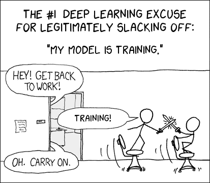

# 提高迷你批次尺寸！

> 原文：<https://medium.datadriveninvestor.com/raise-the-minibatch-size-db74320b9ec8?source=collection_archive---------3----------------------->

/via [https://xkcd-excuse.com/](https://xkcd-excuse.com/)

"*培训需要时间* " ←事情就是这样，一直都是这样。问题是，这不仅仅是你花在等待那个该死的模特训练上的时间，而是由此产生的连锁反应。
一次剥离多个工作流是非常常见的，每个工作流都有自己的调整，这导致了在跟踪到底发生了什么变化时的混乱。[在这个领域，再现性有点像皮塔饼](https://dieswaytoofast.blogspot.com/2018/03/reproducibility-and-machine-learning.html)🙄。事实上，[你甚至可以获得工具来解决跟踪所有这些流水线工作流程的混乱。哎哟！](https://dieswaytoofast.blogspot.com/2018/08/deep-learning-and-workflowsit-can-get.html)

这里的根本问题是，通常培训是以两种方式之一完成的
**1)** 将所有内容都放在单个服务器/GPU 上(如果您已经有了这些内容，您会怎么做)
**2)** 将所有内容都放在服务器群(AWS、GCE 等)上，以及它们附带的 GPU/TPU 等

取 [ResNet-50](https://arxiv.org/abs/1512.03385) 。你通常会把这些图片分成 256 张图片的“小批量”，然后遍历你的训练集。不过这需要时间。哦，比你只在一个 GPU 上运行所有东西的时间要少，但仍然很多(例如，用 8 特斯拉 P100 GPU 大约 ***29 小时*** )。
你*可以*增加迷你批次的大小，但是[正如 Krizhevsky 所展示的，这不可避免地会导致更大的错误率](https://arxiv.org/pdf/1404.5997.pdf)。这有点违背了初衷😡。

或者说，它*使用*导致了更大的错误率。在最近的一篇论文中，Goyal 等人表明，您实际上可以在不影响结果的情况下，将迷你批次大小提高到 ***8192*** 图像。结果是——在与上述相同的设置下，培训时间 ***从 29 小时大幅减少到 1 小时*** ！最棒的是，当扩展到 8192 时，它们

> 在跨数据集(从 ImageNet 到 COCO)和跨任务(从分类到检测/分割)传输时，没有观察到泛化问题

简而言之，所有的好东西，没有不好的东西。事实证明，关键是双重的

1.  当小批量乘以`k`时，将学习率乘以`k`。(高达 8192。在这之后，精确度下降了)
2.  学习率实际上在 5 个时期内上升到它的最终值。事实证明，这促进了健康的融合，并防止模型到处乱晃。

差不多就是这样。30 倍改进 FTW。简单的没有？

好吧，也许事情不是*相当*那么简单。事实证明，当你走这条路的时候，有几件事你真的需要注意。

*   ***动量 SGD:*** 如果使用，需要在 改变学习速率后应用动量修正 ***，否则……不稳定。***
*   ***数据混洗* g:** 使用一个 ***单次*** 随机混洗分配给所有 k 个工人的训练数据(每个时期)。否则，嗯，你的工人都是针对不同的东西进行训练的！
*   ***权重衰减:*** 缩放交叉熵损失是 ***而不是*** 相当于缩放学习率。在这里要小心！
*   ***梯度聚合:*** 根据总最小批量`k*n`而不是每个工人的数量`n`来归一化每个工人的损失。

是的，对于这些较大的批量，通信确实成为一个问题，尤其是在梯度聚合期间。作者在这里使用 [NCCL](https://developer.nvidia.com/nccl) 和几个简洁的算法技巧——递归减半和加倍，结合*分桶*——做了一些相当简洁的工作，以简化整个过程并提高效率..GitHub 上的代码[是*Gloo*。当然，鉴于这里是脸书，一切都是基于](http://4https://github.com/facebookincubator/gloo) [*韩非*](https://caffe2.ai/) 的😀

这绝对是个好消息，我希望这能渗透到训练中的各个地方*，以至于它很快就会成为课程的一部分！*

1.  *“ [*并行卷积神经网络*](https://arxiv.org/pdf/1404.5997.pdf) 的一个怪异技巧”Alex Krizhevsky*
2.  *" [*精确、大型迷你批次 SGD:1 小时训练 ImageNet*](https://arxiv.org/pdf/1706.02677.pdf)"—Goyal 等人。*

**(* [*这篇文章也出现在我的博客*](https://dieswaytoofast.blogspot.com/2018/10/raise-minibatch-size.html) *)**