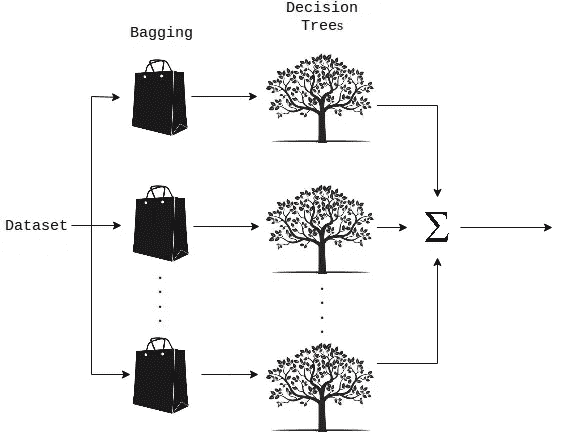

# 随机森林回归初学者指南

> 原文：<https://medium.datadriveninvestor.com/random-forest-regression-9871bc9a25eb?source=collection_archive---------0----------------------->

[](http://www.track.datadriveninvestor.com/1B9E)

source: [https://www.americanforests.org/blog/may-the-forest-be-with-you-and-why-it-matters/](https://www.americanforests.org/blog/may-the-forest-be-with-you-and-why-it-matters/)

作为机器学习世界的完全初学者，我对它无尽的可能性感到惊讶和有点迷惑。我花了几个令人沮丧的周末和咖啡因神的巨大祝福，终于帮我找到了窍门。所以，我想让极客们的生活变得简单一点，并分享一些我学到的东西。在这篇文章中，我将重点关注随机森林回归模型(如果你想要一个实用的指南来开始机器学习，请参考[这篇文章](https://medium.com/datadriveninvestor/a-practical-guide-to-getting-started-with-machine-learning-3a6fcc0f95aa))。首先，我将用简单的术语向所有新手解释随机森林是如何工作的，然后使用 Scikit-learn 让您入门，继续介绍随机森林回归模型的简单实现。

# **随机森林是如何工作的？**

随机森林是一种集成技术，能够通过使用多个决策树和一种称为**引导聚合**的技术来执行回归和分类任务，通常称为即**打包**。你可能会问什么是装袋？在随机森林方法中，Bagging 涉及在不同的数据样本上训练每个决策树，其中采样是用替换来完成的。



Random Forest Regression: Process

这背后的基本思想是在确定最终输出时结合多个决策树，而不是依赖单个决策树。如果你想阅读更多关于随机森林的内容，我提供了一些参考链接，这些链接提供了关于这个主题的深入解释。

让我们开始切吧！

现在我将向您展示如何使用 Python 实现随机森林回归模型。首先，我们需要导入一些库。

```
from sklearn.model_selection import cross_val_score, GridSearchCV
from sklearn.ensemble import RandomForestRegressor
from sklearn.preprocessing import MinMaxScaler
```

这里的星号是 [*scikit-learn*](https://scikit-learn.org/stable/index.html) 库。它是一个机器学习库，具有各种分类、回归和聚类算法，是机器学习爱好者的救星。

让我们直接跳到森林里。事情是这样的，

```
def rfr_model(X, y):# Perform Grid-Search
    gsc = GridSearchCV(
        estimator=RandomForestRegressor(),
        param_grid={
            'max_depth': range(3,7),
            'n_estimators': (10, 50, 100, 1000),
        },
        cv=5, scoring='neg_mean_squared_error', verbose=0,                         n_jobs=-1)

    grid_result = gsc.fit(X, y)
    best_params = grid_result.best_params_

    rfr = RandomForestRegressor(max_depth=best_params["max_depth"], n_estimators=best_params["n_estimators"],                               random_state=False, verbose=False)# Perform K-Fold CV
   scores = cross_val_score(rfr, X, y, cv=10, scoring='neg_mean_absolute_error')

    return scores
```

首先，我们将数据集的特征(X)和因变量(y)值传递给为随机森林回归模型创建的方法。然后，我们使用来自 *sklearn* 库的[网格搜索交叉验证方法](https://scikit-learn.org/stable/modules/generated/sklearn.model_selection.GridSearchCV.html)(更多信息请参考[这篇文章](https://medium.com/datadriveninvestor/an-introduction-to-grid-search-ff57adcc0998))从指定的值范围中确定用于我们模型的超参数的最佳值。这里，我们选择了两个超参数； ***max_depth*** 和***n _ estimators****，*待优化。根据 [*sklearn* 文档，](https://scikit-learn.org/stable/modules/generated/sklearn.ensemble.RandomForestRegressor.html) *max_depth* 是指树的最大深度， *n_estimators* 是森林中树木的数量。理想情况下，树越多，模型的性能越好。但是，您必须对指定的值范围保持谨慎，并尝试使用不同的值来查看模型的执行情况。

在创建一个随机森林回归对象后，我们将它传递给[cross _ val _ score(](https://scikit-learn.org/stable/modules/generated/sklearn.model_selection.cross_val_score.html))函数，该函数对给定数据执行 K-Fold 交叉验证(有关 K-Fold 交叉验证的更多信息，请参考[本文](https://medium.com/datadriveninvestor/k-fold-cross-validation-6b8518070833))并提供一个错误度量值作为输出，该值可用于确定模型性能。

```
scores = cross_val_score(rfr, X, y, cv=10, scoring='neg_mean_absolute_error')
```

这里我们使用了 *10 重*交叉验证(由 *cv* 参数指定)，其中负的*平均绝对误差(MAE)* 作为误差度量(使用*评分*参数指定)来测量模型性能。 *MAE* 越低越好。您还可以使用 [cross_val_predict()](https://scikit-learn.org/stable/modules/generated/sklearn.model_selection.cross_val_predict.html) 函数来获取使用该模型预测的值的列表。

```
predictions = cross_val_predict(rfr, X, y, cv=10)
```

这就把我们带到了本文的结尾。希望你通过这篇文章对随机森林回归有了基本的了解。

如果你是机器学习入门的初学者，请查看文章[机器学习入门实用指南](https://medium.com/datadriveninvestor/a-practical-guide-to-getting-started-with-machine-learning-3a6fcc0f95aa)。

感谢你的阅读，如果你觉得这有用，请鼓掌！

**如果你有兴趣阅读更多的**，看看我列表中的文章，

*   [机器学习文章](https://medium.com/@krishnihw/list/machine-learning-5db3a9d0dc83)
*   [异能匕篇](https://medium.com/@krishnihw/list/power-bi-2e19d2237f90)

愿树精给你带来树叶！再见！

*阅读材料:*

[](http://dataaspirant.com/2017/05/22/random-forest-algorithm-machine-learing/) [## 随机森林算法如何在机器学习中工作

### 在本文中，您将学习最流行的分类算法。哪个是随机森林…

dataaspirant.com](http://dataaspirant.com/2017/05/22/random-forest-algorithm-machine-learing/) [](https://medium.com/@williamkoehrsen/random-forest-simple-explanation-377895a60d2d) [## 随机森林简单解释

### 用直观的例子理解随机森林

medium.com](https://medium.com/@williamkoehrsen/random-forest-simple-explanation-377895a60d2d)