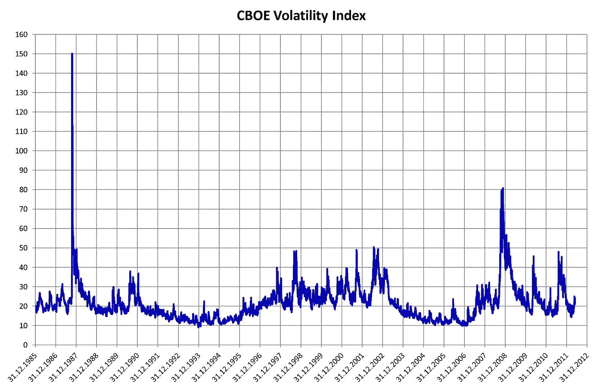

# 区间交易波动率指数期权

> 原文：<https://medium.datadriveninvestor.com/range-trading-vix-options-188ed76b4353?source=collection_archive---------37----------------------->

正如交易者所知，波动率指数在一个区间内交易:它意味着恢复。因此，你可以通过在区间顶部买入波动率指数看跌期权，在底部买入波动率指数看涨期权来获利。或者理论上是这样。附加回测产生 19%的 CAGR，最大压降为 27%

这是 Jupyter 笔记本，可以从我的[要点](https://gist.github.com/AnthonyFJGarner)下载:

*原载于 2018 年 12 月 13 日*[*【http://zenothestoic.com*](https://zenothestoic.com/2018/12/13/range-trading-vix-options/)*。*