# 比率，让你更成功的最简单的心智模式

> 原文：<https://medium.datadriveninvestor.com/ratios-the-simplest-mental-model-to-make-you-more-successful-ae679e35dbd6?source=collection_archive---------3----------------------->

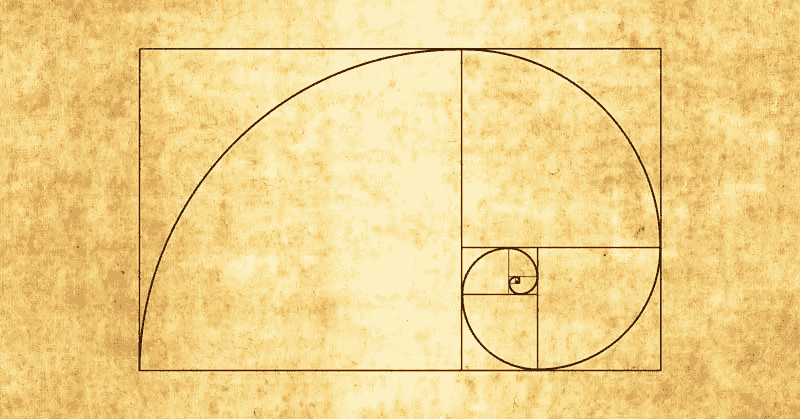

随着时间的推移，对我来说越来越明显的是，成功人士比普通人更善于用比率来思考。特别是在复合增长率、风险和业务优化方面，但也包括不太明显的事情，如算法设计和测试，甚至视觉设计。比率使人们能够快速看到模式，基准想法，总体上做出更明智的决策，产生更好的结果。**比比皆是！**

这篇文章是关于为什么你应该尝试在你的思维过程中加入基于比率的[心智模型](https://fs.blog/mental-models/)。我特意包括了一些非常不同的例子，因为这个原则适用范围非常广，但是当然，我们的目标也不是关于具体的例子，而是关于如何调整你的思维来利用比率。😎

## 使用比率进行更好的设计

好的设计使用特定的比例来创造自然愉悦的美感，这是大自然母亲预先设定好的。这方面最著名的例子是黄金分割率，它出现在许多花卉和植物中，因此也被制作成艺术品和照片等。它告知比例，吸引你的眼睛到细节或形状的重要领域。它们出现在自然、建筑、名画的造型、照片的焦点、报纸以及我们周围的许多事物中。

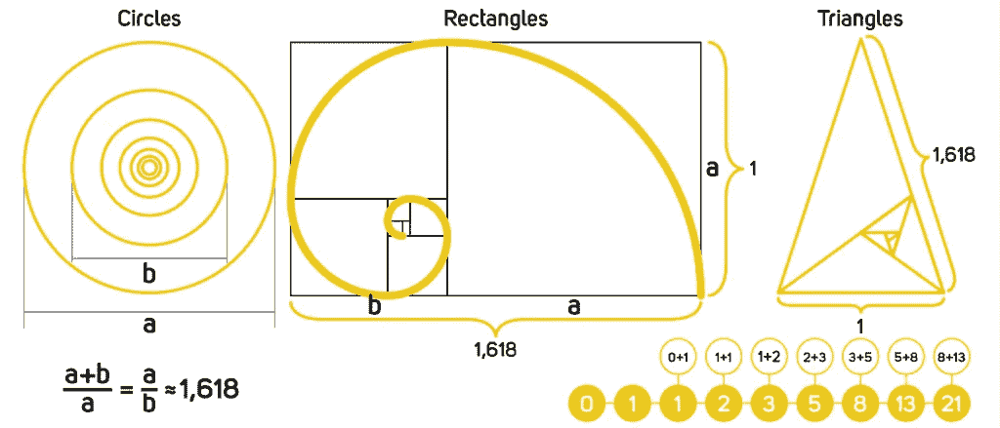

The gold ratio (fibonacci) is often used in visual designs

最优秀的设计师都意识到了这一点，他们的设计比你想象的更注重比例。下面是苹果的标志，和上面很像，这使用了[斐波那契](https://en.wikipedia.org/wiki/Fibonacci_number)序列(1，1，3，5，8，13，…，每一个数字都是前两个的和)产生了[黄金分割比例](https://en.wikipedia.org/wiki/Golden_ratio)。斐波那契数列也出现在金融中，详见下文。

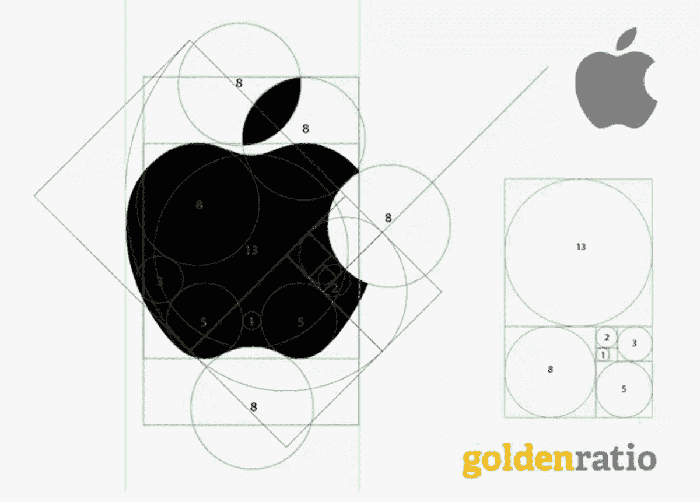

Twitter 也在他们的标识和网页设计布局中使用这些比率。

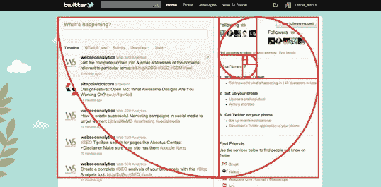

Twitter site layout ratios use the golden ratio

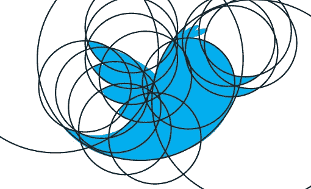

Twitter logo also uses the golden ratio

你随处可见的云标志怎么样？

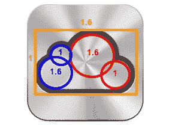

这些只是一些例子，但是今天一些最伟大的设计使用了这些原则。下次当你试图设计一个标志或网页布局时，记住比例是值得的。

## 使用比率评估风险

比率被交易者、赌徒、保险公司使用，事实上任何有风险的地方都有一个比率，来源于成功/失败的概率。例如，赌徒看赔率来下注，赔率本身就是比率。任何给定事件的赔率之和也给出了一个比率来表示赌注的*，它表明了赌注者*对*的预期盈利率%。在澳大利亚长大，很多人打赌。大多数人使用[政府博彩机构](https://en.wikipedia.org/wiki/Totalisator_Agency_Board)中的一家，这些机构通常在每场赛事中抽取平均约 30%的佣金！相比之下，在线平台，如必发，往往是 1-5%。如果这听起来不多，你**必须**阅读下面的复利部分！*

为了赌一把并赢，你需要有能让机会变得对你有利的知识。战胜对你不利的小%是绝对可能的，在 21 点中算牌就是一个很好的例子——知道牌堆中还有哪些牌实际上可以将游戏从亏损转为盈利。但是为了利用这一点，你需要记住这副牌中还有什么牌，这对于一般人来说几乎是不可能的。因此，为了简化问题，无数系统被设计来查看特定卡片的比率，并计算代表获胜可能性的数字。通常这些技术遵循相似的过程:将复杂的信息简化成更容易推动决策的东西。

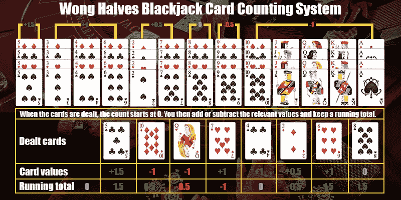

One of the many Blackjack card counting systems

上面重要的不是系统，而是方法论:**你如何简单地表示可用的信息，以便它可以用于决策？这类似于许多业务流程，如购买和销售、设定预算或评估活动。**

> 将复杂的信息简化为更容易推动决策的内容。

赌博特别有趣，因为人类的偏见会导致我们做蠢事。[金钱泵](https://en.wikipedia.org/wiki/Money_pump)就是这样一个观察人类如何处理不及物偏好的思想实验。[价格锚定](https://www.google.com/amp/s/www.helpscout.net/blog/pricing-strategies/amp/)是另一个例子，我们的偏见每天都会暴露出来并被用来对付我们。赌博中使用的相同过程被用于促使人们购买更多的东西。一本名为《无价之宝》的书深入解释了这一点，非常值得一读。

## 使用比率进行交易

技术交易也类似。有无数的技术指标，如 RSI，MACD，MAVG，OBV，交叉，烛台等等。其他比率用于快速评估公司，如 PE、PB 和 PS 比率等。

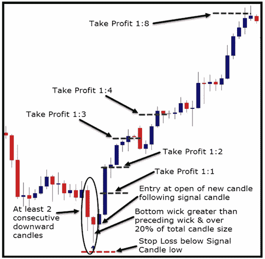

Candles are a visual representation invented originally for rice trading, but now commonly used by traders

指标用于简化决策过程，因为**以更可行的方式表示复杂的信息**。

均线交叉是另一种技术。这种方法使用短期和长期移动平均线之间的比率来指示即将发生的价格变动。数学很简单，但是很难从原始数据中看出。然而，从视觉上看，十字非常明显，很容易识别。

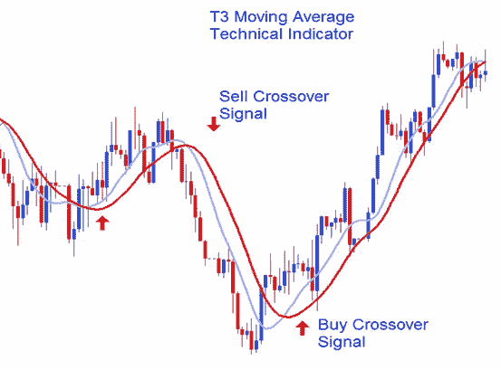

Moving average crosses are widely used to identify buy and sell opportunities

# 经营成绩

关于金融建模和衡量企业绩效的文章不计其数，我在这里就不再赘述了。但是**如果你曾经想要经营一家企业和/或获得投资，你需要了解你的空间的指标和比率**。

经常有经验丰富的人问我三四个问题，现在我很明显，不到一分钟，他们就对我们的业务有了很好的基本了解:

*   *你有多少员工？*这表示尺寸。
*   你从事这项工作多久了？添加时间显示速度。
*   *你们都是工程师吗？添加技能组合表明你的核心重点，例如工程或销售。*

总而言之，这显示了你有多大，你移动的有多快，以及你要去哪里。

> 成功的比率在模式中重复，模式预测未来的结果

投资者也使用比率及其相应的模式来评估企业。当你们见面时，他们会问一些非常简单的问题，以便在几分钟内了解你的业务。例如:

*   你的月收入是多少？这告诉他们你的大概规模，这很重要，因为通常基金只投资一定的规模。
*   你的团队有多少人？这能快速告诉他们你是否赚钱/赔钱，以及大致的速度。
*   *收入增长有多快？*最后一个问题非常关键，因为增长率是复合的，所以微小的差异可能会导致非常不同的结果。

这导致了一个最重要的比率进入你的心智模型武器库:复利。

# 复合增长和成果

增长是保持繁荣的核心(显然😏).现代经济学要求增长，否则就会发生像衰退和萧条这样的坏事。企业与经济有许多相似之处，没有增长，人们就会恐慌，账单无法支付，不得不削减开支。上市公司感受到的压力更大，但老实说，这对两个人的初创公司来说没什么不同。如果你刚刚开始创业，你需要关注增长率，并从第一天就把它们作为你常规计划的一部分**-我怎么强调都不为过。**

## 生长化合物

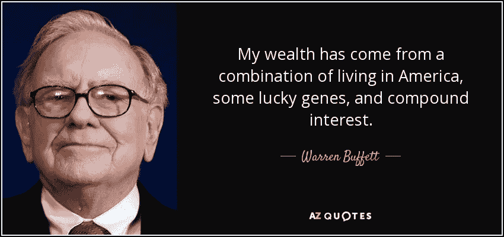

Warren Buffet has many quotes on compound interest for good reason

增长率定义了生活中的许多事情，非常值得整合到你的日常活动中。对于任何复合的东西，你要尽你所能去改变它，让它对你有利，即使是很小的差异也会有很大的影响。下面是一个有用的图表，显示了各种增长率复合需要多长时间，即本金翻倍或减半需要多长时间。

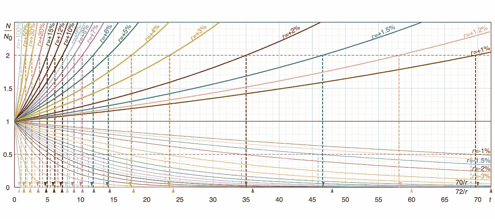

Doubling and halving times for various growth rates

上面的图表很有用，但很难记住，但幸运的是这是由 72 (见下文)的[法则总结的，这是一种快速估算倍增时间的非常快速的方法。投资者喜欢 72 法则，在会议中他们可以在几秒钟内计算出你的翻倍时间。你应该记住并使用它，因为投资者希望你在特定水平的两倍或三倍有资格投资，例如](https://en.wikipedia.org/wiki/Rule_of_72) [2T3D](https://www.battery.com/powered/a-mantra-for-saas-success-triple-triple-double-double-double/) 模式(还有其他模式)。

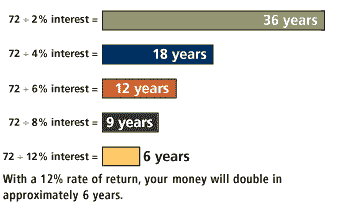

复利在两个方向都起作用，你想在等式的右边。你在商业中做的每一件事都应该考虑它将如何复合(积极或消极)。你的商业比率讲述了一个比你的想法更大的故事，不是说你的故事不重要，而是随着时间的推移，数字和模式预测变得更加有效。

我在这里要提到的最后一点是，越早在电子表格中建立业务模型越好。在过去，我推迟了这个，因为我认为这些数字太模糊了，无法建立一个有用的模型，但这是错误的看待它的方式。知道不确定性在哪里，以及有多少小的变化会影响业务，这是你能拥有的最好的洞察力之一(这让我一次又一次地感到惊讶)。通常小的变化会复合并完全改变商业前景；提前了解这一点可以让你把精力用在正确的地方，从而最小化风险，最大化成功的机会。

## 一次与复合

当追求一次性储蓄没有意义时，要学会这一点，这是一个重要的教训，许多聪明人会一次又一次地失败。例如，如果你的工资是 X 美元/小时，你愿意花多长时间去寻找更便宜的汽油？看一个例子，假设加满一箱油(美国的中型车)要花 40 美元，通过货比三家，最多可以节省 10%。如果你每小时挣 20 美元，那么花费超过$ 40 * 10%/$ 20 = 12 分钟就是浪费。

请注意，这是假设您可以在该时间段内获得全额折扣，并且没有额外的成本！如果你包括开车、排队(打折站更忙)和所有其他浪费，预期的回报通常是没有意义的，即使对那些低工资的人来说。

做上述事情的人之多令人吃惊，其中包括有钱的聪明人。如果你认为这是你的自由时间，因此没有花费你任何东西，那么你低估了你的时间。为什么你会问？

## 时间也会复合

成功人士似乎总是重复的一件事是，花最少比例的时间学习。比尔·盖茨和许多其他人强调每周至少 5 小时的专门学习阅读。这一比率旨在保持复合改善的进程。

> 就像复利对金钱的作用一样，这同样适用于知识和学习。

李嘉诚有一个著名的演讲，他谈到如何按照设定的比例分割你的收入，以获得最大的成功。其中的一部分是花 20%带比你聪明的人出去吃午餐和晚餐，花 15%在书籍和教育上。虽然这是在谈论金钱，但直接后果是在自我提升上花费大量的时间和金钱。就像复利对金钱的作用一样，这同样适用于知识和学习。将这些原则正式化会让它们更容易实现。

总的来说，你应该试着把**的金钱和时间**花在它会复合的地方，并试着避免那些对你不利的事情。

# 算法设计中的比率

比率在机器学习中反复出现，一些表现最好的算法就是建立在比率之上的。[我想到了决策树](https://medium.com/@rishabhjain_22692/decision-trees-it-begins-here-93ff54ef134)，简单的比率被用来决定在哪里分割这棵树。下面展示了如何使用一个 [*基尼系数*](https://en.wikipedia.org/wiki/Gini_coefficient) 来有效地分割树。有趣的是，这个简单的数学也是衡量收入不平等、生物多样性和许多其他基于人口的比较的基础。

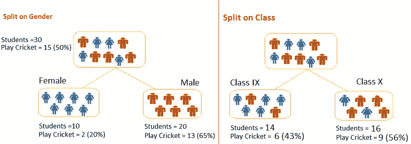

D[ecision tree construction](https://medium.com/@rishabhjain_22692/decision-trees-it-begins-here-93ff54ef134)

决策树不仅使用比率来分割，而且基于树的[集合](https://en.wikipedia.org/wiki/Ensemble_learning)也在它们的构造中使用比率。例如， [*bagging*](https://towardsdatascience.com/decision-tree-ensembles-bagging-and-boosting-266a8ba60fd9) 将训练数据分成子组， [*Random forests*](https://en.wikipedia.org/wiki/Random_forest) 通过对用于构建每棵树的特征进行采样来进一步扩展这一点。bagging 和 feature 采样率创建了不同的数据视图，这些视图可以结合起来做出更好的决策。

[Gradient descent visualization from Hackernoon](https://hackernoon.com/gradient-descent-aynk-7cbe95a778da)

梯度下降也是神经网络如何学习的关键。一般来说，它被大量用作机器学习中的反馈机制。简单来说，梯度实际上就是一个比率，描述了函数在某一点的变化率。通常，它适用于查看模型的某种损失函数(误差),梯度用于使模型逐步减少误差。

贝叶斯算法如 [*朴素贝叶斯*](https://en.wikipedia.org/wiki/Naive_Bayes_classifier) 用于文本分类。这些也使用比率来推断概率。这种特殊的算法被称为“幼稚”算法，因为每个特征的概率独立作用，因此不受其他特征的影响。下面是一个简单的例子，说明简单的概率是如何被用来预测结果的。下面只使用一个单词进行预测，但是这个原则可以很容易地链接到包括许多单词。

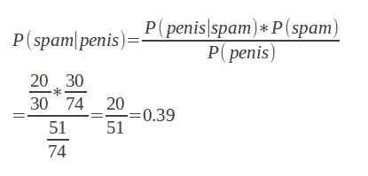

Naive Bayes example: Probability some text is spam based on a word occurrence

多臂土匪算法(首先用于描述老虎机)是另一个使用概率比的例子。一个例子是使用[蒙特卡洛](https://en.wikipedia.org/wiki/Monte_Carlo_method)方法的[贝叶斯强盗](https://www.chrisstucchio.com/blog/2013/bayesian_bandit.html)中的[贝塔抽样](https://en.wikipedia.org/wiki/Beta_distribution)。这种方法将每个项目的正负观察值的比率转换为 beta 分布，然后从每个项目的分布中随机抽样。这个过程开始时非常随机，随着时间的推移，随着观察的增多，随机程度会降低。见下文，其中显示了两个具有不同 beta 分布的项目。

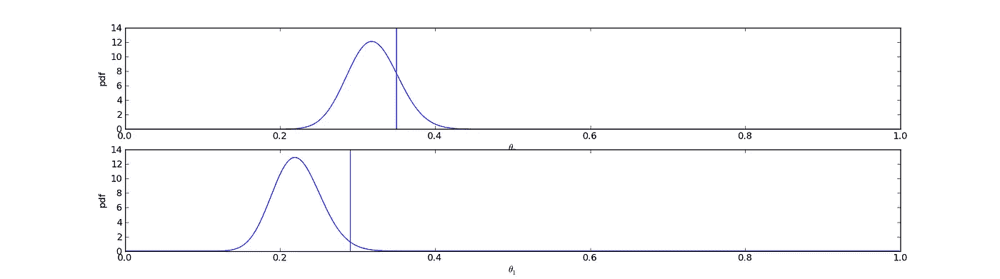

Beta distribution sampling.

上图有趣的地方在于，这些分布共同显示了顶部图形所代表的项目比第二个项目更有可能被选中，但并非每次都是如此，因为这些分布是重叠的。事实上，任何给定点上方和下方的形状的体积(以表示采样的垂直线为例)将给出项目 1 在项目 2 上方的确切概率，反之亦然。

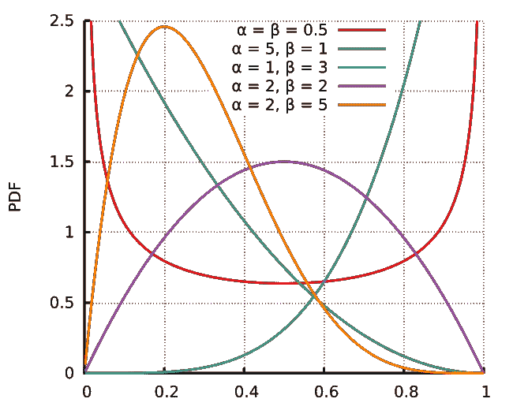

Beta distribution sampling. Positive & negative observations are represented by alpha & beta respectively. As the sample size increases the peak sharpens as the outcome gets more predictable.

[Beta 分布](https://en.wikipedia.org/wiki/Beta_distribution)是一种快速表示好/坏概率比的好方法，目前在许多应用中使用。多年来，Bandit 算法一直在优化[标题](https://www.chrisstucchio.com/blog/2013/bayesian_bandit.html)、[搜索结果](https://staff.fnwi.uva.nl/m.derijke/wp-content/uploads/sigir2016-tutorial.pdf)、[网站按钮颜色](https://www.optimizely.com/optimization-glossary/multi-armed-bandit/)以及我们周围的许多其他东西！

我们使用 bandit 算法优化搜索结果也有好几年了。它们是我们强化学习武库中的一个主要部分，我们积极衡量这些工具带来的在线性能改善，也可以通过这种方式测试新的搜索排名算法。我们还使用朴素贝叶斯对文档和查询进行分类，并预测诸如最有可能成交的类别之类的事情(想想[电子商务搜索](https://www.sajari.com)，其中搜索“Nike”可能意味着“鞋子”或“t 恤衫”，但“鞋子”更有可能成交，因此应该排名更高)。搜索是一个比率游戏，机器学习是为我们的客户提供[最佳搜索排名算法](https://www.sajari.com/features/customizing-ranking)的关键！

# 结论

比率被用于金融、视觉设计、商业、算法等等。它们就在我们周围，学会观察它们以及它们如何以一定的模式重复，可以让我们更有效地做出更好的决定。

比率会节省你的时间和金钱，通常会让你更成功。到处找他们！

# DDI 特色数据科学课程:

*   [**用于数据科学的 Python**](http://go.datadriveninvestor.com/intro-python/mb)
*   [**深度学习**](http://go.datadriveninvestor.com/deeplearningpython/mb)
*   [**数据可视化**](http://go.datadriveninvestor.com/datavisualization/mb)

**DDI 可能会从这些链接中收取会员佣金。我们感谢你一直以来的支持。*