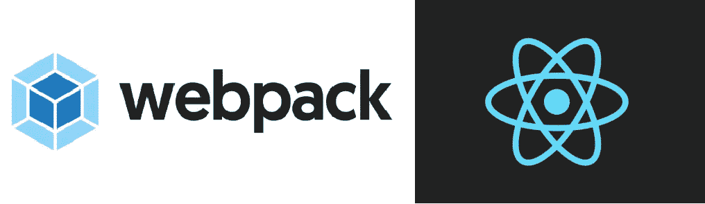
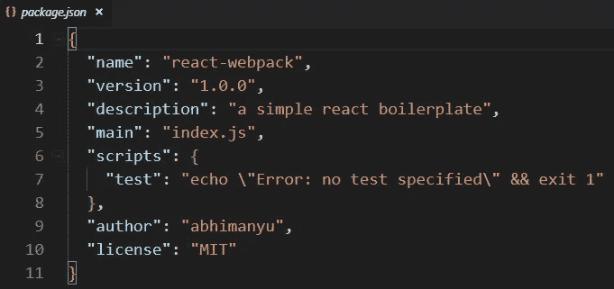
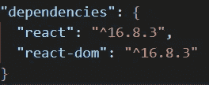
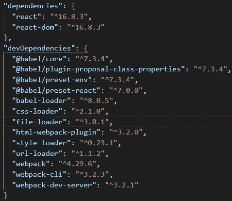
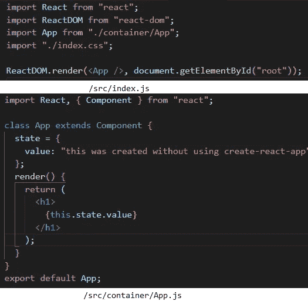
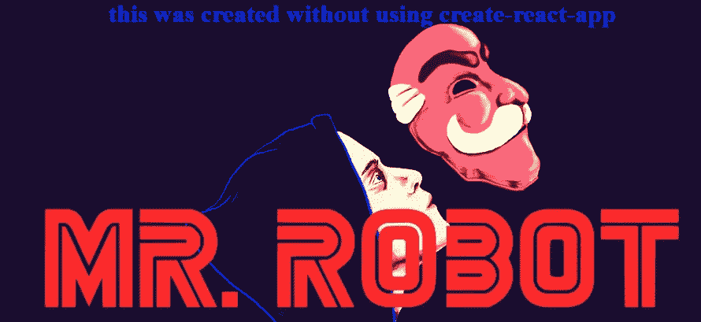

# 使用 WebPack 4 对样板文件做出反应

> 原文：<https://medium.datadriveninvestor.com/react-boilerplate-adc97f608251?source=collection_archive---------3----------------------->

[](http://www.track.datadriveninvestor.com/1B9E)

如今，使用预构建样板代码是一个简单的选择，这些代码是由开发人员创建的，以减少他们自己的工作量。当时间紧迫或者对于刚刚入门的初学者来说，使用这些样板代码确实很方便。

出现的主要问题是，为什么从零开始创建项目。在我 3 年多的前端开发工作中，我学到了一件重要的事情，编码是比较容易的部分，但是建立一个环境是比较难的部分。

[](https://www.datadriveninvestor.com/2019/02/21/best-coding-languages-to-learn-in-2019/) [## 2019 年最值得学习的编码语言——数据驱动的投资者

### 在我读大学的那几年，我跳过了很多次夜游去学习 Java，希望有一天它能帮助我在…

www.datadriveninvestor.com](https://www.datadriveninvestor.com/2019/02/21/best-coding-languages-to-learn-in-2019/) 

建立一个环境需要某种类型的知识，其余的取决于你的谷歌搜索技能。人们必须了解开发依赖性和项目实际需要什么。由于一个特定的实现有如此多的库/jar/二进制文件，我们必须知道哪个库最适合这个需求。

在 React 的情况下，我们使用 *create-react-app，*得到这个惊人的样板文件，所以为什么不一直使用它呢。有几个原因，主要是最终的构建大小和添加了不需要/不使用的模块。

> 正在初始化项目

因此，让我们为自己的参考创建一个简单的样板文件，并在我们进行的过程中添加依赖项。

让我们创建一个文件夹并运行 *npm init* 来创建我们的 *package.json* 文件。它应该如下所示:



package.json

* *注:您可以根据您的标准更新数据。*

> 添加项目依赖关系

现在让我们从安装 *React* 开始，这是我们的主要依赖项。对于 React，你现在需要安装的是 *react* 和 *react-dom* ，你可以添加 *react-router-dom，稍后再添加*到你的项目中。

```
npm install --save react react-dom 
```



react will be added to your dependencies section

现在我们需要安装我们的主要开发依赖项，即 [**webpack**](https://webpack.js.org/) 。Webpack 基本上需要将我们的 react 代码捆绑和编译到一个 javascript 文件中，该文件将用于托管应用程序。我们还需要一个开发服务器，在那里我们可以测试和托管我们的应用程序。Webpack 为我们提供了一个开发服务器，它还内置了一个名为*热重装*的特性。这意味着，我们不需要构建和托管应用程序，每次我们做任何更改，它都会自动处理。

我们还将安装 webpack-cli，它将帮助我们运行 webpack 命令。我们将在开始编写构建脚本时使用它。

```
npm install --save-dev webpack webpack-dev-server webpack-cli
```

**Note -dev 将其添加到 package.json 的 devDependencies 部分*

现在剩下的就是安装 [**巴别塔**](https://babeljs.io/) **。** Babel 是一个 javascript transpiler，它将 ES6 标准 javascript 转换成浏览器可理解的代码。当我们在 React 开发中使用 ES6 标准时，就像 arrow 函数和类一样，babel 是我们不能忽视的东西。

```
npm install --save-dev @babel/core babel-loader @babel/preset-react   @babel/preset-env @babel/plugin-proposal-class-properties
```

*   babel/preset-env 很重要，因为它用于将 ES6 或未来版本的 javascript 编译成浏览器可理解的代码。
*   *编译 JSX 需要 babel-loader* ，用来替代 react 中的 HTML。
*   *babel/plugin-proposal-class-properties*需要使用*类*，这是 ES6 的一个特性。

我们还将安装另一个名为[*html-webpack-plugin*](https://webpack.js.org/plugins/html-webpack-plugin/)*，*的 devDependency，当我们运行构建命令来创建我们的最终 html 文件时，这将是必需的，该文件将用于服务我们的 web pack 包。

```
npm install --save-dev html-webpack-plugin 
```

让我们再添加四个加载器，即 *css-loader* 用于编译我们的 css 样式表， *style-loader* 用于给你的 html 添加样式标签， *url-loader* 和 *file-loader* ，它们将帮助把图像等文件加载到我们的应用程序中。

```
npm install --save-dev url-loader css-loader style-loader file-loader
```

最终的 package.json 应该如下所示:



all the dependencies installed

> 正在配置**网络包**。

首先，我们需要创建我们的 *webpack.config.js，*这是我们配置 webpack 的地方，编译我们的代码并给出最终的输出，这将是我们的捆绑文件，准备好被托管。

```
const path = require('path');
const HtmlWebpackPlugin = require('html-webpack-plugin');
```

*   *路径*是一个内置模块，用于操作文件路径。
*   *HtmlWebpackPlugin* 是我们之前安装的依赖项。

首先我们需要定义一个*入口文件*和一个*输出文件。*在我们的例子中，入口文件将是 *src/index.js* ，它是我们的 react 入口文件。*输出文件*将是最终捆绑的 javascript 文件。

```
module.exports = {
       entry: './src/index.js',
       output: {
           path: path.join(__dirname, '/public'),
           filename: 'bundle.js'
       }
}
```

现在我们可以开始在配置文件中定义我们的加载器了。我们将添加一个名为*模块*的新属性，并在其中定义另一个属性*规则*。*规则*是一个对象数组，在这里我们定义了所有的加载器依赖关系。每个对象持有一个*测试*属性。您可以添加更多属性，如*排除、包含、选项、加载器，如果需要，使用*。

```
module: {
  rules:[
         {test: /\.js$/,
          exclude: /node_modules/,
          use: {loader: "babel-loader"}},
         {test:/\.css$/,use: ["style-loader", "css-loader"]},
         {test:[/\.bmp$/, /\.gif$/, /\.jpe?g$/, /\.png$/],
          loader:require.resolve("url-loader"),
          options:{limit: 10000,
                   name: "static/media/[name].[hash:8].[ext]"}
         }
        ]
}
```

*   ***测试*** 是我们在正则表达式中定义文件类型的地方。
*   ***使用*** 是我们为*测试*中定义的文件类型定义加载器的地方。我们可以将其定义为数组或对象。
*   如果需要，我们可以将 ***选项*** 添加到规则对象中，以定义特定规则的特定特征。如果没有定义选项，规则使用预定义的默认选项。

配置 webpack 的最后一部分是在配置文件中定义 *html-webpack-plugin* 。 [***插件***](https://webpack.js.org/plugins)*是一个数组，可以在其中添加 webpack 提供的所需插件。*

```
*plugins: [new HtmlWebpackPlugin({template: "./src/index.html"})]*
```

*至此，我们完成了 webpack.config 文件的配置。*

> *正在配置**通天塔***

*如果你记得，我们安装了一些巴别塔预置，这些预置为巴别塔行为插件，以编译和传输我们的 ES6 和反应代码浏览器可理解的代码。*

*我们必须在根文件夹中创建一个名为 ***的新文件。babelrc*** 作为 babel 的配置文件。我们将创建一个对象，并创建一个名为 *presets* 的属性，这是一个数组，值是我们安装的巴别塔预设。*

```
*{"presets": ["@babel/preset-env","@babel/preset-react"]}*
```

*向我们的配置文件添加插件。*

```
*{"presets": ["@babel/preset-env","@babel/preset-react"],
 "plugins": [["@babel/plugin-proposal-class-properties",    {"loose":true}]]}*
```

***注意:松散属性被定义为布尔值，如果设置为 true，则类属性被编译为使用赋值表达式，而不是 Object.defineProperty**

> *添加**反应**代码*

*您可以在本文末尾的 git 存储库中找到 react 代码。*

**

> *添加**脚本***

*完成所有工作后，剩下的就是在我们的 package.json 中添加构建脚本。*

```
*"scripts": {    
"start": "webpack-dev-server --mode development --open --hot",    "build": "webpack --mode production"  
}*
```

***注意:npm run start 创建一个热重装的开发服务器**

> *最终产品*

**

*React Application*

*我希望这能让您了解如何从头开始创建自己的项目。如果你还有任何问题，请写在评论区，或者你可以查看我的 [git 库](https://github.com/devAbhimanyu/react-webpack-boilerplate)。*