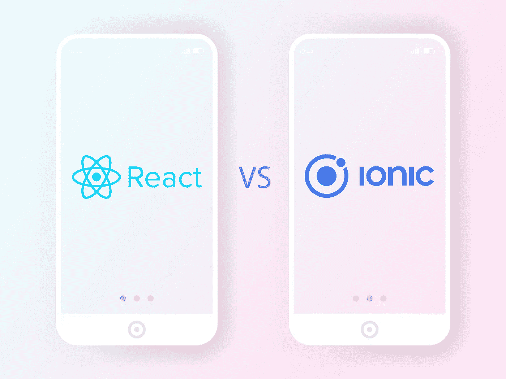

# React Native vs Ionic:选择 2019 年最佳跨平台框架

> 原文：<https://medium.datadriveninvestor.com/react-native-vs-ionic-choosing-the-best-cross-platform-framework-in-2019-627c6843f58?source=collection_archive---------8----------------------->

在[移动应用开发](https://skywell.software/mobile-app-development/)的简单时期，你需要关心的事情很少。你所要做的就是就设计、功能和你愿意花多少钱来创造它达成一致。如今，你必须做出更全面的选择，比如在开发过程中使用哪个框架。虽然似乎有无穷无尽的可能性，但在本文中，我们将着眼于 Ionic 和 React Native。

# Ionic 与 React Native:选择什么样的跨平台框架

Ionic 移动应用程序框架是非常便携的，并且提供了可以在任何平台上工作的完全定制的组件。Ionic 以开放的网络标准给了你这样一种可能性。你的应用程序甚至可以在新平台上运行，比如渐进式网络应用程序。然而，也许开发者喜欢 Ionic 的最大原因是它提供的定制化水平。你可以定制用户界面的每一个小部分。此外，由于您使用的是一个代码库，定制应用程序的设计以更好地适应特定的平台会更容易。

 [## 2019 年移动应用开发之路——数据驱动投资者

### 任何在移动应用程序开发行业工作的人，无论他们是专注于在伦敦开发 iOS 应用程序还是…

www.datadriveninvestor.com](https://www.datadriveninvestor.com/2019/01/15/the-path-of-mobile-app-development-in-2019/) 

用户和开发者都可以享受 Ionic 提供的稳定性。开发人员晚上可以睡得很香，因为他们知道他们某一天写的东西明天会继续工作。也从商业角度考虑这个问题。由于移动用户的数量每天都在增加，潜在客户很有可能通过移动设备找到你。你必须给他们提供高质量的体验，否则他们会离开。

# 下面是一篇 Ionic 框架综述:

*   开源框架；
*   包括一个命令行界面，这意味着可以在任何平台上创建和测试应用程序；
*   以用户界面为中心，因此提供了很好的用户体验；
*   应用程序将在 Android、iOS 和 Windows 上可用。

# 反应自然与离子性能

这很棘手，因为在大多数情况下，就性能而言，hybrid 和 native 之间没有太大的区别。由于在创建应用程序时，性能通常是重中之重，所以最好是原生构建，并利用 iOS 和 Android 提供的工具。

因此，用 Ionic 构建的应用程序在性能方面会很棒，因为你不必担心每个平台的独特行为。这对于 React Native 来说不是问题，用户将获得无缝体验。此外，在处理大量数据时，React Native 提供了更好的响应能力和稳定性。Ionic 将需要网络视图来呈现手机上的应用程序，这将导致更长的上传时间和更多的内存使用。

# 反应型与离子型:何时使用和使用什么

做出正确的决定并不容易。从一开始就要做的最好的事情之一就是确定一个长期愿景。这意味着试图填补长期图景的拼图碎片。这包括思考你如何看待人们使用它，你是否愿意支付额外的费用，如果需要，以获得一流的性能，你是否希望你的应用程序不仅可以在移动设备上访问，也可以在桌面上访问。通过回答这些问题，你将能够更容易地做出选择。例如，如果你的应用程序必须可以从任何设备访问，而不仅仅是移动设备，这将需要一个混合的 web 方法，这意味着你应该使用 Ionic。

React Native 的一个明显优势是文档。因为它得到了像脸书这样的大公司的全力支持，所以所有的文档都是现成的。对于 Ionic 来说就不是这样了，它只有必要支持的文档。获得脸书支持的额外好处是，React Native 将更快成熟。您过去可能遇到的任何问题都会得到更快的处理，因为脸书使用了 React Native to power Messenger 和 Instagram，因此将不断改进任何问题。这意味着脸书将继续测试反应水平，离子不能匹配。

# 为什么应该选择 React Native 来开发移动应用程序:

*   某些部分可以回收，在 Android 和 iOS 上都可以使用；
*   支持实时查看变化；
*   快速解决问题；
*   统一代码开发。

# 结论

每当你对开发过程做出重大决定时，确保每个人都同意你对你选择的框架所做的承诺。这包括发展方法和全球视野。这些决定不应该基于技术栈，而应该基于应用程序的有用性如何与其开发方法保持一致。

考虑到上面提到的所有因素，考虑你的团队现在拥有的技能是很重要的。即使使用一个框架会更好，但您可能没有必要的技能，而且项目的时间表不允许您培训您的团队，使他们达到所需的熟练程度。你的决定可能需要基于许多其他方面，比如你现在拥有什么，以及你可能从外界得到什么。例如，如果您有预算雇佣额外的开发人员来填补一些技能缺口，那么您肯定会给自己很多选择。因此，一定要仔细权衡每一件事，不仅要根据哪种技术最有优势，还要根据物理可能性得出结论。

*最初发布于*[*https://sky well . software*](https://skywell.software/blog/react-native-vs-ionic-choosing-best-cross-platform-framework-in-2019/)*。*