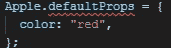

# React 设置默认属性

> 原文：<https://medium.datadriveninvestor.com/react-set-default-props-31c18f9002f6?source=collection_archive---------3----------------------->

REACT 和其他框架的核心概念是组织组件，使它们在整个应用程序中可重用。这就是为什么放置所有必要的信息和设置是重要的，以便呈现组件而没有奇怪的行为。


检查道具时，您可以做的一件事是使用三元表达式来查看道具是否存在，然后相应地输出值。用 **defaultProps** 更干净，因为没那么乱，价值可以整体看。

[](https://www.datadriveninvestor.com/2019/02/21/best-coding-languages-to-learn-in-2019/) [## 2019 年最值得学习的编码语言|数据驱动的投资者

### 在我读大学的那几年，我跳过了很多次夜游去学习 Java，希望有一天它能帮助我在…

www.datadriveninvestor.com](https://www.datadriveninvestor.com/2019/02/21/best-coding-languages-to-learn-in-2019/) 

因为创建 React 组件可以通过多种方式完成。我将展示如何在**功能**组件和基于**类**的组件中设置默认属性。

# 📔类别组件

让我们从基于类的组件开始:

或者你可以在类内部声明它…

```
class App extends React.Component [
    static **defaultProps** = {
      color: “green”,
      title: “Hello World”
    };
}
```

**打字稿**

在 Typescript 上是这样做的。

*   **颜色？:Typescript **接口**中的 string** 将确保 Linter 将属性标记为可选，并且当所有属性都没有传递给组件时不会显示错误。


Lint does not highlight red because color ‘props’ is optional



Declare defaultProps outside

如果你想在类外声明*，你需要声明属性并在类内输入 **defaultProps** 来消除林挺错误。像这样:*

```
class Apple extends React.Component<Props>{ 
    static defaultProps: {color: string}
    ...
}
Apple.defaultProps = {
    color: "red"
}
```

# ⭐Functional 组件

*   类似地，静态属性 **defaultProps** 也可以添加到功能组件中。

## 解构

代替道具，我们可以使用析构，这是来自 **ES6 Javascript 的特性。这是目前为止最推荐的方式**

```
const { color, title } = { color: "red", title: "title"};
***// Will result in below code***
const color = "red"
const title = "title"
```

Destructuring the given props if the property is not given set the default value for them. For more info on [ES6 Destructuring](https://codeburst.io/es6-destructuring-the-complete-guide-7f842d08b98f).

到目前为止，⭐This 是最推荐的方法，因为检查 **defaultProps** 属性需要花费时间，而创建新的 React 组件需要更多的时间。

🕒React 团队将在功能组件中发布 defaultProps 的弃用说明。更多信息 [**此处**](https://github.com/reactjs/rfcs/blob/createlement-rfc/text/0000-create-element-changes.md#deprecate-defaultprops-on-function-components)

# 非 ES6

这就是 React 15.5 以上不使用***ES6 处理*默认道具*的方法。*** *注意，你将需要包含模块* `*create-react-class*`

对于***React 15.5 之前的版本可以用 React.createClass 代替【不含模块】***

> *用 **React.createClass** 替换* **createReactClass**

您可以在我的 [StackBlitz](https://stackblitz.com/edit/default-react-props) 项目中尝试真实的例子。

在 React 中使用**默认属性**可以使您的组件具有高度的可重用性和可伸缩性。