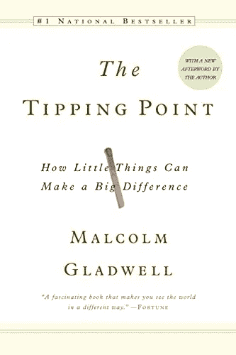
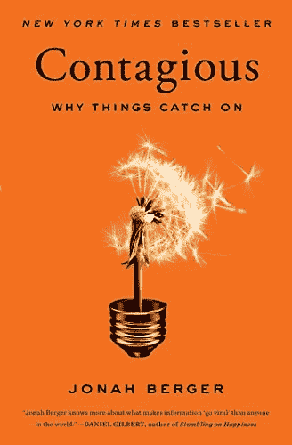
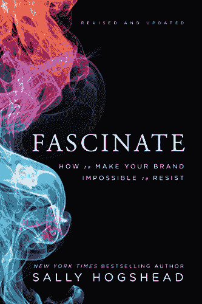
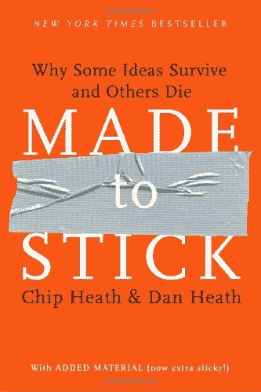
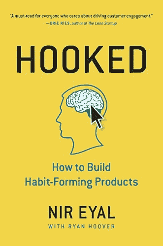
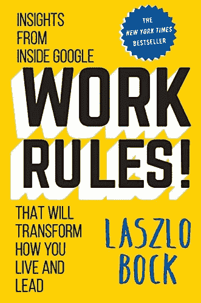
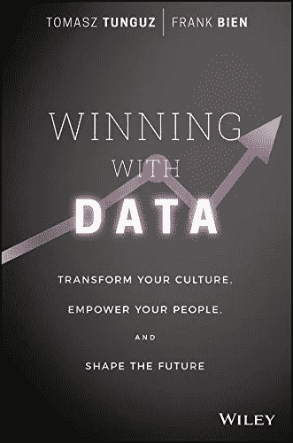
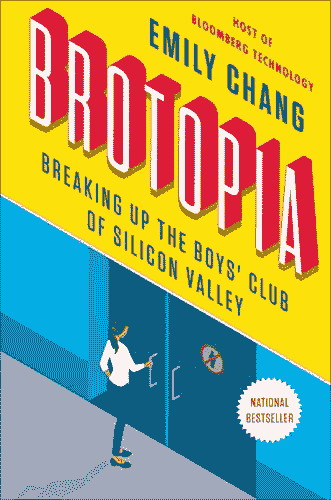
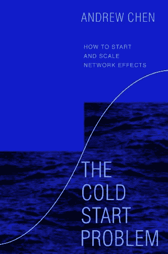
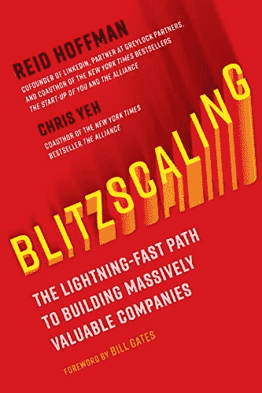

# 如果你想在我的创业公司工作，请阅读这 10 本书

> 原文：<https://medium.datadriveninvestor.com/read-these-8-books-if-you-want-to-work-at-my-startup-f0ef19fce49c?source=collection_archive---------14----------------------->

## 创始人、高管和产品经理必读

[Unsplash](https://unsplash.com?utm_source=medium&utm_medium=referral)

【2022 年 11 月更新

我读了很多书。

作为一名开发人员，我几乎一生都在做功课，因为这就是生活，我读的大多数书确实都与编程有关；然而，我也喜欢阅读范围更广的书籍，这些书籍几乎适用于初创公司的任何角色——尤其是我的初创公司。

> 我觉得都应该是必读书！

这是我最喜欢的几本非技术类的书，它们有一个共同点——我觉得都应该是必读书！我是真心的。

我不打算在这里提供大量的书评。亚马逊上有很多这样的网站。事实上，我在这篇文章中列出这些书意味着我的评论不仅是积极的，而且超出了图表。句号。

不要把小节名称看得太重。其中一些书涵盖了很多领域，我很难为每本书挑选一个章节。这些部分与你的角色无关。这些书非常通用，我认为公司的每个人都应该阅读其中的每一本书——不管你的职位是什么。

所以他们在这里——没有特定的顺序。

## 营销

这里的标题*营销*用得很不严谨。这四本书对人们如何思考、有效的信息传递以及有时对产品、信息或活动的微小调整如何对你的成功产生巨大影响提供了非凡的见解。我希望在我的职业生涯中早点把它们都读完。

[引爆点:小事情如何能产生大影响](http://a.co/d/2CbR0L2)
作者马尔科姆·格拉德威尔

乔纳·伯杰的《传染性:为什么事情会流行起来》

[着迷、修正和更新:如何让你的品牌无法抗拒](http://a.co/d/8y0TLeJ)

奇普·希斯:为什么有些想法存活而有些想法死亡

## 产品

我几乎觉得在这里只列出一本书很糟糕，因为 *Brotopia* 和 *Winning with Data* 也包含一些关于产品开发的重要见解，尽管我最终将它们列在了*文化*下。

[上钩:如何打造养成习惯的产品](http://a.co/d/b3jPVu2)
作者 Nir Eyal 等人。

*Hooked* 提供了我从未见过如此精彩的见解。我无法想象有哪个产品经理没有记住这本书。但是这本书不仅仅是写给经前综合症的。这本书里有适合每个人的东西。

## 文化

公司文化源于高层，这些书代表了我希望我公司的每个人都会采纳的价值观和思维方式。总的来说，这三本书就如何正确对待文化提供了独特的见解和指导。

这里列出的每本书都涵盖了不同的文化角度；涵盖从核心价值观到多元化、招聘以及如何做出明智决策的话题。

[工作规则！:来自谷歌内部的见解将改变你的生活方式，并领导拉兹洛·博克的](http://a.co/d/agW5sgc)

[用数据取胜:转变文化、增强员工能力、塑造未来](http://a.co/d/7E57MTQ)
作者:Tomasz Tunguz 等人。

[布罗托皮亚:解散硅谷的男孩俱乐部](http://a.co/d/gGdfsoZ)
艾米莉·张

## 增长

陈楚翔的*冷启动问题*充满了关于如何从零开始并建立一个强大的用户群的宝贵见解，重点是原子网络和网络效应。这本书和*钩*是我最推荐给科技界朋友的两本。两者缺一不可。

我读过一些关于增长技巧和扩大规模的好书。雷德·霍夫曼的*闪电战*的不同之处在于，它不是一个操作指南；而是一种心态。它帮助你了解你的头脑需要在哪里，以及如果你在寻找指数增长，你将如何去做某些决定。

[冷启动问题:如何启动及规模网络效应](https://www.amazon.com/Cold-Start-Problem-Andrew-Chen-ebook/dp/B08HZ5XY7X/ref=sr_1_1?crid=2PZWQON4RFRTT)
作者 Andew Chen

《闪电战:打造高价值公司的捷径》
作者:雷德·霍夫曼等人。

## 包扎

我写这篇文章是希望最终决定面试我的人能够提前了解我的想法、我的价值观，以及我对最终可能被邀请到 Hello Gloss 与我们一起工作的其他人的期望。换句话说，它是一张进入我大脑的地图，可供那些在见我之前做足功课的候选人使用。

如果你已经在为我工作，我期待在午餐时讨论这些问题。更好的是，告诉我另一本书我应该添加到这个列表中，以及为什么它与这些书并列。

## 感谢阅读。如果你喜欢这篇文章，请随意点击那个按钮👏帮助其他人找到它。