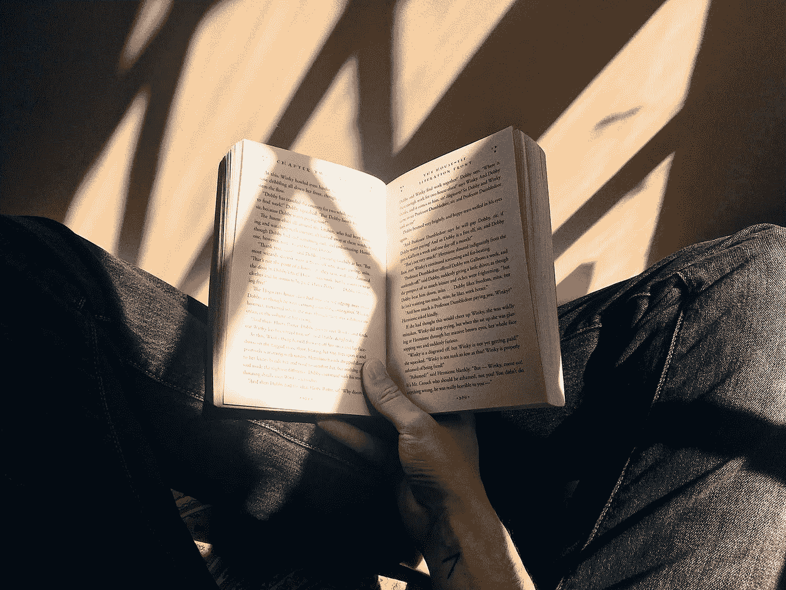

# 阅读挑战会扼杀阅读的乐趣。

> 原文：<https://medium.datadriveninvestor.com/reading-challenge-can-kill-the-joy-of-reading-dccd534eae07?source=collection_archive---------7----------------------->

Image courtesy: JotForm

去年，我开始积极地读书。这很有侵略性，因为我有一些非常好的书吸引了我。我很幸运地找到了它们，当我继续阅读时，这变成了一种乐趣。

而读好书，让你兴奋，让你充满某种能量的书，绝对是应该读的那种书。因此，和许多人一样，我也决定接受阅读挑战。因为我一个月读 3-4 本书，所以我认为一年读 50 本书是个好主意。

但是当你强迫他们时，事情不会变好。后来，我发现自己在挑选短小、随意的书，在这些书里我找不到灵魂。我读书只是为了挑战，没有兴趣。

在我 42 岁的时候，老实说，我读过的书中只有几本书是有意义的，其余的都是一种模糊而虚假的阅读体验。

*但是结局好就一切都好。*

就在那时，我决定在 42 岁时退出 Goodreads 阅读挑战，我很感激这种意识终于实现了，即使是在很久以后，我完全接受了这一点。

# **以下是我从这次经历中学到的东西**

*   只读那些提升你意识的书。

唯一值得一读的书是那些提升你的意识的书。书籍拥有将你变成好的或坏的自己的力量。每本书都包含一些强大的东西。

*   书籍就像煎饼。

商店里有很多煎饼，但你不会去买所有的煎饼。有些是你喜欢的，有些不是——这对我来说是难以接受的事实，如果我不喜欢一本书，我不会受到责备。一个人应该尝试，但与此同时，他应该能够认识到自己的兴趣所在。

*   明智地选择你的书。

你播种的就是你收获的。你选择的书是你将要成为的人，因为每本书都给我们的个性增加了一些东西，也减少了一些东西。为此，我尝试了内容、类型、作者、故事的一点背景，然后如果我想去做，我就一头扎进去。

*   **感受节奏。**

很难通过封面来判断一本书，甚至很难在 30 页内做出判断。书籍是神秘的，这就是它们的方式，否则没有人会读它们。

所以，如果一本书对我有特殊的召唤，我就会去读，就这样。相信我，你是什么样的人，你有什么样的使命。来电是一种持续在你潜意识中的警报，直到你听到它，它会一直嗡嗡作响。**听听看。**

所以，我决定从现在开始，在接下来的几年里，我要慢慢来，慢慢来。因为一本书可以做一打书做不到的事。

这些是我的一些想法，它们可能与你的有所不同，因为许多人发现阅读挑战是一种阅读更多的好方法，但重要的不是数量，而是质量和学习。

有一个伟大的阅读年，珍惜阅读的快乐。

既然你来了，能帮我一个忙吗？我全心全意地写作，很想知道你对这篇文章的感受。所以，请喜欢，评论和分享你的想法，让我知道我做得怎么样。[*E-mail*](http://Kartikayshastri@gmail.com)*me，关注我上*[*Twitter*](https://twitter.com/kartikayshastri)*或*[*LinkedIn*](https://www.linkedin.com/in/kartikayshastri/)*。*