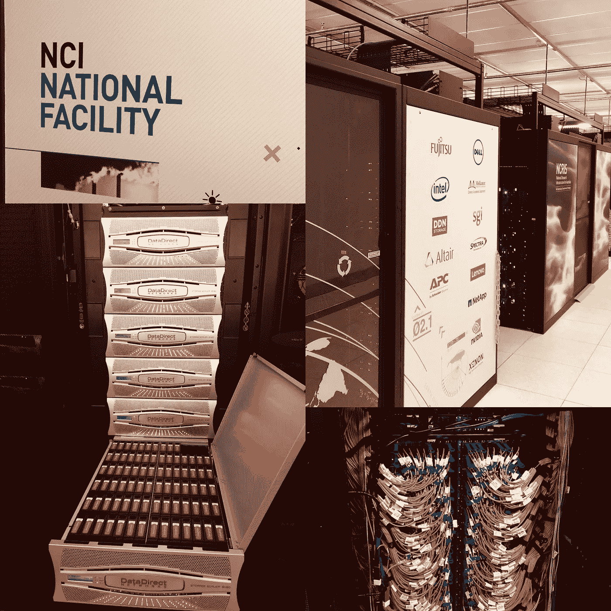

# 数据的实际和当前成本

> 原文：<https://medium.datadriveninvestor.com/real-and-present-cost-of-data-259590af6246?source=collection_archive---------3----------------------->

开放数据现在是一个广泛使用的短语，世界各地的政府正在向任何人提供数据，任何人都希望使用数据来创造有价值和有成效的见解。这些数据以及全球科技公司持有的数据仓库现在非常有价值，如果首席财务官们现在考虑如何在资产负债表上计入数据资产，我不会感到惊讶。

我们不会讨论数据的价值，但我们将探索利用这些数据不可避免的隐性成本。数据被用于各种目的，尽管十年前它被视为对组织绩效的洞察，但今天的重点已转移到通过机器和深度学习算法输入数据。当这些算法嵌入人工智能(AI)时，它们将塑造我们的未来，人工智能将运行我们生活的世界。现在，人工智能不是一个新概念，因为它已经存在了几十年，但今天使它相关的是可供消费的大量数据

 [## 人工智能与创造力:作为创意引擎的比根——数据驱动的投资者

### 的确，2018 年可以被视为人工智能创造的创造力全盛时期的开始。当然可以…

www.datadriveninvestor.com](https://www.datadriveninvestor.com/2019/02/13/ai-creativity-biggan-as-a-creative-engine/) 

最近，我有幸参加了微软总裁 Brad Smith 的演讲，他说“数据每 18 个月翻一番”，我们每年创建的数据比 2008 年的总和还要多。这是大量“可开采”的信息，可供技术公司和相关方使用。但对于一个未经训练的人来说，这种数据挖掘功能似乎是一种改善我们生活的慈善行为。我不想让自己听起来像一个半空杯子的人，但是我想展示一些我最近参观国家计算基础设施(NCI)时得到的信息。

澳大利亚 NCI 是澳大利亚高度集成的高性能研究计算环境，为政府、行业和研究人员提供世界一流的服务。NCI 拥有澳洲最快的超级计算机，建于 2012 年。但是在七年的时间里。它变得“慢”了，需要换成新的更快的机器。科技公司、政府和研究人员使用这个 NCI 设施来研究气候变化、天气模式和基因组等等。使用这种基础设施进行的探索是惊人的，无疑提高了我们对地球的了解，并在健康和其他重要的研究功能方面取得了进展，使澳大利亚和世界受益。但是在我的访问中让我惊讶的是这项研究的未知成本，尽管没有隐藏起来，我们对这些成本知之甚少。NCI 的超级计算机拥有巨大的数据存储和计算能力，除了一年中的几个维护日之外，全年 24 小时都在使用。它每年有 800，000，000 小时的计算时间(几乎有 8 亿台计算机同时运行)，网络速度为每秒 100 千兆位。相比之下，澳大利亚国家宽带网络(NBN)承诺的最快速度是每秒 100 兆。因此，NCI 的网速比承诺的 NBN 网速快 1000 倍。这就是我所说的闪电般的速度。但是这种闪电般的速度和随之而来的计算能力带来了巨大的成本。NCI 每天使用 2000 升水来冷却产生大量热量的超级计算机处理器和硬盘驱动器。作为比较，它是一个平均大小的雨水池。这些水被蒸发了，所以基本上每天都在用于农业或饮用水的过程中流失。

NCI 还消耗 2 兆瓦时(MWh)的电力来为超级计算机供电。它的屋顶上有太阳能电池板，但它们只贡献了 5%的电力。其中一部分电力用于保持存储大量数据的硬盘运转。然而，算法执行处理器分析和消耗数据以获得洞察力消耗了大量的这种能量。客观地看，2 兆瓦时的电力相当于大约 660 个家庭供电一个小时，相当于一个小郊区的电力。这里的争论不是关于 NCI 为其存在留下了大量的碳足迹，而是关于数据存储和处理所涉及的成本的模糊性。

《人工智能剖析》第 17 章作者 Kate Crawford 谈到，由于云计算的流行，数据和信息计算服务通常对普通消费者来说是不可见的。与以前的计算方式不同，在以前的计算方式中，组织在内部安装大量的处理器和服务器，云计算是在云中处理的。这并不意味着这些耗电量大、位于远处的计算处理器和数据中心没有碳足迹，而是关于普通消费者不了解或无法访问这些信息。

目前世界上有数百台超级计算机，而且这个数字还在不断增长。澳大利亚的 NCI 超级计算机是世界上第 120 快的计算机，因此与世界上其他地方的计算机相比，它的能力相对较弱。世界正在迅速走向由机器学习和深度学习实现的人工智能(AI)。为了让规模扩大的人工智能系统高效且有效地运行，我们将需要更多的通勤和处理能力。这意味着我们需要建造更大更强大的超级计算机，留下巨大的碳足迹。目前，没有机制来识别使用强大计算机器的组织的能量消耗，并且没有关于这种组织的责任或治理来披露这种信息。

在一个推动透明度的社会，开放数据和围绕它的处理也需要被拆箱。消费者和政府需要更好地了解人工智能或机器学习技术的碳足迹和能源消耗。这些开放原则有望推动基于价值的技术和人工智能系统的道德使用。

关于作者

Hrishikesh Desai 是一名进步领袖，目前是澳大利亚国立大学 3A 学院的学生。赫里什克什在联邦政府的监管、知识产权方面有经验，你可以通过 [LinkedIn](https://www.linkedin.com/in/rishidesaii/) 和 [Twitter](https://twitter.com/ScalingAI) 与他联系。